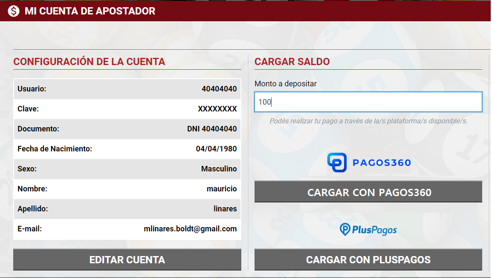
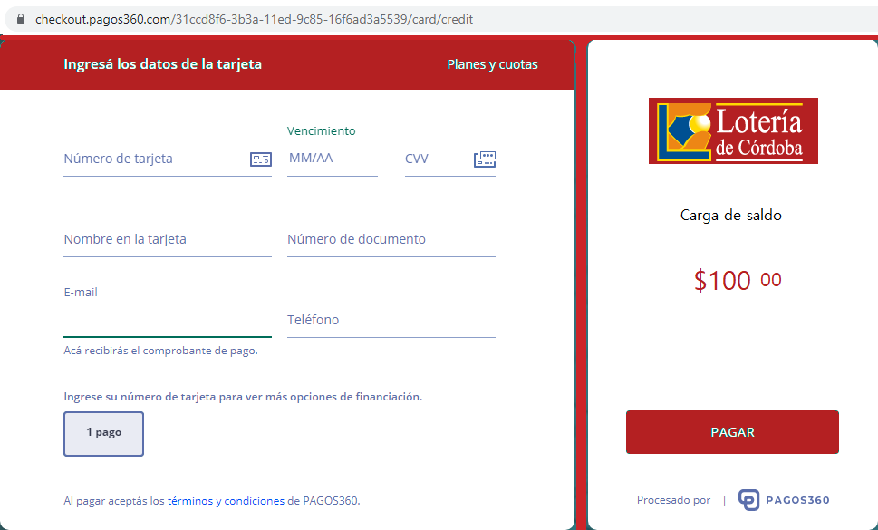
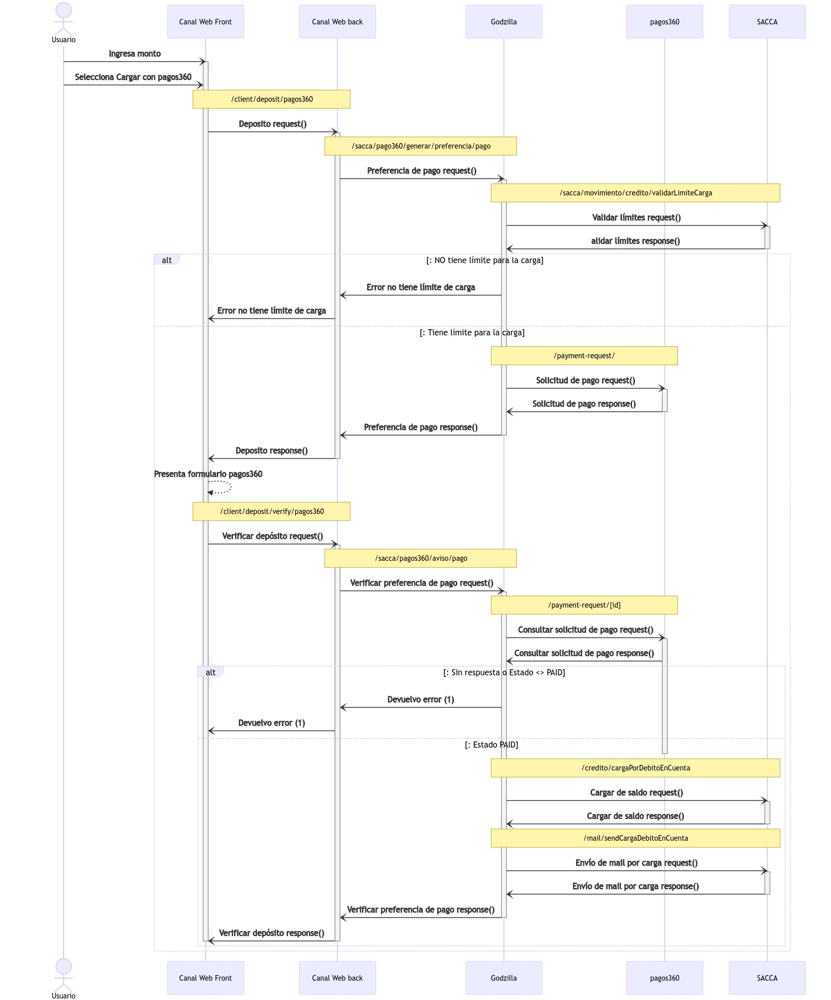
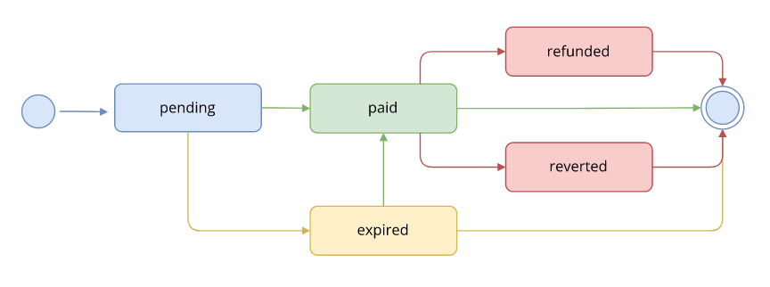

= Godzilla Api
Boldt Gamming8
v2.0: Transacciones Rest
:version-label: Versión
:toc: left
:toclevels: 4
:toc-title: Tabla de contenido
:encode: UTF-8
:title-page: 

== Versionado
[width="100%",cols="10%,16%,21%,53%",options="header",]
|===
|Versión |Fecha |Autor |Descripción
|2.0.24 |11/5/2023 |pRomo a|
- Se agregar errores a la transacción /acca/actualizar/validarRenaper/
|2.0.23 |10/5/2023 |pRomo a|
- Se modifica la transacción /venta/cancelar/
|2.0.22 |10/5/2023 |pRomo a|
- Se agrega la transacción  /sacca/limiteApuesta/cliente/
- Se modifica la transacción /sacca/actualizar/validarRenaper/
|2.0.21 |27/4/2023 |pRomo a|
- Se agrega la transacción /sacca/autoexclusionPanico/cliente/
- Se eliminan los saldos en respuestas de alta y exclusiones.
- Se eliminan tx /sacca/alta/cliente/
- Se eliminan tx /sacca/acepta/actualiza/tyc/email/
- Se eliminan tx /sacca/actualizar/datos/básicos/
- Se eliminan tx /sacca/actualizar/datos/varios/
- Se eliminan tx /sacca/actualiza/email/
- Se eliminan tx /sacca/validar/cliente/
|2.0.20 |24/4/2023 |pRomo a|
- Se agrega la transacción /sacca/actualizar/validarRenaper/
- Se agrega la transacción /sacca/tiempoAfuera/cliente/
- Se modifica la transacción /sacca/codigo/extraccion/
|2.0.19 |14/4/2023 |pRomo a|
- Se agrega la transacción /sacca/alta/validarRenaper/
- Se agrega la transacción /sacca/alta/clienteRenaper/
- Se agrega la transacción /sacca/validar/email/
- Se agrega la transacción /sacca/validar/email/reenviar/
|2.0.18 |13/4/2023 |pRomo a|
- Se reempla en los response de txs que devuelven el saldo de SACCA, el campo saldos por una estructura que envía el saldo disponible, el saldo por depósitos y saldo por premios.
|2.0.17 |14/3/2023 |pRomo a|
- Se agregan txs /central/refsa/cobro/consultar y /central/refsa/cobro/confirmar y /central/refsa/caja/consultar para cobro de REFSA Formosa.
|2.0.16 |3/3/2023 |pRomo a|
- Se agrega el array de billeteras virtuales en la transacción de parámetros iniciales.
|2.0.15 |2/3/2023 |pRomo a|
- Se agrega el array con los saldos en la transacción /sacca/codigo/extraccion.
|2.0.14 |20/1/2023 |pRomo a|
- Se agrega el array con los saldos en la transacción /sacca/ultimos/movimientos.
|2.0.13 |9/1/2023 |pRomo a|
- Se agrega el campo orden a los juegos en la tx de parámetros iniciales.
|2.0.12 |19/12/2022 |pRomo a|
- Se renombra el campo jacks por numerosPlus en /venta/loto.
|2.0.11 |5/12/2022 |pRomo a|
- Se agrega campo saldoRetiro en tx /sacca/validacion/usuario.
|2.0.10 |17/10/2022 |pRomo a|
- Se agrega apartado de pagos360.
|2.0.9 |4/10/2022 |pRomo a|
- Se agregan los campos callbackSuccess y callbackCancel en la transacción /sacca/pagos360/generar/preferencia/pago.
|2.0.8 |27/09/2022 |pRomo a|
- Se agrega campo checkout_url en la transacción /sacca/pagos360/generar/preferencia/pago.
|2.0.7 |23/09/2022 |pRomo a|
- Se agrega campos de URL en la transacción /sacca/pagos360/generar/preferencia/pago
|2.0.6 |23/09/2022 |pRomo a|
- Se cambia campo channelFiltro por chanelId en /central/agenciero/web/reporte/caja/detallado.
- Se agrega la transacción /sacca/pagos360/generar/preferencia/pago
- Se agrega la transacción /sacca/pagos360/confirmar/preferencia/pago
|2.0.5 |21/09/2022 |pRomo |Se agrega campo monto a transacción /sacca/credito/agenciero/web/apuesta/ganada.
|2.0.4 |16/09/2022 |pRomo a| 
- Se modifica campo numeroDocumento por documento en /sacca/credito/agenciero/web/apuesta/ganada.
- Se cambia campo chanel_id por channelFiltro, se agrega campo terminalId en /central/agenciero/web/reporte/caja/detallado.
|2.0.3 |07/09/2022 |pRomo | Corrección en URL de Reporte de Caja en Libreta de agenciero.
|2.0.2 |06/09/2022 |pRomo | Se agregan  tx /venta/agenciero/web/ticket/consultar
|2.0.1 |06/09/2022 |pRomo | Se agregan los campos juegoId y juegoNombre en tx /sacca/crédito/agenciero/web/apuesta/ganada
|2.0.0 |02/09/2022 |pRomo | Migración final de Transacciones-Rest-5.doc a gotzillaApi.adoc.
|1.0.80 |31/08/2022 |pRomo | Se agrega el campo ordenExtracto a tx Extracto por Fecha.
|1.0.79 |22/08/2022 |Mpereira  a|
- Premios pendientes request, agregado de game, drawNumber y channel para filtro (pedido por AG).
- Reporte de caja diario (AG).
- Reporte de caja detallado (AG).
AG: Aplicación Agenciero.
|1.0.78 |09/08/2022 |Mpereira  |Agregado de solicitaDni y solicitaCodigoUif a 
ticket-check.
|1.0.77 |02/08/2020 |Mpereira  a|
- Nuevo endpoint de pedido de extractos por fecha.
- Nuevo endpoint reporte de premios pendientes para libreta agenciero.
- Agregado de columna "Descripcion front end” para tabla de canales.
|1.0.76 |01/02/2022 |EGarrido  |Se agrega tx para listar las url de autoservicio.
|1.0.75 |28/01/2022 |EGarrido  |Se agrega la tx para listar y consulta de Campañas de la Autoservicio a través de Godzilla.
|1.0.74 |16/12/2021 |EGarrido  |Se agregan tx de generar y confirmar preferencia de pago en SACCA para WEIGO.
|1.0.73 |03/12/2021 |EGarrido  |Se agrega tx de venta Quiniela Instantánea plus para CW.
|1.0.72 |23/11/2021 |EGarrido  |Se agrega tx de venta Quiniela tempranita para CW y libreta de agenciero.
|1.0.71 |20/10/2021 |Egarrido  |Se agrega 2do código de barra en ventade BL.
|1.0.70 |17/09/2021 |EGarrido  |Se agrega ejemplo con jugada de Quiniela con modalidad Trinka en la tx ticket/detalle.
|1.0.69 |10/09/2021 |EGarrido  |Se actualiza venta de Quiniela para CNA y APA con modalidad Trinka.
|1.0.68 |01/09/2021 |EGarrido  |Se actualiza detalle de ticket solo para billetes de loterías, parámetros iniciales y de juego para Trinka. Se agrega tabla de variantes de Quinielas (3 - Trinka).
|1.0.67 |04/05/2021 |EGarrido  |Se volvió atrás en cambio en los parámetros iniciales, todos los juegos quedaron como antes y solo los de lotería van en el formato nuevo.
|1.0.66 |30/07/2021 |EGarrido  |Se agrega venta de lotería unificada y de córdoba.
|1.0.65 |28/07/2021 |EGarrido  |Se agrega venta de lotería tradicional.
|1.0.64 |15/07/2021 |EGarrido  |Se agrega tx para la consulta de las partes disponibles de un numero para la venta de loterías.
|1.0.63 |14/07/2021 |EGarrido  |Se modifican parámetros iniciales y por juego debido a que en billetes de loterías pueden enviar más de un sorteo.
|1.0.62 |08/07/2021 |EGarrido  |Se agrega Mini Poceada.
|1.0.61 |22/03/2021 |EGarrido  |Se agrega campo "codigoBarraExterno” en las transacciones de venta.
|1.0.60 |08/03/2021 |EGarrido  |Se agrega tabla relacional juego-modalidad para el campo idResult de la consulta de extractos.
|1.0.59 |05/03/2021 |EGarrido  |Se agrega transacción límite de venta.
|1.0.58 |02/03/2021 |EGarrido  |Se actualiza extracto de billetes de lotería.
|1.0.57 |04/12/2020 |EGarrido  |Se actualiza venta de bingo y detalle de ticket.
|1.0.56 |11/11/2020 |EGarrido  |Se modifica consulta de últimos movimientos (se agrega campo nameGame).
|1.0.55 |05/11/2020 |EGarrido  |Se agrega Bingo en parámetros iniciales.
|1.0.54 |04/11/2020 |EGarrido  |Se agrega Bingo Domingon.
|1.0.53 |08/10/2020 |EGarrido  |Se agregan llamadas de libreta agenciero.
|1.0.52 |05/10/2020 |EGarrido  |Modificación en la llamada de venta de LT.
|1.0.51 |02/10/2020 |E.Garrido  |Modificación en la llamada y actualización de la respuesta para poceadas.
|1.0.50 |20/12/2019 |H. Martin  |Modificación de Tabla de Provincias. Modificación de Alta de cliente SACCA. Modificación de Datos Varios.
|1.0.49 |11/12/2019 |H. Martin  |Se agrega leyenda e impuesto al premio en Quiniela Instantánea.
|1.0.48 |03/07/2019 |H. Martin  |Se actualizaron los parámetros iniciales, agregado de Tiempo de sesión.
|1.0.47 |01/07/2019 |H. Martin  |Se agrega alta de cliente SACCA y Consulta de Limites de cliente.
|1.0.46 |03/06/2019 |H. Martin  |Se agrego transacción de autoexclusión.
|1.0.45 |01/04/2019 |H. Martin  |Se agrega sección con notificaciones de Plus Pagos.
|1.0.44 |10/01/2018 |H. Martin  |Modificación de parámetros iniciales (se agrega Agencia Virtual).
|1.0.43 |25/04/2018 |H. Martin  |Modificación de parámetros iniciales, agregado de transacción de Loto, Loto5, Brinco.
|1.0.42 |17/01/2017 |H. Martin  |Modificación transacción de mis movimientos (sacca).
|1.0.41 |22/06/2016 |H. Martin  |Modificación transacción de venta de Quiniela Instantánea, campo numérico a cadena de caracteres.
|1.0.40 |14/06/2016 |H. Martin  |Agregado de transacción de Raspabingo.
|1.0.39 |07/06/2016 |H. Martin  |Agregado de transacción de Pin por Canal.
|1.0.38 |06/06/2016 |H. Martin  |Modificación de Mis Apuestas para ver más apuestas.
|1.0.37 |03/05/2016 |M. Ferrari  |Corrección y unificación de tablas de errores.
|1.0.36 |29/04/2016 |H. Martin  |Creación de tabla de errores.
|1.0.35 |24/02/2016 |H. Martin  |Modificación llamada en Crédito por Apuesta Ganada.
|1.0.34 |17/02/2016 |H. Martin  |Modificación de Ticket Check y Ticket Detalle.
|1.0.33 |11/02/2016 |H. Martin  |Modificación de Detalle de Apuesta.
|1.0.32 |05/02/2016 |H. Martin  |Modificación Parámetros Iníciales.
|1.0.31 |29/01/2016 |H. Martin  |Modificación parámetros de Modificación de Datos Adicionales.
|1.0.30 |27/01/2016 |H. Martin  |Modificación de Quiniela Express.
|1.0.29 |18/01/2016 |H. Martin  |Modificación de Quiniela Express.
|1.0.28 |07/01/2016 |H. Martin  |Borrado la Actualización de valores. Se cambiaron los ejemplos de Quini 6. Cambio de parámetros en Crédito por Apuesta Ganada. Agregado de Nueva clave.
|1.0.27 |29/12/2015 |H. Martin  |Agregado de Tabla de provincias.
|1.0.26 |29/12/2015 |O. Villarreal a|
- Se agregaron códigos de error en cada transacción.
- Se agrego la transacción de Quiniela Instantánea.
|1.0.25 |23/12/2015 |H. Martin  |Modificación de Parámetros Iníciales y de Juego.
|1.0.24 |21/12/2015 |H. Martin  |Modificación de Datos Básicos y Datos Adicionales.
|1.0.23 |15/12/2015 |O. Villarreal  |Se actualizaron las transacciones Mis Apuestas y Detalle de Apuesta. Se agregó Tabla de estados de ticket y se modificaron las descripciones de la tabla estado de Premios.
|1.0.22 |03/12/2015 |H. Martin | Modificación parámetro en extractos. Agregado de urls para los llamados. Agregado tabla estados del premio para Ticket Check.
|1.0.21 |02/12/2015 |H. Martin | Modificación de Tx de Datos Básicos y Datos Adicionales. Agregado de Parámetros Iniciales. Agregado de Parámetros de Juego.
|1.0.20 |24/11/2015 |H. Martin | Modificación de Tx de Últimos Movimientos.
|1.0.19 |20/11/2015 |H. Martin | Modificación de Tx de Detalle de Apuesta.
|1.0.18 |19/11/2015 |H. Martin | Modificación de Blanqueo de clave. Modificación de tabla de opciones.
|1.0.17 |21/10/2015 |H. Martin | Modificación tabla de opciones de juego.
|1.0.16 |21/10/2015 |H. Martin | Modificado extractos de Loterías.
|1.0.15 |20/10/2015net |H. Martin  |Agregado errores externos.
|1.0.14 |20/10/2015 |H. Martin | Agregado extracto de Loterías.
|1.0.13 |16/10/2015 |H. Martin | Modificación de parámetros de extracto poceado, cambio de clave, actualizar email, aceptar tyc y reserva para extracción. Agregado extracto quinielas.
|1.0.12 |15/10/2015 |H. Martin | Modificación de parámetros de extracto poceado.
|1.0.11 |14/10/2015 |H. Martin | Modificación de parámetros de extracto poceado.
|1.0.10 |09/10/2015 |H. Martin | Modificación de parámetros de extracto poceado.
|1.0.9 |09/10/2015 |H. Martin | Modificación de parámetro en venta Quini6.
|1.0.8 |08/10/2015 |H. Martin | Modificación de llamada de extractos poceados.
|1.0.7 |08/10/2015 |H. Martin | Tabla de medios de pago de acuerdo a Libra.
|1.0.6 |07/10/2015 |H. Martin | Modificación en respuestas, se quitaron canales y versiones en las que no correspondía.
|1.0.5 |05/10/2015 |H. Martin | Agregado y corrección de tablas. Unificación de respuestas, las ventas con datos completos, las demás solo OK y datos que pida (saldo p.e.).
|1.0.4 |05/10/2015 |L. Ortiz  |Actualización del documento.
|1.0.3 |25/09/2015 |L. Ortiz  |Actualización del documento.
|1.0.2 |28/8/2015 |P. Avellaneda  |Consenso Venta Q6.
|1.0.1 |27/07/2015 |M. Quirinali  |Se agrega transacción datos personales.
|1.0.0 |21/07/2015 |M. Quirinali  |Generación del documento.
|===

'''
== Quini6
=== url: /venta/quini6/
=== Request
....
{
    "canal": 2,
    "version": "CW-13", 
    "numeros": [1, 5, 6, 7, 8, 9], 
    "medioPago": 2, 
    "moneda": 1, 
    "usuario": "32323232", 
    "clave": "AQ142536", 
    "opcion": 3, 
    "monto": 20, 
    "sorteo": 1173, 
    "idJuego": 6 
    "terminalId": 6333
}
....

[width="100%",cols="25%,62%,13%",options="header",]
|===
|Campo | Descripción | Tipo
|canal | Identificador de canal (ver tabla). | Number
|versión | Versión de la transacción. | String
|numeros | Lista de números de la apuesta. | Number[]
|medioPago | Id de medio de pago (ver tabla). | Number
|moneda | Código de moneda (ver tabla). | Number
|usuario | Usuario de monedero (cadena de 8 caracteres). | String
|clave | Clave del usuario de monedero (cadena entre 4 y 8 caracteres). | String
|opcion | Opción del juego apostado (ver tabla). | Number
|monto | Monto de la apuesta (decimal grande, con dos decimales). | Number
|sorteo | Sorteo al que se apuesta. | Number
|idJuego | Id del juego apostado (ver tabla). | Number
|terminalId | Id de terminal (Obligatorio para Term Autoservicio, sin uso para el resto de los canales). | Number
|===

=== Response
....
{
    "codigo": 0,
    "observacion": "Servicio exitoso.", 
    "correlationId": "9912cda3-1447-46f5-875f-b32a97591f4b", 
    "monto": 15, 
    "medioPago": 2, 
    "usuario": "66111111",
    "codigoOperacion": "00000000G1",
    "ticketId": "0600FAF5E1E88EE3",
    "sorteo": 250,
    "fechaVenta": "20160107 12:08:38",
    "fechaSorteo": "20160108 21:00:00", 
    "fechaPrescribe": "20160131",
    "codigoSeguridad": "576434AE91367490",
    "moneda": 1, 
    "tipoDocumento": 1, 
    "numeroDocumento": "66111111", 
    "secuencia": 100000232, 
    "codigoBarraExterno": "0401173100000016", 
    "numeros": [10, 20, 30, 40, 41, 42], 
    "opcion": 3,
    "saldos": [
        {
            "moneda": "1",
            "montoDisponible": 10000,
            "montoDepositos": 5500,
	        "montoPremios": 4500
        }
    ]
}
....

[width="100%",cols="25%,62%,13%",options="header",]
|===
|Campo | Descripción | Tipo
|codigo | Código de respuesta (ok = 0, error número negativo). | Number
|observacion | Descripción de la respuesta. | String
|correlationId |Id de seguimiento de transacción. | String
|monto |Monto de la apuesta. | Number
|medioPago | Id de medio de pago (ver tabla). | Number
|usuario | Usuario de monedero (cadena de 8 caracteres). | String
|codigoOperacion | Código de la operación de monedero (cadena de 10 caracteres) | String
|ticketId |Identificador del ticket (cadena de 16 caracteres) | String
|sorteo | Sorteo al que se apuesta | Number
|fechaVenta | Fecha de venta (dd/mm/aaaa hh:mm:ss) | Date
|fechaSorteo | Fecha de sorteo (dd/mm/aaaa hh:mm:ss) | Date
|fechaPrescribe | Fecha de prescripción (dd/mm/aaaa hh:mm:ss) | Date
|codigoSeguridad |Código de seguridad de la apuesta (cadena de 16 caracteres) | String
|moneda | Código de moneda (ver tabla) | Number
|tipoDocumento | Id de tipo de documento del usuario monedero (ver tabla) | Number
|numeroDocumento | Número de documento del usuario monedero | String
|secuencia | Número de secuencia del ticket | Number
|codigoBarraExterno | Código de Barra Externo| String
|numeros | Números apostados | Number[]
|opcion | Opción del juego apostado (ver tabla) | Number
|saldos[] | Array con los saldos por moneda | Array
e| -> moneda | Código de moneda| Number
e| -> montoDisponible | Saldo en monedero para apostar (número decimal grande, con dos decimales) | Number
e| -> montoDepositos | Monto que compone el saldo disponible proveniente de depósitos (número decimal grande, con dos decimales) | Number   
e| -> montoPremios | Monto que compone el saldo disponible proveniente de premios (número decimal grande, con dos decimales) | Number   
|===

=== Códigos de error
[width="15%",cols="25%",options="header",]
|===
|0
|-2500
|-2599
|-2121
|-3102
|-2505
|-2506
|-2028
|-2128
|-2100
|-3101
|-2101
|-2507
|-2509
|-2533
|-2513
|-2531
|-2535
|-2532
|-2534
|===

'''
== Quiniela Instantánea
=== url: /venta/quiniela/express/
=== Request
....
{
    "canal": 3,
    "version": "0.0.1",
    "paneles": [
        {
            "numero": 45,
            "alcance": 1,
            "monto": 5.50
        },
        {
            "numero": 4,
            "alcance": 10,
            "monto": 5.00
        }
    ],
    "medioPago": 2, 
    "moneda": 1, 
    "monto": 10.50, 
    "usuario": "28000062", 
    "clave": "desa1"
}
....

[width="100%",cols="25%,62%,13%",options="header",]
|===
|Campo | Descripción | Tipo
|canal |Id de canal (ver tabla) | Number
|version |Versión de la transacción  | String
|paneles[] |Array con paneles de la apuesta  | Array
e| -> numero | Alcance del panel | Number
e| -> alcance | Número apostado en el panel |Number
e| -> monto | Monto del panel  | Number
|medioPago |Id de medio de pago (ver tabla)  | Number
|moneda |Id de moneda (ver tabla) | Number
|monto |Monto total de la apuesta (numero decimal grande, con dos decimales) | Number
|usuario |Usuario de monedero (cadena de 8 posiciones)| String
|clave |Clave del usuario de monedero (cadena entre 4 a 8 caracteres) | String
|terminalId |Número de terminal | Number
|===

=== Response
....
{
    "codigo": 0,
    "observacion": "Servicio exitoso.",
    "correlationId": "94bbb39f-5d80-4032-84a8-74e161813f70",
    "monto": 50.5,
    "medioPago"  2,
    "usuario": "12665904",
    "codigoOperacion": "0000001LUG",
    "ticketId": "100B54F5E1189802",
    "sorteo": 2900,
    "fechaVenta": "20191211 14:33:04",
    "fechaSorteo": "20191211 20:00:00",
    "fechaPrescribe": "20191231",
    "codigoSeguridad": "8D31765E6AF53F0C",
    "moneda": 1,
    "tipoDocumento": 1,
    "numeroDocumento": "12665904",
    "secuencia": 100000024,
    "paneles": [
        {
            "numero": "1",
            "alcance": 5,
            "monto": 10.5
        },
        {
            "numero": "2",
            "alcance": 5,
            "monto": 10
        },
        {
            "numero": "3",
            "alcance": 5,
            "monto": 10
        }
    ],
    "extracto": [ "050","248","022","920","602","292","343","792","564","975"],
    "premio": 27.44,
    "impuestoPremio": 0.56,
    "amountMessageProv": "Impuestos 2,00% $ 0,56",
    "codigoPago": -2599,
    "estado": 10,
    "saldos": [
        {
            "moneda": "1",
            "montoDisponible": 10000,
            "montoDepositos": 5500,
	        "montoPremios": 4500
        }
    ]
}
....

[width="100%",cols="25%,62%,13%",options="header",]
|===
|Campo | Descripción | Tipo
|codigo | Código de respuesta (ok = 0, error número negativo) | Number
|observacion | Descripción de la respuesta | String
|correlationId |Id de seguimiento de transacción | String
|monto |Monto total de la apuesta (numero decimal grande, con dos decimales) | Number
|medioPago |Id de medio de pago (ver tabla)  | Number
|usuario |Usuario de monedero (cadena de 8 posiciones)| String
|codigoOperacion | Código de la operación de monedero (cadena de 10 caracteres) | String
|ticketId |Identificador del ticket (cadena de 16 caracteres) | String
|sorteo | Sorteo al que se apuesta | Number
|fechaVenta | Fecha de venta (dd/mm/aaaa hh:mm:ss) | Date
|fechaSorteo | Fecha de sorteo (dd/mm/aaaa hh:mm:ss) | Date
|fechaPrescribe | Fecha de prescripción (dd/mm/aaaa hh:mm:ss) | Date
|codigoSeguridad |Código de seguridad de la apuesta (cadena de 16 caracteres) | String
|moneda | Código de moneda (ver tabla) | Number
|tipoDocumento | Id de tipo de documento del usuario monedero (ver tabla) | Number
|numeroDocumento | Número de documento del usuario monedero | String
|secuencia | Número de secuencia del ticket | Number
|paneles[] |Array con paneles de la apuesta  | Array
e| -> numero | Alcance del panel | Number
e| -> alcance | Número apostado en el panel |Number
e| -> monto | Monto del panel  | Number
|extracto[] |Array con los números de extracto | String[]
|premio |Monto del premio  | Number
|impuestoPremio |Monto del impuesto del premio | Number
|amountMessageProv |Mensaje y monto de impuesto al premio  | String
|codigoPago |Código para el pago del premio  | Number
|estado |Estado del ticket  | Number
|saldos[] | Array con los saldos por moneda | Array
e| -> moneda | Código de moneda| Number
e| -> montoDisponible | Saldo en monedero para apostar (número decimal grande, con dos decimales) | Number
e| -> montoDepositos | Monto que compone el saldo disponible proveniente de depósitos (número decimal grande, con dos decimales) | Number   
e| -> montoPremios | Monto que compone el saldo disponible proveniente de premios (número decimal grande, con dos decimales) | Number   
|===

=== Códigos de error
[width="15%",cols="25%",options="header",]
|===
|Código
|0
|-2500
|-2599
|-2121
|-3102
|-2505
|-2506
|-2028
|-2100
|-3101
|-2101
|-2507
|-2509
|-2533
|-2513
|-2531
|-2535
|-2532
|-2534
|===

'''
== Quiniela Instantánea Plus 
=== url: /venta/quiniela/express/plus/
=== Request
....
{
    "canal": 2,
    "version": "2.1.27",
    "paneles": [
        {
            "numero": 125,
            "alcance": 1,
            "monto": 20.00
        },
        {
            "numero": 421,
            "alcance": 5,
            "monto": 20.00
        }
    ],
    "loterias": [1],
    "medioPago": 2,
    "moneda": 1,
    "monto": 40.00,
    "usuario": "21094209",
    "clave": "AQ142536",
    "externalPointOfSale":"007002000000",
    "sorteo": 4
}
....

[width="100%",cols="25%,62%,13%",options="header",]
|===
|Campo | Descripción | Tipo
|canal |Id de canal (ver tabla) | Number
|version |Versión de la transacción  | String
|paneles[] |Array con paneles de la apuesta  | Array
e| -> numero | Alcance del panel | Number
e| -> alcance | Número apostado en el panel |Number
e| -> monto | Monto del panel  | Number
|loterias[] |Array con los códigos de lotería  | Number[]
|medioPago |Id de medio de pago (ver tabla)  | Number
|moneda |Id de moneda (ver tabla) | Number
|monto |Monto total de la apuesta (numero decimal grande, con dos decimales) | Number
|usuario |Usuario de monedero (cadena de 8 posiciones)| String
|clave |Clave del usuario de monedero (cadena entre 4 a 8 caracteres) | String
|externalPointOfSale |Códigod e barra externo  | String
|sorteo |Número de sorteo  | Number
|===

=== Response
....
{
    "codigo": 0,
    "observacion": "Servicio exitoso.",
    "correlationId": "19b1ec25-1b80-486e-b2bd-4fdad1a28afa",
    "monto": 40,
    "medioPago": 2,
    "usuario": "21094209",
    "codigoOperacion": "0000006JM9",
    "ticketId": "1E0004F5E107BA0A",
    "sorteo": 4,
    "fechaVenta": "20211203 14:05:47",
    "fechaSorteo": "20211203 21:00:00",
    "fechaPrescribe": "20211203",
    "codigoSeguridad": "5D85C55888993935",
    "moneda": 1,
    "tipoDocumento": 1,
    "numeroDocumento": "21094209",
    "secuencia": 100000007,
    "codigoBarraExterno": "5700004100000007",
    "paneles": [
        {
            "numero": "125",
            "alcance": 1,
            "monto": 20,
            "trinka": false
        },
        {
            "numero": "421",
            "alcance": 5,
            "monto": 20,
            "trinka": false
        }
    ],
    "extracto": ["330","599","766","169","408","647","477","220","729","141"],
    "premio": 0,
    "impuestoPremio": 0,
    "amountMessageProv": "",
    "estado": 1,
    "saldos": [
        {
            "moneda": "1",
            "montoDisponible": 10000,
            "montoDepositos": 5500,
	        "montoPremios": 4500
        }
    ]
}
....

[width="100%",cols="25%,62%,13%",options="header",]
|===
|Campo | Descripción | Tipo
|codigo | Código de respuesta (ok = 0, error número negativo) | Number
|observacion | Descripción de la respuesta | String
|correlationId |Id de seguimiento de transacción | String
|monto |Monto total de la apuesta (numero decimal grande, con dos decimales) | Number
|medioPago |Id de medio de pago (ver tabla)  | Number
|usuario |Usuario de monedero (cadena de 8 posiciones)| String
|codigoOperacion | Código de la operación de monedero (cadena de 10 caracteres) | String
|ticketId |Identificador del ticket (cadena de 16 caracteres) | String
|sorteo | Sorteo al que se apuesta | Number
|fechaVenta | Fecha de venta (dd/mm/aaaa hh:mm:ss) | Date
|fechaSorteo | Fecha de sorteo (dd/mm/aaaa hh:mm:ss) | Date
|fechaPrescribe | Fecha de prescripción (dd/mm/aaaa hh:mm:ss) | Date
|codigoSeguridad |Código de seguridad de la apuesta (cadena de 16 caracteres) | String
|moneda | Código de moneda (ver tabla) | Number
|tipoDocumento | Id de tipo de documento del usuario monedero (ver tabla) | Number
|numeroDocumento | Número de documento del usuario monedero | String
|secuencia | Número de secuencia del ticket | Number
|codigoBarraExterno |Código de barra externo  | String
|paneles[] |Array con paneles de la apuesta  | Array
e| -> numero | Alcance del panel | Number
e| -> alcance | Número apostado en el panel |Number
e| -> monto | Monto del panel  | Number
e| -> trinka | Indica si juega Trinka   | Boolean
|extracto[] |Array con los números de extracto | String
|premio |Monto del premio  | Number
|impuestoPremio |Monto del impuesto del premio | Number
|amountMessageProv |Mensaje y monto de impuesto al premio  | String
|estado |Estado del ticket  | Number
|saldos[] | Array con los saldos por moneda | Array
e| -> moneda | Código de moneda| Number
e| -> montoDisponible | Saldo en monedero para apostar (número decimal grande, con dos decimales) | Number
e| -> montoDepositos | Monto que compone el saldo disponible proveniente de depósitos (número decimal grande, con dos decimales) | Number   
e| -> montoPremios | Monto que compone el saldo disponible proveniente de premios (número decimal grande, con dos decimales) | Number   
|===

=== Códigos de error
[width="15%",cols="25%",options="header",]
|===
|Código
|0
|-2500
|-2599
|-2121
|-3102
|-2505
|-2506
|-2028
|-2100
|-3101
|-2101
|-2507
|-2509
|-2533
|-2513
|-2531
|-2535
|-2532
|-2534
|===

'''
== Quiniela (Primero, Matutina, Vespertina, Nocturna, Turista, Tempranita)
=== url: /venta/quiniela/
=== Request
....
{
    "canal": 2,
    "version": "CW-18",
    "paneles": [
        {
            "numero": 45,
            "alcance": 1,
            "monto": 10.00,
            "trinka":false
        },
        {
            "numero": 401,
            "alcance": 1,
            "monto": 10.00,
            "trinka":true
        },
        {
            "numero": "40",
            "alcance": 1,
            "monto": 10.00,
            "trinka":false,
            "redoblona": 
                {
                    "numero": "10",
                    "alcance": 5
                }
        }
    ],
    "loterias": [1,2,3],
    "medioPago": 2,
    "moneda": 1,
    "monto": 30.00,
    "usuario":"21094209",
    "clave":"AQ142536",
    "sorteo": 12234
}
....

[width="100%",cols="25%,62%,13%",options="header",]
|===
|Campo | Descripción | Tipo
|canal |Id de canal (ver tabla) | Number
|version |Versión de la transacción  | String
|paneles[] |Array con paneles de la apuesta  | Array
e| -> numero | Alcance del panel | Number
e| -> alcance | Número apostado en el panel |Number
e| -> monto | Monto del panel  | Number
e| -> trinka | Indica si juega Trinka   | Boolean
e| -> redoblona[] | Apuesta de redoblona   | Array
e| -> -> numero | Alcance redoblona | Number
e| -> -> alcance | Número redoblona |Number
|loterias[] |Array con los códigos de lotería  | Number[]
|medioPago |Id de medio de pago (ver tabla)  | Number
|moneda |Id de moneda (ver tabla) | Number
|monto |Monto total de la apuesta (numero decimal grande, con dos decimales) | Number
|usuario |Usuario de monedero (cadena de 8 posiciones)| String
|clave |Clave del usuario de monedero (cadena entre 4 a 8 caracteres) | String
|sorteo | Sorteo al que se apuesta | Number
|===

=== Response
....
{
    "codigo": 0,
    "observacion": "Servicio exitoso.",
    "correlationId": "53c06120-09de-4596-8e79-14eff774d804",
    "monto": 30,
    "medioPago": 2,
    "usuario": "21094209",
    "codigoOperacion": "0000005SRC",
    "ticketId": "042FCAF5E126A5BF",
    "sorteo": 12234,
    "fechaVenta": "20210910 15:29:42",
    "fechaSorteo": "20210929 20:00:00",
    "fechaPrescribe": "20210930",
    "codigoSeguridad": "5B148A1CCE923CD4",
    "moneda": 1,
    "tipoDocumento": 1,
    "numeroDocumento": "21094209",
    "secuencia": 100000038,
    "retencion": 1,
    "retencionDescripcion": "Impuesto a los juegos de azar",
    "paneles": [
        {
            "numero": "45",
            "alcance": 1,
            "monto": 10,
            "trinka": false
        },
        {
            "numero": "401",
            "alcance": 1,
            "monto": 10,
            "trinka": true
        },
        {
            "numero": "40",
            "alcance": 1,
            "monto": 10,
            "redoblona": 
                {
                "numero": "10",
                "alcance": 5
                },
             "trinka": false
        }
    ],
    "loterias": [1,2,3],
    "saldos": [
        {
            "moneda": "1",
            "montoDisponible": 10000,
            "montoDepositos": 5500,
	        "montoPremios": 4500
        }
    ]
}
....

[width="100%",cols="25%,62%,13%",options="header",]
|===
|Campo | Descripción | Tipo
|codigo | Código de respuesta (ok = 0, error número negativo) | Number
|observacion | Descripción de la respuesta | String
|correlationId |Id de seguimiento de transacción | String
|monto |Monto de la apuesta | Number
|medioPago | Id de medio de pago (ver tabla) | Number
|usuario | Usuario de monedero (cadena de 8 caracteres) | String
|codigoOperacion | Código de la operación de monedero (cadena de 10 caracteres) | String
|ticketId |Identificador del ticket (cadena de 16 caracteres) | String
|sorteo | Sorteo al que se apuesta | Number
|fechaVenta | Fecha de venta (dd/mm/aaaa hh:mm:ss) | Date
|fechaSorteo | Fecha de sorteo (dd/mm/aaaa hh:mm:ss) | Date
|fechaPrescribe | Fecha de prescripción (dd/mm/aaaa hh:mm:ss) | Date
|codigoSeguridad |Código de seguridad de la apuesta (cadena de 16 caracteres) | String
|moneda | Código de moneda (ver tabla) | Number
|tipoDocumento | Id de tipo de documento del usuario monedero (ver tabla) | Number
|numeroDocumento | Número de documento del usuario monedero | String
|secuencia | Número de secuencia del ticket | Number
|retencion | Monto de la retención | Number
|retencionDescripcion | Descripción de la retención | String
|paneles[] |Array con paneles de la apuesta  | Array
e| -> numero | Alcance del panel | Number
e| -> alcance | Número apostado en el panel |Number
e| -> monto | Monto del panel  | Number
e| -> trinka | Indica si juega Trinka   | Boolean
e| -> redoblona[] | Apuesta de redoblona   | Array
e| -> -> numero | Alcance redoblona | Number
e| -> -> alcance | Número redoblona |Number
|loterias[] |Array con los códigos de lotería  | Number[]
|saldos[] | Array con los saldos por moneda | Array
e| -> moneda | Código de moneda| Number
e| -> montoDisponible | Saldo en monedero para apostar (número decimal grande, con dos decimales) | Number
e| -> montoDepositos | Monto que compone el saldo disponible proveniente de depósitos (número decimal grande, con dos decimales) | Number   
e| -> montoPremios | Monto que compone el saldo disponible proveniente de premios (número decimal grande, con dos decimales) | Number   
|===

=== Códigos de error
[width="15%",cols="15%",options="header",]
|===
|Código
|0
|-2500
|-2599
|-2121
|-3102
|-2505
|-2506
|-2028
|-2100
|-3101
|-2101
|-2507
|-2509
|-2533
|-2513
|-2531
|-2535
|-2532
|-2534
|===

'''
== Quiniela Poceada
=== url: /venta/quiniela/poceada/
=== Request
....
{
    "canal":2,
    "version":"CW-13",
    "numeros":[1,5,6,7,8,9,3,2],
    "medioPago":2,
    "moneda":"1",
    "usuario":"32323232",
    "clave":"AQ142536",
    "opcion": 1,
    "monto":8,
    "sorteo": 810,
    "idJuego":12,
    "terminalId": 6333
}
....

[width="100%",cols="25%,62%,13%",options="header",]
|===
|Campo | Descripción | Tipo
|canal |Id de canal (ver tabla) | Number
|version |Versión de la transacción  | String
|numeros | Lista de números de la apuesta | Number[]
|medioPago | Id de medio de pago (ver tabla) | Number
|moneda | Código de moneda (ver tabla) | Number
|usuario | Usuario de monedero (cadena de 8 caracteres) | String
|clave | Clave del usuario de monedero (cadena entre 4 y 8 caracteres) | String
|opcion | Opción del juego apostado (ver tabla) | Number
|monto | Monto de la apuesta (decimal grande, con dos decimales) | Number
|sorteo | Sorteo al que se apuesta | Number
|idJuego | Id del juego apostado (ver tabla) | Number
|terminalId | Id de terminal (Obligatorio para Term Autoservicio, sin uso para el resto de los canales) | Number
|===

*Nota*: para Idjuego *21:* para poceada formoseña, *12:* para poceada federal (que abarca la cordobesa, la de sf y la de er), *25* para poceada misionera.

=== Response
....
{ 
    "codigo": 0,
    "observacion": "Servicio exitoso.",
    "correlationId": "2f82bc04-b37d-46d0-aa8f-804541be64f1",
    "monto": 8,
    "medioPago": 2,
    "usuario": "32323232",
    "codigoOperacion": "0000002RP2",
    "ticketId": "0C032AF5E10E565B",
    "sorteo": 810,
    "fechaVenta": "20210322 10:49:25",
    "fechaSorteo": "20210331 18:30:00",
    "fechaPrescribe": "20210430",
    "codigoSeguridad": "3C829903DC8EF9B2",
    "moneda": 1,
    "tipoDocumento": 1,
    "numeroDocumento": "32323232",
    "secuencia": 100000014,
    "codigoBarraExterno": "3200810100000014",
    "numeros": [1,2,3,5,6,7,8,9],
    "opcion": 1,
    "saldos": [
        {
            "moneda": "1",
            "montoDisponible": 10000,
            "montoDepositos": 5500,
	        "montoPremios": 4500
        }
    ]
}
....

[width="100%",cols="25%,62%,13%",options="header",]
|===
|Campo | Descripción | Tipo
|codigo | Código de respuesta (ok = 0, error número negativo) | Number
|observacion | Descripción de la respuesta | String
|correlationId |Id de seguimiento de transacción | String
|monto |Monto de la apuesta | Number
|medioPago | Id de medio de pago (ver tabla) | Number
|usuario | Usuario de monedero (cadena de 8 caracteres) | String
|codigoOperacion | Código de la operación de monedero (cadena de 10 caracteres) | String
|ticketId |Identificador del ticket (cadena de 16 caracteres) | String
|sorteo | Sorteo al que se apuesta | Number
|fechaVenta | Fecha de venta (dd/mm/aaaa hh:mm:ss) | Date
|fechaSorteo | Fecha de sorteo (dd/mm/aaaa hh:mm:ss) | Date
|fechaPrescribe | Fecha de prescripción (dd/mm/aaaa hh:mm:ss) | Date
|codigoSeguridad |Código de seguridad de la apuesta (cadena de 16 caracteres) | String
|saldo | Saldo en monedero después de la apuesta (número decimal grande, con dos decimales) | Number
|moneda | Código de moneda (ver tabla) | Number
|tipoDocumento | Id de tipo de documento del usuario monedero (ver tabla) | Number
|numeroDocumento | Número de documento del usuario monedero | String
|secuencia | Número de secuencia del ticket | Number
|codigoBarraExterno | Código de Barra Externo| String
|numeros | Números apostados | Number[]
|opcion | Opción del juego apostado (ver tabla) | Number
|saldos[] | Array con los saldos por moneda | Array
e| -> moneda | Código de moneda| Number
e| -> montoDisponible | Saldo en monedero para apostar (número decimal grande, con dos decimales) | Number
e| -> montoDepositos | Monto que compone el saldo disponible proveniente de depósitos (número decimal grande, con dos decimales) | Number   
e| -> montoPremios | Monto que compone el saldo disponible proveniente de premios (número decimal grande, con dos decimales) | Number   
|===

=== Códigos de error
[width="15%",cols="15%",options="header",]
|===
|Código
|0
|-2500
|-2599
|-2121
|-3102
|-2505
|-2506
|-2028
|-2100
|-3101
|-2101
|-2507
|-2509
|-2533
|-2513
|-2531
|-2535
|-2532
|-2534
|===

'''
== Mini Poceada
=== url: /venta/quiniela/poceada/
=== Request
....
{ 
    "canal":2, 
    "version":"CW-18", 
    "numeros":[1, 8, 18, 25, 53], 
    "opcion":1, 
    "monto":150.00, 
    "medioPago":2, 
    "moneda":1, 
    "idJuego": 27, 
    "usuario": "21094209", 
    "clave": "AQ142536", 
    "sorteo": 24 
}
....

[width="100%",cols="25%,62%,13%",options="header",]
|===
|Campo | Descripción | Tipo
|canal | Identificador de canal (ver tabla) | Number
|versión | Versión de la transacción | String
|numeros | Lista de números de la apuesta | Number[]
|opcion | Opción del juego apostado (ver tabla) | Number
|monto | Monto de la apuesta (decimal grande, con dos decimales) | Number
|medioPago | Id de medio de pago (ver tabla) | Number
|moneda | Código de moneda (ver tabla) | Number
|idJuego | Id del juego apostado (ver tabla) | Number
|usuario | Usuario de monedero (cadena de 8 caracteres) | String
|clave | Clave del usuario de monedero (cadena entre 4 y 8 carac | String
|sorteo | Sorteo al que se apuesta | Number
|===

*Nota*: para Idjuego *21:* para poceada formoseña, *12:* para poceada federal (que abarca la cordobesa, la de sf y la de er), *25* para poceada misionera.

=== Response
....
{ 
    "codigo": 0, 
    "observacion": "Servicio exitoso.", 
    "correlationId": "30e9ce53-d672-4e94-9ab5-3578b4be83ab", 
    "monto": 150, 
    "medioPago": 2, 
    "usuario": "21094209", 
    "codigoOperacion": "0000002THL", 
    "ticketId": "1B0018F5E10B43CC", 
    "sorteo": 24, 
    "fechaVenta": "20210707 10:22:56", 
    "fechaSorteo": "20210709 22:00:00", 
    "fechaPrescribe": "20210731", 
    "codigoSeguridad": "B9184C98BC5FC823", 
    "moneda": 1, 
    "tipoDocumento": 1, 
    "numeroDocumento": "21094209", 
    "secuencia": 100000011, 
    "codigoBarraExterno": "3600024100000011", 
    "numeros": [1,8,18,25,53], 
    "opcion": 1,
    "saldos": [
        {
            "moneda": "1",
            "montoDisponible": 10000,
            "montoDepositos": 5500,
	        "montoPremios": 4500
        }
    ]
}
....

[width="100%",cols="25%,62%,13%",options="header",]
|===
|Campo | Descripción | Tipo
|codigo | Código de respuesta (ok = 0, error número negativo) | Number
|observacion | Descripción de la respuesta | String
|correlationId |Id de seguimiento de transacción | String
|monto |Monto de la apuesta | Number
|medioPago | Id de medio de pago (ver tabla) | Number
|usuario | Usuario de monedero (cadena de 8 caracteres) | String
|codigoOperacion | Código de la operación de monedero (cadena de 10 caracteres) | String
|ticketId |Identificador del ticket (cadena de 16 caracteres) | String
|sorteo | Sorteo al que se apuesta | Number
|fechaVenta | Fecha de venta (dd/mm/aaaa hh:mm:ss) | Date
|fechaSorteo | Fecha de sorteo (dd/mm/aaaa hh:mm:ss) | Date
|fechaPrescribe | Fecha de prescripción (dd/mm/aaaa hh:mm:ss) | Date
|codigoSeguridad |Código de seguridad de la apuesta (cadena de 16 caracteres) | String
|moneda | Código de moneda (ver tabla) | Number
|tipoDocumento | Id de tipo de documento del usuario monedero (ver tabla) | Number
|numeroDocumento | Número de documento del usuario monedero | String
|secuencia | Número de secuencia del ticket | Number
|codigoBarraExterno | Código de Barra Externo| String
|numeros | Números apostados | Number[]
|opcion | Opción del juego apostado (ver tabla) | Number
|saldos[] | Array con los saldos por moneda | Array
e| -> moneda | Código de moneda| Number
e| -> montoDisponible | Saldo en monedero para apostar (número decimal grande, con dos decimales) | Number
e| -> montoDepositos | Monto que compone el saldo disponible proveniente de depósitos (número decimal grande, con dos decimales) | Number   
e| -> montoPremios | Monto que compone el saldo disponible proveniente de premios (número decimal grande, con dos decimales) | Number   
|===

=== Códigos de error
[width="15%",cols="15%",options="header",]
|===
|Código
|0
|-2500
|-2599
|-2121
|-3102
|-2505
|-2506
|-2028
|-2100
|-3101
|-2101
|-2507
|-2509
|-2533
|-2513
|-2531
|-2535
|-2532
|-2534
|===

'''
== Loto
=== url: /venta/loto/
=== Request
....
{
    "canal": 2,
    "version": "CW-16",
    "numeros":[1, 6, 12, 26, 32, 40],
    "numerosPlus": [4],
    "opcion":3,
    "monto": 15.00,
    "medioPago":2,
    "moneda":1,
    "idJuego": 7,
    "usuario":"21094209",
    "clave":"AQ142536",
    "sorteo": 3251
}
....

[width="100%",cols="25%,62%,13%",options="header",]
|===
|Campo | Descripción | Tipo
|canal | Identificador de canal (ver tabla) | Number
|versión | Versión de la transacción | String
|numeros | Lista de números de la apuesta | Number[]
|numerosPlus | Lista de números plus | Number[]
|opcion | Opción del juego apostado (ver tabla) | Number
|monto | Monto de la apuesta (decimal grande, con dos decimales) | Number
|medioPago | Id de medio de pago (ver tabla) | Number
|moneda | Código de moneda (ver tabla) | Number
|idJuego | Id del juego apostado (ver tabla) | Number
|usuario | Usuario de monedero (cadena de 8 caracteres) | String
|clave | Clave del usuario de monedero (cadena entre 4 y 8 caracteres) | String
|sorteo | Sorteo al que se apuesta | Number
|===

=== Response
....
{
    "codigo": 0,
    "observacion": "Servicio exitoso.",
    "correlationId": "d95afd47-dfe4-4634-a10b-48edbbc34686",
    "monto": 15,
    "medioPago": 2,
    "usuario": "21094209",
    "codigoOperacion": "0000002HF6",
    "ticketId": "070CB3F5E12E55CE",
    "sorteo": 3251,
    "fechaVenta": "20201005 10:06:49",
    "fechaSorteo": "20201030 22:00:00",
    "fechaPrescribe": "20201031",
    "codigoSeguridad": "0A24B5E3449FE4F7",
    "moneda": 1,
    "tipoDocumento": 1,
    "numeroDocumento": "21094209",
    "secuencia": 100000046,
    "numeros": [1,6,12,26,32,40],
    "opcion": 3,
    "numerosPlus": [4],
    "saldos": [
        {
            "moneda": "1",
            "montoDisponible": 10000,
            "montoDepositos": 5500,
	        "montoPremios": 4500
        }
    ]
}
....

[width="100%",cols="25%,62%,13%",options="header",]
|===
|Campo | Descripción | Tipo
|codigo | Código de respuesta (ok = 0, error número negativo) | Number
|observacion | Descripción de la respuesta | String
|correlationId |Id de seguimiento de transacción | String
|monto |Monto de la apuesta | Number
|medioPago | Id de medio de pago (ver tabla) | Number
|usuario | Usuario de monedero (cadena de 8 caracteres) | String
|codigoOperacion | Código de la operación de monedero (cadena de 10 caracteres) | String
|ticketId |Identificador del ticket (cadena de 16 caracteres) | String
|sorteo | Sorteo al que se apuesta | Number
|fechaVenta | Fecha de venta (dd/mm/aaaa hh:mm:ss) | Date
|fechaSorteo | Fecha de sorteo (dd/mm/aaaa hh:mm:ss) | Date
|fechaPrescribe | Fecha de prescripción (dd/mm/aaaa hh:mm:ss) | Date
|codigoSeguridad |Código de seguridad de la apuesta (cadena de 16 caracteres) | String
|moneda | Código de moneda (ver tabla) | Number
|tipoDocumento | Id de tipo de documento del usuario monedero (ver tabla) | Number
|numeroDocumento | Número de documento del usuario monedero | String
|secuencia | Número de secuencia del ticket | Number
|numeros | Números apostados | Number[]
|opcion | Opción del juego apostado (ver tabla) | Number
|numerosPlus | Lista de números plus | Number[]
|saldos[] | Array con los saldos por moneda | Array
e| -> moneda | Código de moneda| Number
e| -> montoDisponible | Saldo en monedero para apostar (número decimal grande, con dos decimales) | Number
e| -> montoDepositos | Monto que compone el saldo disponible proveniente de depósitos (número decimal grande, con dos decimales) | Number   
e| -> montoPremios | Monto que compone el saldo disponible proveniente de premios (número decimal grande, con dos decimales) | Number   
|===

=== Códigos de error
[width="15%",cols="15%",options="header",]
|===
|Código
|0
|===

'''
== Loto5
=== url: /venta/loto5/
=== Request
....
{
    "canal": 5,
    "version": "AU-048",
    "numeros": [5, 9, 15, 25, 32],
    "opcion": 3,
    "monto": 5.00,
    "medioPago": 2,
    "moneda": 1,
    "usuario": "28000080",
    "clave": "test1",
    "sorteo": 614,
    "terminalId": 3486
}
....

[width="100%",cols="25%,62%,13%",options="header",]
|===
|Campo | Descripción | Tipo
|canal | Identificador de canal (ver tabla) | Number
|versión | Versión de la transacción | String
|numeros | Lista de números de la apuesta | Number[]
|opcion | Opción del juego apostado (ver tabla) | Number
|monto | Monto de la apuesta (decimal grande, con dos decimales) | Number
|medioPago | Id de medio de pago (ver tabla) | Number
|moneda | Código de moneda (ver tabla) | Number
|usuario | Usuario de monedero (cadena de 8 caracteres) | String
|clave | Clave del usuario de monedero (cadena entre 4 y 8 caracteres) | String
|sorteo | Sorteo al que se apuesta | Number
|terminalId | Id de terminal (Obligatorio para Term Autoservicio, sin uso para el resto de los canales) | Number
|===

=== Response
....
{
    "codigo": 0,
    "observacion": "Servicio exitoso.",
    "correlationId": "01515ca3-3cd1-4a75-940a-07091264cd2c",
    "monto": 5,
    "medioPago": 2,
    "usuario": "66222222",
    "codigoOperacion": "00000015ZV",
    "ticketId": "0B0460F5E1019FE6",
    "sorteo": 1120,
    "fechaVenta": "20180504 10:45:20",
    "fechaSorteo": "20180504 18:30:00",
    "fechaPrescribe": "20180531",
    "codigoSeguridad": "22463414125321BB",
    "moneda": 1,
    "tipoDocumento": 1,
    "numeroDocumento": "66222222",
    "secuencia": 100000001,
    "numeros": [1,5,6,7,8],
    "opcion": 1,
    "saldos": [
        {
            "moneda": "1",
            "montoDisponible": 10000,
            "montoDepositos": 5500,
	        "montoPremios": 4500
        }
    ]
}
....

[width="100%",cols="25%,62%,13%",options="header",]
|===
|Campo | Descripción | Tipo
|codigo | Código de respuesta (ok = 0, error número negativo) | Number
|observacion | Descripción de la respuesta | String
|correlationId |Id de seguimiento de transacción | String
|monto |Monto de la apuesta | Number
|medioPago | Id de medio de pago (ver tabla) | Number
|usuario | Usuario de monedero (cadena de 8 caracteres) | String
|codigoOperacion | Código de la operación de monedero (cadena de 10 caracteres) | String
|ticketId |Identificador del ticket (cadena de 16 caracteres) | String
|sorteo | Sorteo al que se apuesta | Number
|fechaVenta | Fecha de venta (dd/mm/aaaa hh:mm:ss) | Date
|fechaSorteo | Fecha de sorteo (dd/mm/aaaa hh:mm:ss) | Date
|fechaPrescribe | Fecha de prescripción (dd/mm/aaaa hh:mm:ss) | Date
|codigoSeguridad |Código de seguridad de la apuesta (cadena de 16 caracteres) | String
|moneda | Código de moneda (ver tabla) | Number
|tipoDocumento | Id de tipo de documento del usuario monedero (ver tabla) | Number
|numeroDocumento | Número de documento del usuario monedero | String
|secuencia | Número de secuencia del ticket | Number
|numeros | Números apostados | Number[]
|opcion | Opción del juego apostado (ver tabla) | Number
|saldos[] | Array con los saldos por moneda | Array
e| -> moneda | Código de moneda| Number
e| -> montoDisponible | Saldo en monedero para apostar (número decimal grande, con dos decimales) | Number
e| -> montoDepositos | Monto que compone el saldo disponible proveniente de depósitos (número decimal grande, con dos decimales) | Number   
e| -> montoPremios | Monto que compone el saldo disponible proveniente de premios (número decimal grande, con dos decimales) | Number   
|===

=== Códigos de error
[width="15%",cols="15%",options="header",]
|===
|Código
|0
|===

'''
== Brinco
=== url: /venta/brinco/
=== Request
....
{
    "canal": 3,
    "version": "0.0.1",
    "numeros": [1,5,6,7,8,9],
    "opcion": 1,
    "monto": 5.00,
    "medioPago": 2,
    "moneda":1,
    "usuario": "66222222",
    "clave": "654789",
    "sorteo": 618
}
....

[width="100%",cols="25%,62%,13%",options="header",]
|===
|Campo | Descripción | Tipo
|canal | Identificador de canal (ver tabla) | Number
|versión | Versión de la transacción | String
|numeros | Lista de números de la apuesta | Number[]
|opcion | Opción del juego apostado (ver tabla) | Number
|monto | Monto de la apuesta (decimal grande, con dos decimales) | Number
|medioPago | Id de medio de pago (ver tabla) | Number
|moneda | Código de moneda (ver tabla) | Number
|usuario | Usuario de monedero (cadena de 8 caracteres) | String
|clave | Clave del usuario de monedero (cadena entre 4 y 8 caracteres) | String
|sorteo | Sorteo al que se apuesta | Number
|===

=== Response
....
{
    "codigo": 0,
    "observacion": "Servicio exitoso.",
    "correlationId": "5ab0e844-d841-4c3b-8589-9a04fde03dca",
    "monto": 5,
    "medioPago": 2,
    "usuario": "66222222",
    "codigoOperacion": "00000015ZS",
    "ticketId": "08026AF5E100A8C0",
    "sorteo": 618,
    "fechaVenta": "20180504 10:35:32",
    "fechaSorteo": "20180504 21:00:00",
    "fechaPrescribe": "20180531",
    "codigoSeguridad": "383A767A3C4BAD7F",
    "moneda": 1,
    "tipoDocumento": 1,
    "numeroDocumento": "66222222",
    "secuencia": 100000000,
    "numeros": [1,5,6,7,8,9],
    "opcion": 1,
    "saldos": [
        {
            "moneda": "1",
            "montoDisponible": 10000,
            "montoDepositos": 5500,
	        "montoPremios": 4500
        }
    ]
}
....

[width="100%",cols="25%,62%,13%",options="header",]
|===
|Campo | Descripción | Tipo
|codigo | Código de respuesta (ok = 0, error número negativo) | Number
|observacion | Descripción de la respuesta | String
|correlationId |Id de seguimiento de transacción | String
|monto |Monto de la apuesta | Number
|medioPago | Id de medio de pago (ver tabla) | Number
|usuario | Usuario de monedero (cadena de 8 caracteres) | String
|codigoOperacion | Código de la operación de monedero (cadena de 10 caracteres) | String
|ticketId |Identificador del ticket (cadena de 16 caracteres) | String
|sorteo | Sorteo al que se apuesta | Number
|fechaVenta | Fecha de venta (dd/mm/aaaa hh:mm:ss) | Date
|fechaSorteo | Fecha de sorteo (dd/mm/aaaa hh:mm:ss) | Date
|fechaPrescribe | Fecha de prescripción (dd/mm/aaaa hh:mm:ss) | Date
|codigoSeguridad |Código de seguridad de la apuesta (cadena de 16 caracteres) | String
|moneda | Código de moneda (ver tabla) | Number
|tipoDocumento | Id de tipo de documento del usuario monedero (ver tabla) | Number
|numeroDocumento | Número de documento del usuario monedero | String
|secuencia | Número de secuencia del ticket | Number
|numeros | Números apostados | Number[]
|opcion | Opción del juego apostado (ver tabla) | Number
|saldos[] | Array con los saldos por moneda | Array
e| -> moneda | Código de moneda| Number
e| -> montoDisponible | Saldo en monedero para apostar (número decimal grande, con dos decimales) | Number
e| -> montoDepositos | Monto que compone el saldo disponible proveniente de depósitos (número decimal grande, con dos decimales) | Number   
e| -> montoPremios | Monto que compone el saldo disponible proveniente de premios (número decimal grande, con dos decimales) | Number   
|===

=== Códigos de error
[width="15%",cols="15%",options="header",]
|===
|Código
|0
|===

'''
== Bingo Domingon
=== url: /venta/bingo/
=== Request
....
{
    "canal":2,
    "version":"CW-17",
    "idTicketOld" :"", id del ticket viejo si quiere volver a jugarlo
    "billete": "-1", número de billete, sino tiene un numero de billete enviar -1
    "monto":30.00,
    "medioPago":2,
    "moneda":1,
    "idJuego": 26,
    "usuario":"21094209",
    "clave":"AQ142536",
    "sorteo": 166
}
....

[width="100%",cols="25%,62%,13%",options="header",]
|===
|Campo | Descripción | Tipo
|canal | Identificador de canal (ver tabla) | Number
|idTicketOld | Id del ticket viejo si quiere volver a jugarlo | String
|billete | Número de billete, sino tiene un numero de billete enviar -1 | String
|monto | Monto de la apuesta (decimal grande, con dos decimales) | Number
|medioPago | Id de medio de pago (ver tabla) | Number
|moneda | Código de moneda (ver tabla) | Number
|idJuego | Id del juego apostado (ver tabla) | Number
|usuario | Usuario de monedero (cadena de 8 caracteres) | String
|clave | Clave del usuario de monedero (cadena entre 4 y 8 caracteres) | String
|sorteo | Sorteo al que se apuesta | Number
|===

=== Response
....
{
    "codigo": 0,
    "observacion": "Servicio exitoso.",
    "correlationId": "80f67efa-abd8-42ec-a53b-43be44839126",
    "monto": 30,
    "medioPago": 2,
    "usuario": "21094209",
    "codigoOperacion": "0000002NOZ",
    "ticketId": "1A00A6F5E1386126",
    "sorteo": 166,
    "fechaVenta": "20201104 16:44:42",
    "fechaSorteo": "20201106 23:00:00",
    "fechaPrescribe": "20201231",
    "codigoSeguridad": "8FDD8D3705F2363A",
    "moneda": 1,
    "tipoDocumento": 1,
    "numeroDocumento": "21094209",
    "secuencia": 100000073,
    "retencion": 3,
    "retencionDescripcion": "Imp. jueg. azar - Ley 1.590",
    "billete": "779415",
    "reposicion": "", 
    "rondas": 2, 
    "carton1": "294852748201153779890317495364", 
    "carton2": "023540506505162239812748687682",
    "saldos": [
        {
            "moneda": "1",
            "montoDisponible": 10000,
            "montoDepositos": 5500,
	        "montoPremios": 4500
        }
    ]
}
....

[width="100%",cols="25%,62%,13%",options="header",]
|===
|Campo | Descripción | Tipo
|codigo | Código de respuesta (ok = 0, error número negativo) | Number
|observacion | Descripción de la respuesta | String
|correlationId |Id de seguimiento de transacción | String
|monto |Monto de la apuesta | Number
|medioPago | Id de medio de pago (ver tabla) | Number
|usuario | Usuario de monedero (cadena de 8 caracteres) | String
|codigoOperacion | Código de la operación de monedero (cadena de 10 caracteres) | String
|ticketId |Identificador del ticket (cadena de 16 caracteres) | String
|sorteo | Sorteo al que se apuesta | Number
|fechaVenta | Fecha de venta (dd/mm/aaaa hh:mm:ss) | Date
|fechaSorteo | Fecha de sorteo (dd/mm/aaaa hh:mm:ss) | Date
|fechaPrescribe | Fecha de prescripción (dd/mm/aaaa hh:mm:ss) | Date
|codigoSeguridad |Código de seguridad de la apuesta (cadena de 16 caracteres) | String
|moneda | Código de moneda (ver tabla) | Number
|tipoDocumento | Id de tipo de documento del usuario monedero (ver tabla) | Number
|numeroDocumento | Número de documento del usuario monedero | String
|secuencia | Número de secuencia del ticket | Number
|retencion | Monto de la retención | Number
|retencionDescripcion | Descripción de la retención | String
|billete | Número de billete | String
|reposicion | Número de reposición | String
|rondas | Cantidad de rondas del billete | Number
|carton1 | Números del cartón 1 | String
|carton2 | Números del cartón 2 | String
|saldos[] | Array con los saldos por moneda | Array
e| -> moneda | Código de moneda| Number
e| -> montoDisponible | Saldo en monedero para apostar (número decimal grande, con dos decimales) | Number
e| -> montoDepositos | Monto que compone el saldo disponible proveniente de depósitos (número decimal grande, con dos decimales) | Number   
e| -> montoPremios | Monto que compone el saldo disponible proveniente de premios (número decimal grande, con dos decimales) | Number   
|===

=== Códigos de error
[width="70%",cols="15%,55%",options="header",]
|===
|Código |Descripción
|0 |
|-2207 | Numero no disponible 
|-2208 | La configuración del sorteo es diferente
|===

'''
== Consulta partes disponibles - BL
=== url: /central/consulta/loteria/partes/

Rest para consultar si un numero tiene partes disponibles. +
Hay 2 casos:

. Que el numero tenga partes disponibles, en ese caso devuelve las partes disponibles de ese numero
. Si ese número no está disponible devuelve posibles sugerencias y las partes disponibles de los números sugeridos.

=== Request
....
{
    "canal":2,
    "version":"CW-18",
    "numero":"02235",
    "partes":1,
    "sorteo":3865,
    "idJuego":14
}
....

[width="100%",cols="25%,62%,13%",options="header",]
|===
|Campo | Descripción | Tipo
|canal | Identificador de canal (ver tabla) | Number
|versión | Versión de la transacción | String
|numero | Número de billete | Number
|partes | Cantidad de partes solicitadas | Number
|sorteo | Sorteo al que se apuesta | Number
|idJuego | Id del juego apostado (ver tabla) | Number
|===

=== Response
==== El número tiene partes disponibles
....
{
    "codigo": 0,
    "observacion": "Servicio exitoso.",
    "correlationId": "df139bb2-24ca-4593-a579-330349aafa57",
    "numerosLotericos": {
        "flag_montos": 0,
        "numeros": [
            {
                "numero": 10010,
                "series": [
                    {
                        "numeroSerie": 1,
                        "partes": [1, 2]
                    } 
                ] 
            } 
        ]
    }
}
....

==== El número no tiene partes disponibles
En caso de no tener partes disponibles devuelve sugerencias de ese numero
....
{
    "codigo": 0,
    "observacion": "Servicio exitoso.",
    "correlationId": "04f9bf24-be21-4db9-9272-f44a3a34ce86",
    "numerosLotericos": 
    {
        "flag_montos": 0,
        "numeros": [
            {
                "numero": 235,
                "series": [
                    {
                        "numeroSerie": 1,
                        "partes": [1,2] 
                    }
                ] 
            },
            {
                "numero": 1235,
                "series": [
                    {
                        "numeroSerie": 1,
                        "partes": [1,2]
                    }
                ]
            },
            {
                "numero": 3235,
                "series": [
                    {
                        "numeroSerie": 1,
                        "partes": [1,2]
                    }
                ]
            }
        ]
    }
}
....

[width="100%",cols="25%,62%,13%",options="header",]
|===
|Campo | Descripción | Tipo
|codigo | Código de respuesta (ok = 0, error número negativo) | Number
|observacion | Descripción de la respuesta | String
|correlationId |Id de seguimiento de transacción | String
|numerosLotericos | Sorteo al que se apuesta | Number
e|-> flag_montos | Flag de montosa | Number
e|-> numeros[] | Array con números disponibles | Array
e| -> -> numero | Número disponible | Number
e| -> -> series[] | Array con series disponibles | Array
e| -> -> -> numeroSerie | Número de serie | Number
e| -> -> -> partes[] | Partes disponibles | Number[]
|===

=== Códigos de error
[width="15%",cols="15%",options="header",]
|===
|Código
|0
|===

'''
== Lotería Tradicional
=== url: /venta/loteria/

.*NOTA:*

. En la modalidad tradicional de venta solo indicabas cuantas partes
. En la modalidad nueva de venta se pueden seleccionar que partes quieres comprar.

=== Ejecutando venta de 2 partes sin indicar cual
==== Request
....
{
    "canal": 2,
    "version": "2.1.1",
    "numero":"16013",
    "parte": null,
    "cantidadPartes":"2",
    "variante":1,
    "progresion":1,
    "serie":1,
    "monto":300,
    "medioPago":2,
    "moneda":1,
    "idJuego": 14,
    "usuario": "21094209",
    "clave": "AQ142536",
    "sorteo": 3874
}
....

[width="100%",cols="25%,62%,13%",options="header",]
|===
|Campo | Descripción | Tipo
|canal | Identificador de canal (ver tabla) | Number
|versión | Versión de la transacción | String
|numero | Número de billete | Number
|partes | Partes solicita. Un ejemplo "parte": "1,2,5". Si está en null solicita la primera parte disponible | Number
|cantidadPartes | Cantidad de partes solicitadas | Number
|variante | Variante del sorteo | Number
|progresion | Númeero de progresión | Number
|serie | Serie de la emisión de billetes | Number
|monto |Monto de la apuesta | Number
|medioPago | Id de medio de pago (ver tabla) | Number
|moneda | Código de moneda (ver tabla) | Number
|idJuego | Id del juego apostado (ver tabla) | Number
|usuario |Usuario de monedero (cadena de 8 posiciones)| String
|clave |Clave del usuario de monedero (cadena entre 4 a 8 caracteres) | String
|sorteo | Sorteo al que se apuesta | Number
|===

==== Response
....
{
    "codigo": 0,
    "observacion": "Servicio exitoso.",
    "correlationId": "ceebbb38-a0a6-49bd-be1e-4d8367a3918d",
    "medioPago": 2,
    "usuario": "21094209",
    "codigoOperacion": "00000061PX",
    "sorteo": 3874,
    "fechaSorteo": "20211030 20:30:00",
    "fechaPrescribe": "20211031",
    "moneda": 1,
    "tipoDocumento": 1,
    "numeroDocumento": "21094209",
    "numero": "16013",
    "legenda1": "Leyenda1",
    "legenda2": "Leyenda2",
    "legenda3": "Leyenda3",
    "montoTotalVenta": 30000,
    "premioEntero": 300,
    "premioPartes": 250000,
    "premios": 1302791.2,
    "cantidadPremios": 13285,
    "ticketLoterias": [
        {
            "idTicket": "0E0F220000324696",
            "fechaVenta": "20211016 16:59:02",
            "montoTicket": 150,
            "secuencia": 100000102,
            "partesSeleccionadas": "1",
            "serie": "1",
            "progresion": "2",
            "codigoSeguridad": "EDDCA4C537483B91",
            "codigoBarraExterno": "5503874100000102"
        },
        {
            "idTicket": "0E0F2200003295E6",
            "fechaVenta": "20211016 16:59:02",
            "montoTicket": 150,
            "secuencia": 100000103,
            "partesSeleccionadas": "2",
            "serie": "1",
            "progresion": "2",
            "codigoSeguridad": "FCDDCB982D2A1136",
            "codigoBarraExterno": "5503874100000103"
        }
    ],
    "saldos": [
        {
            "moneda": "1",
            "montoDisponible": 10000,
            "montoDepositos": 5500,
	        "montoPremios": 4500
        }
    ]
}
....

[width="100%",cols="25%,62%,13%",options="header",]
|===
|Campo | Descripción | Tipo
|codigo | Código de respuesta (ok = 0, error número negativo) | Number
|observacion | Descripción de la respuesta | String
|correlationId |Id de seguimiento de transacción | String
|medioPago | Id de medio de pago (ver tabla) | Number
|usuario | Usuario de monedero (cadena de 8 caracteres) | String
|codigoOperacion | Código de la operación de monedero (cadena de 10 caracteres) | String
|sorteo | Sorteo al que se apuesta | Number
|fechaSorteo | Fecha de sorteo (dd/mm/aaaa hh:mm:ss) | Date
|fechaPrescribe | Fecha de prescripción (dd/mm/aaaa hh:mm:ss) | Date
|moneda | Código de moneda (ver tabla) | Number
|tipoDocumento | Id de tipo de documento del usuario monedero (ver tabla) | Number
|numeroDocumento | Número de documento del usuario monedero | String
|numero | Número de billete | Number
|legenda1 | Leyenda descriptiba 1 | String
|legenda2 | Leyenda descriptiba 2 | String
|legenda3 | Leyenda descriptiba 3 | String
|montoTotalVenta |Monto de la apuesta | Number
|premioEntero |Premio del entero | Number
|premioPartes |Premio por parte | Number
|premios |Total para premios | Number
|cantidadPremios |Cantidad de premios | Number
|ticketLoterias[] |Array de billetes disponibles | Array
e| -> idTicket | Identiicador del ticket | String
e| -> fechaVenta | Fecha de la venta |Date
e| -> montoTicket | Monto del ticket  | Number
e| -> secuencia | Secuencia del ticket  | Number
e| -> partesSeleccionadas | Partes seleccionadas  | String
e| -> serie | Serie del sorteo  | String
e| -> progresion | Número de la progresión  | String
e| -> codigoSeguridad | Código de seguridad del ticket | String
e| -> codigoBarraExterno | Código de barras externo | String
|saldos[] | Array con los saldos por moneda | Array
e| -> moneda | Código de moneda| Number
e| -> montoDisponible | Saldo en monedero para apostar (número decimal grande, con dos decimales) | Number
e| -> montoDepositos | Monto que compone el saldo disponible proveniente de depósitos (número decimal grande, con dos decimales) | Number   
e| -> montoPremios | Monto que compone el saldo disponible proveniente de premios (número decimal grande, con dos decimales) | Number   
|===

=== Ejemplo seleccionando una parte especifica
==== Request
....
{
    "canal": 2,
    "version": "CW-18",
    "numero":"03431",
    "parte": "2", 
    "cantidadPartes":"1",
    "cantidadPartes":"1",
    "variante":1,
    "progresion":1,
    "serie":1,
    "monto":150.00,
    "medioPago":2,
    "moneda":1,
    "idJuego": 14,
    "usuario": "21094209",
    "clave": "AQ142536",
    "sorteo": 3867
}
....

==== Response
....
{
    "codigo": 0,
    "observacion": "Servicio exitoso.",
    "correlationId": "4ee384ff-644c-495a-a1b2-6bdf22cc4e2c",
    "medioPago": 2,
    "usuario": "21094209",
    "codigoOperacion": "0000002TZ2",
    "sorteo": 3867,
    "fechaSorteo": "20210930 20:31:00",
    "fechaPrescribe": "20210930",
    "saldo": 27529.1,
    "moneda": 1,
    "tipoDocumento": 1,
    "numeroDocumento": "21094209",
    "numero": "16013",
    "legenda1": "",
    "legenda2": "",
    "legenda3": "",
    "montoTotalVenta": 15000,
    "premioEntero": 150,
    "premioPartes": 250000,
    "premios": 1302791.2,
    "cantidadPremios": 13285,
    "ticketLoterias": [
        {
            "idTicket": "0E0F1B000026D927",
            "fechaVenta": "20210728 16:20:21",
            "montoTicket": 150,
            "secuencia": 100000059,
            "partesSeleccionadas": "2",
            "serie": "1",
            "progresion": "2",
            "codigoSeguridad": "B1FF292195C4E2A0"
            "codigoBarraExterno": "5503874100000102"
        }
    ]
}
....

'''
== Lotería Unificada
=== url: /venta/loteria/

.*NOTA:*

. En la modalidad tradicional de venta solo indicabas cuantas partes
. En la modalidad nueva de venta se pueden seleccionar que partes quieres comprar.

=== Seleccionando una parte especifica
==== Request
....
{
    "canal": 2,
    "version": "CW-18",
    "numero":"0343",
    "parte": "2,3", 
    "cantidadPartes":"2",
    "variante":1,
    "progresion":1,
    "serie":1,
    "monto":100.00,
    "medioPago":2,
    "moneda":1,
    "idJuego": 18,
    "usuario": "21094209",
    "clave": "AQ142536",
    "sorteo": 1887
}
....

[width="100%",cols="25%,62%,13%",options="header",]
|===
|Campo | Descripción | Tipo
|canal | Identificador de canal (ver tabla) | Number
|versión | Versión de la transacción | String
|numero | Número de billete | Number
|partes | Partes solicita. Ejemplo "parte": "1,2,5". Si está en null solicita la primera parte disponible | Number
|cantidadPartes | Cantidad de partes solicitadas | Number
|variante | Variante del sorteo | Number
|progresion | Númeero de progresión | Number
|serie | Serie de la emisión de billetes | Number
|monto |Monto de la apuesta | Number
|medioPago | Id de medio de pago (ver tabla) | Number
|moneda | Código de moneda (ver tabla) | Number
|idJuego | Id del juego apostado (ver tabla) | Number
|usuario |Usuario de monedero (cadena de 8 posiciones)| String
|clave |Clave del usuario de monedero (cadena entre 4 a 8 caracteres) | String
|sorteo | Sorteo al que se apuesta | Number
|===

==== Response
....
{
    "codigo": 0,
    "observacion": "Servicio exitoso.",
    "correlationId": "112777f6-a5d8-4301-943a-f155785cc532",
    "medioPago": 2,
    "usuario": "21094209",
    "codigoOperacion": "0000002TZB",
    "sorteo": 1887,
    "fechaSorteo": "20210730 18:30:00",
    "fechaPrescribe": "20210731",
    "moneda": 1,
    "tipoDocumento": 1,
    "numeroDocumento": "21094209",
    "numero": "16013",
    "legenda1": "Leyenda de algo1",
    "legenda2": "Leyenda de todo",
    "legenda3": "Leyenda de siempre",
    "montoTotalVenta": 10000,
    "ticketLoterias": [
        {
            "idTicket": "12075F000055D87B",
            "fechaVenta": "20210728 17:35:00",
            "montoTicket": 100,
            "secuencia": 100000383,
            "partesSeleccionadas": "2,3",
            "serie": "1",
            "progresion": "3",
            "codigoSeguridad": "051B98F90FBA3B5C"
            "codigoBarraExterno": "5503874100000102" 
        } 
    ],
    "saldos": [
        {
            "moneda": "1",
            "montoDisponible": 10000,
            "montoDepositos": 5500,
	        "montoPremios": 4500
        }
    ]
}
....

[width="100%",cols="25%,62%,13%",options="header",]
|===
|Campo | Descripción | Tipo
|codigo | Código de respuesta (ok = 0, error número negativo) | Number
|observacion | Descripción de la respuesta | String
|correlationId |Id de seguimiento de transacción | String
|medioPago | Id de medio de pago (ver tabla) | Number
|usuario | Usuario de monedero (cadena de 8 caracteres) | String
|codigoOperacion | Código de la operación de monedero (cadena de 10 caracteres) | String
|sorteo | Sorteo al que se apuesta | Number
|fechaSorteo | Fecha de sorteo (dd/mm/aaaa hh:mm:ss) | Date
|fechaPrescribe | Fecha de prescripción (dd/mm/aaaa hh:mm:ss) | Date
|moneda | Código de moneda (ver tabla) | Number
|tipoDocumento | Id de tipo de documento del usuario monedero (ver tabla) | Number
|numeroDocumento | Número de documento del usuario monedero | String
|numero | Número de billete | Number
|legenda1 | Leyenda descriptiba 1 | String
|legenda2 | Leyenda descriptiba 2 | String
|legenda3 | Leyenda descriptiba 3 | String
|montoTotalVenta |Monto de la apuesta | Number
|ticketLoterias[] |Array de billetes disponibles | Array
e| -> idTicket | Identiicador del ticket | String
e| -> fechaVenta | Fecha de la venta |Date
e| -> montoTicket | Monto del ticket  | Number
e| -> secuencia | Secuencia del ticket  | Number
e| -> partesSeleccionadas | Partes seleccionadas  | String
e| -> serie | Serie del sorteo  | String
e| -> progresion | Número de la progresión  | String
e| -> codigoSeguridad | Código de seguridad del ticket | String
e| -> codigoBarraExterno | Código de barras externo | String
|saldos[] | Array con los saldos por moneda | Array
e| -> moneda | Código de moneda| Number
e| -> montoDisponible | Saldo en monedero para apostar (número decimal grande, con dos decimales) | Number
e| -> montoDepositos | Monto que compone el saldo disponible proveniente de depósitos (número decimal grande, con dos decimales) | Number   
e| -> montoPremios | Monto que compone el saldo disponible proveniente de premios (número decimal grande, con dos decimales) | Number   
|===

=== Ejemplo de venta de 1 partes sin indicar cual
==== Request
....
{
    "canal": 2,
    "version": "CW-18",
    "numero":"0344",
    "parte": null, 
    "cantidadPartes":"1",
    "variante":1,
    "progresion":1,
    "serie":1,
    "monto":100.00,
    "medioPago":2,
    "moneda":1,
    "idJuego": 18,
    "usuario": "21094209",
    "clave": "AQ142536",
    "sorteo": 1887
}
....

[width="100%",cols="25%,62%,13%",options="header",]
|===
|Campo | Descripción | Tipo
| |  | Number
| |  | String
|===

==== Response
....
{
    "codigo": 0,
    "observacion": "Servicio exitoso.",
    "correlationId": "31a90b5d-1a62-4bea-8ad3-7ec87924874b",
    "medioPago": 2,
    "usuario": "21094209",
    "codigoOperacion": "0000002TZQ",
    "sorteo": 1887,
    "fechaSorteo": "20210730 18:30:00",
    "fechaPrescribe": "20210731",
    "saldo": 27129.1,
    "moneda": 1,
    "tipoDocumento": 1,
    "numeroDocumento": "21094209",
    "legenda1": "Leyenda de algo1",
    "legenda2": "Leyenda de todo",
    "legenda3": "Leyenda de siempre",
    "montoTotalVenta": 5000,
    "ticketLoterias": [
        {
            "idTicket": "12075F00005791DC",
            "fechaVenta": "20210729 14:09:34",
            "montoTicket": 50,
            "secuencia": 100000386,
            "partesSeleccionadas": "2",
            "serie": "1",
            "progresion": "3",
            "codigoSeguridad": "52B36F933F34720F"
            "codigoBarraExterno": "5503874100000102"
        } 
    ]
}
....

'''
== Lotería de Córdoba
=== Url: /venta/loteria/

.*NOTA:*

. En la modalidad tradicional de venta solo indicabas cuantas partes
. En la modalidad nueva de venta se pueden seleccionar que partes quieres comprar.

=== Seleccionando una parte especifica
==== Request
....
{
    "canal": 2,
    "version": "2.1.1",
    "numero":"00013",
    "parte": "2,3",
    "cantidadPartes":"2",
    "variante":1,
    "progresion":1,
    "serie":1,
    "monto":20,
    "medioPago":2,
    "moneda":1,
    "idJuego": 20,
    "usuario": "21094209",
    "clave": "AQ142536",
    "sorteo": 5080
}
....

[width="100%",cols="25%,62%,13%",options="header",]
|===
|Campo | Descripción | Tipo
|canal | Identificador de canal (ver tabla) | Number
|versión | Versión de la transacción | String
|numero | Número de billete | Number
|partes | Partes solicita. Ejemplo "parte": "1,2,5". Si está en null solicita la primera parte disponible | Number
|cantidadPartes | Cantidad de partes solicitadas | Number
|variante | Variante del sorteo | Number
|progresion | Númeero de progresión | Number
|serie | Serie de la emisión de billetes | Number
|monto |Monto de la apuesta | Number
|medioPago | Id de medio de pago (ver tabla) | Number
|moneda | Código de moneda (ver tabla) | Number
|idJuego | Id del juego apostado (ver tabla) | Number
|usuario |Usuario de monedero (cadena de 8 posiciones)| String
|clave |Clave del usuario de monedero (cadena entre 4 a 8 caracteres) | String
|sorteo | Sorteo al que se apuesta | Number
|===

==== Response
....
{
    "codigo": 0,
    "observacion": "Servicio exitoso.",
    "correlationId": "40c78dcd-b814-4051-9c32-800a296281e5",
    "medioPago": 2,
    "usuario": "21094209",
    "codigoOperacion": "00000069GA",
    "sorteo": 5080,
    "fechaSorteo": "20211030 21:00:00",
    "fechaPrescribe": "20211031",
    "moneda": 1,
    "tipoDocumento": 1,
    "numeroDocumento": "21094209",
    "numero": "00013",
    "legenda1": "",
    "legenda2": "",
    "legenda3": "",
    "montoTotalVenta": 2000,
    "ticketLoterias": [
        {
            "idTicket": "1413D800000C708D",
            "fechaVenta": "20211019 10:21:56",
            "montoTicket": 20,
            "secuencia": 200000053,
            "partesSeleccionadas": "2,3",
            "serie": "1",
            "progresion": "3",
            "codigoSeguridad": "67DC219947E0EA25",
            "codigoBarraExterno": "5005080200000053"
        }
    ],
    "saldos": [
        {
            "moneda": "1",
            "montoDisponible": 10000,
            "montoDepositos": 5500,
	        "montoPremios": 4500
        }
    ]
}
....

[width="100%",cols="25%,62%,13%",options="header",]
|===
|Campo | Descripción | Tipo
|codigo | Código de respuesta (ok = 0, error número negativo) | Number
|observacion | Descripción de la respuesta | String
|correlationId |Id de seguimiento de transacción | String
|medioPago | Id de medio de pago (ver tabla) | Number
|usuario | Usuario de monedero (cadena de 8 caracteres) | String
|codigoOperacion | Código de la operación de monedero (cadena de 10 caracteres) | String
|sorteo | Sorteo al que se apuesta | Number
|fechaSorteo | Fecha de sorteo (dd/mm/aaaa hh:mm:ss) | Date
|fechaPrescribe | Fecha de prescripción (dd/mm/aaaa hh:mm:ss) | Date
|saldo | Saldo en monedero después de la apuesta (número decimal grande, con dos decimales) | Number
|moneda | Código de moneda (ver tabla) | Number
|tipoDocumento | Id de tipo de documento del usuario monedero (ver tabla) | Number
|numeroDocumento | Número de documento del usuario monedero | String
|numero | Número de billete | Number
|legenda1 | Leyenda descriptiba 1 | String
|legenda2 | Leyenda descriptiba 2 | String
|legenda3 | Leyenda descriptiba 3 | String
|montoTotalVenta |Monto de la apuesta | Number
|ticketLoterias |Array de billetes disponibles | Array
e| -> idTicket | Identiicador del ticket | String
e| -> fechaVenta | Fecha de la venta |Date
e| -> montoTicket | Monto del ticket  | Number
e| -> secuencia | Secuencia del ticket  | Number
e| -> partesSeleccionadas | Partes seleccionadas  | String
e| -> serie | Serie del sorteo  | String
e| -> progresion | Número de la progresión  | String
e| -> codigoSeguridad | Código de seguridad del ticket | String
e| -> codigoBarraExterno | Código de barras externo | String
|saldos[] | Array con los saldos por moneda | Array
e| -> moneda | Código de moneda| Number
e| -> montoDisponible | Saldo en monedero para apostar (número decimal grande, con dos decimales) | Number
e| -> montoDepositos | Monto que compone el saldo disponible proveniente de depósitos (número decimal grande, con dos decimales) | Number   
e| -> montoPremios | Monto que compone el saldo disponible proveniente de premios (número decimal grande, con dos decimales) | Number   
|===

=== Ejemplo de venta de 2 partes sin indicar cual
==== Request
....
{
    "canal": 2,
    "version": "CW-18",
    "numero":"0344",
    "parte": null, 
    "cantidadPartes":"2",
    "variante":1,
    "progresion":1,
    "serie":1,
    "monto":100.00,
    "medioPago":2,
    "moneda":1,
    "idJuego": 20,
    "usuario": "21094209",
    "clave": "AQ142536",
    "sorteo": 5050
}
....

==== Response
....
{
    "codigo": 0,
    "observacion": "Servicio exitoso.",
    "correlationId": "2471e23f-2e4c-4510-9c96-067392b4ddea",
    "medioPago": 2,
    "usuario": "21094209",
    "codigoOperacion": "0000002TZS",
    "sorteo": 5050,
    "fechaSorteo": "20210730 22:00:00",
    "fechaPrescribe": "20210731",
    "saldo": 26929.1,
    "moneda": 1,
    "tipoDocumento": 1,
    "numeroDocumento": "21094209",
    "legenda1": "",
    "legenda2": "",
    "legenda3": "",
    "montoTotalVenta": 2000,
    "ticketLoterias": [
        {
            "idTicket": "1413BA0000C1E473",
            "fechaVenta": "20210729 14:18:24",
            "montoTicket": 10,
            "secuencia": 100001413,
            "partesSeleccionadas": "1",
            "serie": "1",
            "progresion": "4",
            "codigoSeguridad": "9E859546B4BAF6B5"
            "codigoBarraExterno": "5503874100000102"
        },
        {
            "idTicket": "1413BA0000C1A541",
            "fechaVenta": "20210729 14:18:24",
            "montoTicket": 10,
            "secuencia": 100001414,
            "partesSeleccionadas": "4",
            "serie": "1",
            "progresion": "4",
            "codigoSeguridad": "8C54E4F05A4FC1BF"
            "codigoBarraExterno": "5503874100000102"
        }
    ]
}
....

'''
== Raspabingo
=== url: /venta/raspabingo/
=== Request
....
{
    "canal": 3,
    "clave": "123456",
    "usuario": "66222222",
    "version": "0.0.1",
    "monto": 5.00,
    "moneda": 1,
    "medioPago": 2
}
....

[width="100%",cols="25%,62%,13%",options="header",]
|===
|Campo | Descripción | Tipo
|canal |Id de canal (ver tabla) | Number
|clave | Clave del usuario de monedero (cadena entre 4 y 8 caracteres) | String
|usuario | Usuario de monedero (cadena de 8 caracteres) | String
|version |Versión de la transacción  | String
|monto |Monto de la apuesta | Number
|moneda | Código de moneda (ver tabla) Number
|medioPago | Id de medio de pago (ver tabla) | Number
|===

=== Response
....
{
    "codigo": 0,
    "emision": 166,
    "numeroCarton": "779415",
    "valorCarton": 30,
    "fechaVenta": "20201104 16:44:42",
    "cartones": [
            "id": "2948", 
            "numeros": "294852748201153779890317495364"   
        ],
        "extraccion": "294852748201153779890317495364", 
        "ganadores": [
            "idCarton": "2948", 
            "montoPremio": 50000.00  
        ],
    "monto": 30,    
    "medioPago": 2,
    "moneda": 1,
    "ticketId": "1A00A6F5E1386126",
    "fechaPrescripcion": "20201231",
    "codigoSeguridad": "8FDD8D3705F2363A",
    "secuencia": 100000073,
    "tipoDocumento": 1,
    "numeroDocumento": "21094209",
    "saldos": [
        {
            "moneda": "1",
            "montoDisponible": 10000,
            "montoDepositos": 5500,
	        "montoPremios": 4500
        }
    ]
}
....

[width="100%",cols="25%,62%,13%",options="header",]
|===
|Campo | Descripción | Tipo
|codigo | Código de respuesta (ok = 0, error número negativo) | Number
|emision | Número de emisión del sorteo | Number
|numeroCarton | Número de cartón | String
|valorCarton |Monto de la apuesta | Number
|fechaVenta | Fecha de venta (dd/mm/aaaa hh:mm:ss) | Date
|cartones[] | Array con cartones | Array
e| -> id | Id de cartóns | Number
e| -> numeros | Números del carton | String
|extraccion[] | Números sorteados | Number[]
|ganadores[] | Array con ganadores | Array
e| -> idCarton | Id de cartón | Number
e| -> montoPremio | Monto del premio | Number
|monto |Monto total de la apuesta (numero decimal grande, con dos decimales) | Number
|medioPago | Id de medio de pago (ver tabla) | Number
|moneda | Código de moneda (ver tabla) | Number
|ticketId |Identificador del ticket (cadena de 16 caracteres) | String
|fechaPrescripcion | Fecha de prescripción (dd/mm/aaaa hh:mm:ss) | Date
|codigoSeguridad |Código de seguridad de la apuesta (cadena de 16 caracteres) | String
|secuencia | Número de secuencia del ticket | Number
|tipoDocumento | Id de tipo de documento del usuario monedero (ver tabla) | Number
|numeroDocumento | Número de documento del usuario monedero | String
|saldos[] | Array con los saldos por moneda | Array
e| -> moneda | Código de moneda| Number
e| -> montoDisponible | Saldo en monedero para apostar (número decimal grande, con dos decimales) | Number
e| -> montoDepositos | Monto que compone el saldo disponible proveniente de depósitos (número decimal grande, con dos decimales) | Number   
e| -> montoPremios | Monto que compone el saldo disponible proveniente de premios (número decimal grande, con dos decimales) | Number   
|===

=== Códigos de error
[width="15%",cols="15%",options="header",]
|===
|Código
|0
|-2500
|-2599
|===

'''
== Cambio de clave
=== url: /sacca/cambio/clave/
=== Request
....
{
    "canal": 2,
    "version": "CW-18",
    "usuario": "21094209",
    "clave": "AQ142536",
    "nuevaClave": "AQ123456"
}
....

[width="100%",cols="25%,62%,13%",options="header",]
|===
|Campo | Descripción | Tipo
|canal | Identificador de canal (ver tabla) | Number
|versión | Versión de la transacción | String
|usuario | Usuario de monedero (cadena de 8 caracteres) | String
|clave | Clave del usuario de monedero (cadena entre 4 y 8 caracteres) | String
|nuevaClave | Nueva clave del usuario de monedero (cadena entre 4 y 8 caracteres) | String
|===

=== Response
....
{
    "codigo": 0,
    "observacion": "Servicio exitoso.",
    "saldos": [
        {
            "moneda": "1",
            "montoDisponible": 10000,
            "montoDepositos": 5500,
	        "montoPremios": 4500
        }
    ]
}
....

[width="100%",cols="25%,62%,13%",options="header",]
|===
|Campo | Descripción | Tipo
|codigo | Código de respuesta (ok = 0, error número negativo) | Number
|observacion | Descripción de la respuesta | String
|saldos[] | Array con los saldos por moneda | Array
e| -> moneda | Código de moneda| Number
e| -> montoDisponible | Saldo en monedero para apostar (número decimal grande, con dos decimales) | Number
e| -> montoDepositos | Monto que compone el saldo disponible proveniente de depósitos (número decimal grande, con dos decimales) | Number   
e| -> montoPremios | Monto que compone el saldo disponible proveniente de premios (número decimal grande, con dos decimales) | Number   
|===

=== Códigos de error
[width="15%",cols="15%",options="header",]
|===
|Código
|0
|-2500
|-2599
|-3102
|-2505
|-2506
|-2508
|-2509
|-2512
|-2533
|-2531
|-2535
|-2532
|-2534
|===

'''
== AceptaTyC
=== url: /sacca/acepta/tyc/
=== Request
....
{
    "canal": 2,
    "version": "CW-18",
    "usuario": "21094209"
}
....

[width="100%",cols="25%,62%,13%",options="header",]
|===
|Campo | Descripción | Tipo
|canal | Identificador de canal (ver tabla) | Number
|versión | Versión de la transacción | String
|usuario | Usuario de monedero (cadena de 8 caracteres) | String
|===

=== Response
....
{
    "codigo": 0,
    "observacion": "Servicio exitoso.",
    "saldos": [
        {
            "moneda": "1",
            "montoDisponible": 10000,
            "montoDepositos": 5500,
	        "montoPremios": 4500
        }
    ]
}
....

[width="100%",cols="25%,62%,13%",options="header",]
|===
|Campo | Descripción | Tipo
|codigo | Código de respuesta (ok = 0, error número negativo) | Number
|observacion | Descripción de la respuesta | String
|saldos[] | Array con los saldos por moneda | Array
e| -> moneda | Código de moneda| Number
e| -> montoDisponible | Saldo en monedero para apostar (número decimal grande, con dos decimales) | Number
e| -> montoDepositos | Monto que compone el saldo disponible proveniente de depósitos (número decimal grande, con dos decimales) | Number   
e| -> montoPremios | Monto que compone el saldo disponible proveniente de premios (número decimal grande, con dos decimales) | Number   
|===

=== Códigos de error
[width="15%",cols="15%",options="header",]
|===
|Código
|0
|-2500
|-2599
|-3102
|-2505
|-2506
|-2507
|-2509
|-2535
|-2532
|-2534
|===

'''
== Extractos Poceados
=== url: /central/extracto/
=== Request
....
{
    "canal": 2,
    "version": "CW-18",
    "juego": 6
}
....

[width="100%",cols="25%,62%,13%",options="header",]
|===
|Campo | Descripción | Tipo
|canal | Identificador de canal (ver tabla) | Number
|versión | Versión de la transacción | String
|juego | Id de juego (ver tabla) | Number
|===

=== Response
....
{
    "codigo": 0,
    "descripcion": "OK",
    "sorteos": [
        {
            "juego": 6,
            "sorteo": 2417,
            "fechaSorteo": "19/05/2015",
            "resultado": [
                {
                    "nombreVariante": "Tradicional",
                    "numeros": [11,32,33,34,45,26]
                },
                {
                    "nombreVariante": "Revancha",
                    "numeros": [11,32,33,34,45,26]
                }, 
                {
                    "nombreVariante": "Siempre sale",
                    "numeros": [11,32,33,34,45,26]
                },
                {
                    "nombreVariante": "Jackpots",
                    "numeros": [1,2]
                }   
            ]
        },
        {
            "juego": 6,
            "sorteo": 2416,
            "fechaSorteo": "15/05/2015",
            "resultado": [
                {
                    "nombreVariante": "Tradicional",
                    "numeros": [11,32,33,34,45,26]
                },
                {
                    "nombreVariante": "Revancha",
                    "numeros": [11,32,33,34,45,26]
                }, 
                {
                    "nombreVariante": "Siempre sale",
                    "numeros": [11,32,33,34,45,26]
                },
                {
                    "nombreVariante": "Jackpots",
                    "numeros": [1,2]
                }   
            ]
        }
    ]
}
....

[width="100%",cols="25%,62%,13%",options="header",]
|===
|Campo | Descripción | Tipo
|codigo | Código de respuesta (ok = 0, error número negativo) | Number
|sorteos[] | Array con sorteos | Array
e| -> juego | Id de juego (ver tabla) | Number
e| -> sorteo | Sorteo al que se apuesta | Number
e| -> fechaSorteo | Fecha de sorteo (dd/mm/aaaa hh:mm:ss) | Date
e| -> resultado[] | Array de variantes | Array
e| -> -> nombreVariante | Nombre de la variante | String
e| -> -> numeros[] | Lista de números del extracto | Number[]
|===

=== Códigos de error
[width="15%",cols="15%",options="header",]
|===
|Código
|0
|-2500
|-2599
|-3102
|===

'''
== Extractos Quinielas 
=== url: /central/extracto/
=== Request
....
{
    "canal": 2,
    "version": "CW-18",
    "juego": 6
}
....

[width="100%",cols="25%,62%,13%",options="header",]
|===
|Campo | Descripción | Tipo
|canal | Identificador de canal (ver tabla) | Number
|versión | Versión de la transacción | String
|juego | Id de juego (ver tabla) | Number
|===

=== Response
....
{
    "codigo": 0,
    "descripcion": "OK",
    "sorteos": [
        {
            "juego": 6,
            "sorteo": 2417,
            "fechaSorteo": "19/05/2015",
            "resultado": [
                {
                    "loteria": "Nacional",
                    "numeros": [1241,3242,3354,3874,4895,298]
                },
                {
                    "loteria": "Provincia",
                    "numeros": [1241,3242,3354,3874,4895,298]
                }, 
                {
                    "loteria": "Cordoba",
                    "numeros": [1241,3242,3354,3874,4895,298]
                }
            ]
        },
        {
            "juego": 6,
            "sorteo": 2416,
            "fechaSorteo": "15/05/2015",
            "resultado": [
                {
                    "loteria": "Nacional",
                    "numeros": [11241,3242,3354,3874,4895,298]
                },
                {
                    "loteria": "Provincia",
                    "numeros": [1241,3242,3354,3874,4895,2986]
                }, 
                {
                    "loteria": "Santa Fe",
                    "numeros": [1241,3242,3354,3874,4895,298]
                }   
            ]
        }
    ]
}
....

[width="100%",cols="25%,62%,13%",options="header",]
|===
|Campo | Descripción | Tipo
|codigo | Código de respuesta (ok = 0, error número negativo) | Number
|sorteos[] | Array con sorteos | Array
e| -> juego | Id de juego (ver tabla) | Number
e| -> sorteo | Sorteo al que se apuesta | Number
e| -> fechaSorteo | Fecha de sorteo (dd/mm/aaaa hh:mm:ss) | Date
e| -> resultado[] | Array de variantes | Array
e| -> -> loteria | Nombre de la loteria | String
e| -> -> numeros[] | Lista de números del extracto | Number[]
|===

=== Códigos de error
[width="15%",cols="15%",options="header",]
|===
|Código
|0
|-2500
|-2599
|-3102
|===

'''
== Extractos Loterías 
=== url: /central/extracto/
=== Request
....
{
    "canal": 2,
    "version": "CW-18",
    "juego": 20
}
....

[width="100%",cols="25%,62%,13%",options="header",]
|===
|Campo | Descripción | Tipo
|canal | Identificador de canal (ver tabla) | Number
|versión | Versión de la transacción | String
|juego | Id de juego (ver tabla) | Number
|===

=== Response
....
{
    "codigo": 0,
    "observacion": "Servicio exitoso.",
    "correlationId": "94bbb39f-5d80-4032-84a8-74e161813f70",
    "sorteos": [
        {
            "sorteo": 2417,
            "fechaSorteo": "19/05/2015",
            "idGame": 20, 
            "resultado": [
                {
                    "idResult": 1, 
                    "descripción": "extraordinario",
                    "numeros": ["19628", "46399", "02668", "41061", "91449","01091",....]
                },
                {
                    "idResult": 2,
                    "descripción": "Progresión",
                    "números": ["005"]
                }
            ]
        },
        {
            "sorteo": 5017,
            "fechaSorteo": "2021-01-10 22:00:00.0",
            "idGame": 20,
            "resultado": [
                {
                    "idResult": 1,
                    "descripción": "extraordinario",
                    "numeros": ["19628","46399","02668","41061","91449","01091",....]
                },
                {
                    "idResult": 2,
                    "descripción": "Progresión",
                    "numeros": ["005"]
                },
                {
                    "idResult": 3,
                    "descripcion": "Doble chance",
                    "numeros": ["19628"]
                }
            ]
        }
    ]
}
....

[width="100%",cols="25%,62%,13%",options="header",]
|===
|Campo | Descripción | Tipo
|codigo | Código de respuesta (ok = 0, error número negativo) | Number
|observacion | Descripción de la respuesta | String
|correlationId |Id de seguimiento de transacción | String
|sorteos[] | Array con sorteos | Array
e| -> sorteo | Sorteo al que se apuesta | Number
e| -> fechaSorteo | Fecha de sorteo (dd/mm/aaaa hh:mm:ss) | Date
e| -> idGame | Id de juego (ver tabla) | Number
e| -> resultado[] | Array de variantes | Array
e| -> -> idResult | Id de resultado (ver tabla) | Number
e| -> -> descripción | Descripción del extracto | String
e| -> -> numeros[] | Lista de números del extracto | Number[]
|===

=== Códigos de error
[width="15%",cols="15%",options="header",]
|===
|Código
|0
|-2500
|-2599
|-3102
|===

*NOTA:* ver Tabla Relacional Juego/Modalidades - IdResult

'''
== Extractos por fecha
=== url: /central/extracto/fecha/

=== Request
....
{
    "canal": 1,
    "version": "1204A",
    "fecha": "2022-08-02"
}
....

[width="100%",cols="25%,62%,13%",options="header",]
|===
|Campo | Descripción | Tipo
|canal | Identificador de canal (ver tabla) | Number
|versión | Versión de la transacción | String
|fecha | Fecha solicitado de extracto | Date
|===

=== Response
....
{
    "codigo": 0,
    "observacion": "Servicio exitoso.",
    "correlationId": "94bbb39f-5d80-4032-84a8-74e161813f70",
    "sorteos": [
        {
            "idGame": 20,
            "sorteo": 5013,
            "fechaSorteo": "2022-07-05 21:00:00.0",
            "ordenExtracto": 1,
            "resultado": [
                {
                    "idResult": 1,
                    "descripcion": "EXTRAORDINARIO",
                    "numeros": ["19628","46399","02668","41061","91449","01091",....]
                },
                {
                    "idResult": 2,
                    "descripcion": "Progresión",
                    "numeros": ["005"]
                }
            ]
        },
        {
            "idGame": 6,
            "sorteo": 2903,
            "fechaSorteo": "2022-07-05 21:00:00.0",
            "ordenExtracto": 2,
            "resultado": [
                {
                    "idResult": 1,
                    "descripcion": "Tradicional",
                    "numeros": ["02","04","05","15","22","45"]
                },
                {
                    "idResult": 2,
                    "descripcion": "La Segunda del Quini",
                    "numeros": ["02","05","06","14","26","38"]
                },
                {
                    "idResult": 3,
                    "descripcion": "Revancha",
                    "numeros": ["01","05","09","18","25","40"]
                },
                {
                    "idResult": 4,
                    "descripcion": "Siempre Sale",
                    "numeros": ["00","02","03","15","18","43"]
                },
                {
                    "idResult": 5,
                    "descripcion": "Premio Extra",
                    "numeros": ["01","02","04","05","06","09","14","15","18","22","25","26","38","40","45"]
                }
            ]
        }
    ]
}
....

[width="100%",cols="25%,62%,13%",options="header",]
|===
|Campo | Descripción | Tipo
|codigo | Código de respuesta (ok = 0, error número negativo) | Number
|observacion | Descripción de la respuesta | String
|correlationId |Id de seguimiento de transacción | String
|sorteos[] | Array con sorteos | Array
e| -> idGame | Id de juego (ver tabla) | Number
e| -> sorteo | Sorteo al que se apuesta | Number
e| -> fechaSorteo | Fecha de sorteo (dd/mm/aaaa hh:mm:ss) | Date
e| -> ordenExtracto | Orden en que se mostrará el extracto | Number
e| -> resultado[] | Array de variantes | Array
e| -> -> idResult | Id de resultado (ver tabla) | Number
e| -> -> descripción | Descripción del extracto | String
e| -> -> numeros[] | Lista de números del extracto | Number[]
|===

'''
== Ticket Check
=== url: /central/ticket/check/
=== Request
....
{
    "canal": 1,
    "version": "1204A",
    "usuario": "21094209",
    "clave": "AQ142536",
    "idTicket": "1200AF8795SD5876",
    "terminalId": 0
}
....

[width="100%",cols="25%,62%,13%",options="header",]
|===
|Campo | Descripción | Tipo
|canal |Id de canal (ver tabla) | Number
|version |Versión de la transacción  | String
|usuario |Usuario de monedero (cadena de 8 posiciones)| String
|clave |Clave del usuario de monedero (cadena entre 4 a 8 caracteres) | String
|idTicket |Identificador del ticket (cadena de 16 caracteres) | String
|terminalId | Id de terminal (Obligatorio para Term Autoservicio, sin uso para el resto de los canales) | Number
|===

=== Response
....
{
    "codigo": 0,
    "observacion": "Servicio exitoso.",
    "correlationId": "9a388628-427d-4f18-9f3e-fd5423fe1759"
	"idTicket": "sjdhskajfhk"
	"estado": "3",
	"monto": 60,
	"medioPago": 2,
	"solicitaDni": true,
    "solicitaCodigoUif": false
}
....

[width="100%",cols="25%,62%,13%",options="header",]
|===
|Campo | Descripción | Tipo
|codigo | Código de respuesta (ok = 0, error número negativo) | Number
|observacion | Descripción de la respuesta | String
|correlationId |Id de seguimiento de transacción | String
|idTicket |Identificador del ticket (cadena de 16 caracteres) | String
|estado |Estado del premio (ver tabla)  | Number
|monto |Monto del premio (numero decimal grande, con dos decimales) | Number
|medioPago |Id de medio de pago (ver tabla)  | Number
|solicitaDni |Flag si debe pedirse DNI | Boolean
|solicitaCodigoUif |Flag si debe pedirse código UIF | Boolean
|===

=== Códigos de error
[width="15%",cols="15%",options="header",]
|===
|Código
|0
|-2500
|-2599
|-3102
|-3103
|-2107
|===

'''
== Crédito por apuesta ganada
=== url: /sacca/credito/apuesta/ganada/
=== Request
....
{
    "canal":3,
    "version":"0.0.1",
    "usuario":"66222222",
    "codigoOperacion": "0000000EXC",
    "moneda": 1,
    "monto": 10000,
    "idTicket": "sjdhskajfhk"
}
....

[width="100%",cols="25%,62%,13%",options="header",]
|===
|Campo | Descripción | Tipo
|canal |Id de canal (ver tabla) | Number
|version |Versión de la transacción  | String
|usuario |Usuario de monedero (cadena de 8 posiciones)| String
|codigoOperacion | Código de la operación de monedero (cadena de 10 caracteres) | String
|moneda | Código de moneda (ver tabla) Number
|monto |Monto del crédito | Number
|idTicket |Identificador del ticket (cadena de 16 caracteres) | String
|===

=== Response
....
{
    "codigo": 0,
    "observacion": "Servicio exitoso.",
    "correlationId": "9a388628-427d-4f18-9f3e-fd5423fe1759"
	"codigoOperacion": "0001232E",
    "usuario":"25896655",
    "saldos": [
        {
            "moneda": "1",
            "montoDisponible": 10000,
            "montoDepositos": 5500,
	        "montoPremios": 4500
        }
    ]
}
....

[width="100%",cols="25%,62%,13%",options="header",]
|===
|Campo | Descripción | Tipo
|codigo | Código de respuesta (ok = 0, error número negativo) | Number
|observacion | Descripción de la respuesta | String
|correlationId |Id de seguimiento de transacción | String
|codigoOperacion | Código de la operación de monedero (cadena de 10 caracteres) | String
|usuario |Usuario de monedero (cadena de 8 posiciones)| String
|saldos[] | Array con los saldos por moneda | Array
e| -> moneda | Código de moneda| Number
e| -> montoDisponible | Saldo en monedero para apostar (número decimal grande, con dos decimales) | Number
e| -> montoDepositos | Monto que compone el saldo disponible proveniente de depósitos (número decimal grande, con dos decimales) | Number   
e| -> montoPremios | Monto que compone el saldo disponible proveniente de premios (número decimal grande, con dos decimales) | Number   
|===

=== Códigos de error
[width="15%",cols="15%",options="header",]
|===
|Código
|0
|-2500
|-2599
|-3102
|-2505
|-2506
|-2028
|-2509
|-2533
|-2531
|-2535
|-2532
|-2534
|===

'''
== Reserva para extracción
=== url: /sacca/codigo/extraccion/

=== Request
....
{
    "canal":1,
    "version":"1204A",
    "usuario":"25896655",
    "clave": "1234",
    "medioPago": 1
    "moneda": 1,
    "montoDepositos": 1000.00,
    "montoComision": 200.00,
    "montoPremios": 500.00
}
....

[width="100%",cols="25%,62%,13%",options="header",]
|===
|Campo | Descripción | Tipo
|canal |Id de canal (ver tabla) | Number
|version |Versión de la transacción  | String
|usuario |Usuario de monedero (cadena de 8 posiciones)| String
|clave |Clave del usuario de monedero (cadena entre 4 a 8 caracteres) | String
|medioPago |Id de medio de pago (ver tabla)  | Number
|moneda | Código de moneda (ver tabla)|  Number
|montoDepositos |Monto con origen en depósitos | Number
|montoComision |Monto de comisión por extracción de depósitos | Number
|montoPremios |Monto con origen en premios | Number
|===

=== Response
....
{
    "codigo": 0,
    "observacion": "Servicio exitoso.",
    "correlationId": "9a388628-427d-4f18-9f3e-fd5423fe1759"
	"codigoReserva": 412341,
    "codigoOperacion": "0001232E",
    "fechaVencimiento": "23/07/2015 14:43",
    "saldos": [
        {
            "moneda": "1",
            "montoDisponible": 10000,
            "montoDepositos": 5500,
	        "montoPremios": 4500
        }
    ]
}
....

[width="100%",cols="25%,62%,13%",options="header",]
|===
|Campo | Descripción | Tipo
|codigo | Código de respuesta (ok = 0, error número negativo) | Number
|observacion | Descripción de la respuesta | String
|correlationId |Id de seguimiento de transacción | String
|codigoReserva | Código de la reserva | Number
|codigoOperacion | Código de la operación de monedero (cadena de 10 caracteres) | String
|fechaVencimiento | Fecha de vencimiento de la reserva | Date
|saldos[] | Array con los saldos por moneda | Array
e| -> moneda | Código de moneda| Number
e| -> montoDisponible | Saldo en monedero para apostar (número decimal grande, con dos decimales) | Number
e| -> montoDepositos | Monto que compone el saldo disponible proveniente de depósitos (número decimal grande, con dos decimales) | Number   
e| -> montoPremios | Monto que compone el saldo disponible proveniente de premios (número decimal grande, con dos decimales) | Number     
|===

=== Códigos de error
[width="15%",cols="15%",options="header",]
|===
|Código
|0
|-2500
|-2599
|-3102
|-2505
|-2506
|-2028
|-3101
|-2507
|-2509
|-2533
|-2513
|-2521
|-2522
|-2523
|-2524
|-2525
|-2526
|-2527
|-2528
|-2531
|-2535
|-2532
|-2534
|===

'''
== Últimos Movimientos
=== url: /sacca/ultimos/movimientos/
=== Request
....
{
    "canal":1,
    "version":"1204A",
    "moneda": 1,
    "usuario":"25896655",
    "clave": "1234",
    "desde": 10
}
....

[width="100%",cols="25%,62%,13%",options="header",]
|===
|Campo | Descripción | Tipo
|canal |Id de canal (ver tabla) | Number
|version |Versión de la transacción  | String
|moneda | Código de moneda (ver tabla) | Number
|usuario |Usuario de monedero (cadena de 8 posiciones)| String
|clave |Clave del usuario de monedero (cadena entre 4 a 8 caracteres) | String
|desde |Posición del registro a pedir | Number
|===

=== Response
....
{
    "codigo": 0,
    "observacion": "Servicio exitoso.",
    "correlationId": "9a388628-427d-4f18-9f3e-fd5423fe1759"
	"usuario":"25896655",
    "moneda": 1,
    "cantidad": 354,
    "saldo":200.00,
    "movimientos": [
        {
            "fechaOperacion": "04/06/2015 14:43",
            "descripcion": "Deb x apuesta",
            "importe": 10.00,
            "codigoOperacion": "000000018K"
        },
        {
            "fechaOperacion": "04/06/2015 14:43",
            "descripcion": "Deb x apuesta",
            "importe": 54.00,
            "codigoOperacion": "000000019K"
        }
    ],
    "saldos": [
        {
            "moneda": "1",
            "montoDisponible": 10000,
            "montoDepositos": 5500,
	        "montoPremios": 4500
        }
    ]
}
....

[width="100%",cols="25%,62%,13%",options="header",]
|===
|Campo | Descripción | Tipo
|codigo | Código de respuesta (ok = 0, error número negativo) | Number
|observacion | Descripción de la respuesta | String
|correlationId |Id de seguimiento de transacción | String
|usuario |Usuario de monedero (cadena de 8 posiciones)| String
|moneda | Código de moneda (ver tabla) |  Number
|cantidad | Registros totales | Number
|saldo | Saldo en monedero (número decimal grande, con dos decimales) | Number
|movimientos[] | Array cn movimientos | Array
e| -> fechaOperacion | Fecha del movimiento | Date
e| -> descripcion | Descripción del movimiento | String
e| -> importe | Importe del movimiento | Number
e| -> codigoOperacion | Código de la operación de monedero (cadena de 10 caracteres) | String
|saldos[] | Array con los saldos por moneda | Array
e| -> moneda | Código de moneda| Number
e| -> montoDisponible | Saldo en monedero para apostar (número decimal grande, con dos decimales) | Number
e| -> montoDepositos | Monto que compone el saldo disponible proveniente de depósitos (número decimal grande, con dos decimales) | Number   
e| -> montoPremios | Monto que compone el saldo disponible proveniente de premios (número decimal grande, con dos decimales) | Number     
|===

=== Códigos de error
[width="15%",cols="15%",options="header",]
|===
|Código
|0
|-2500
|-2599
|-3102
|-2505
|-2506
|-2028
|-2507
|-2509
|-2533
|-2531
|-2535
|-2532
|-2534
|===

'''
== Consultar Datos Personales
=== url: /sacca/consultar/cliente/
=== Request
....
{
    "canal": 3,
    "version":"1204A",
    "usuario":"55222222",
    "clave": "123456"
}
....

[width="100%",cols="25%,62%,13%",options="header",]
|===
|Campo | Descripción | Tipo
|canal |Id de canal (ver tabla) | Number
|version |Versión de la transacción  | String
|usuario |Usuario de monedero (cadena de 8 posiciones)| String
|clave |Clave del usuario de monedero (cadena entre 4 a 8 caracteres) | String
|===

=== Response
....
{
    "codigo": 0,
    "observacion": null,
    "usuario": "55222222",
    "email": "hmartin@boldt.com.ar",
    "idTipoDoc": 1,
    "nroDoc": "55222222",
    "idSexo": 1,
    "nombre": "Juan",
    "apellido": "Perez",
    "nacionalidad": null,
    "fecNacimiento": "29/05/1979",
    "idEstadoCivil": 1,
    "cuitCuil": null,
    "ocupacion": null,
    "pep": 0,
    "celulares": [0],
    "calle": null,
    "numero": null,
    "localidad": null,
    "piso": null,
    "departamento": null,
    "idLocalidad": null,
    "idProvincia": 8,
    "idPais": 1,
    "localidadAlternativa": null,
    "codPostal": null,
    "terminosYCondiciones": 1,
    "saldos": [
        {
            "moneda": "1",
            "montoDisponible": 10000,
            "montoDepositos": 5500,
	        "montoPremios": 4500
        }
    ]
}
....

[width="100%",cols="25%,62%,13%",options="header",]
|===
|Campo | Descripción | Tipo
|codigo | Código de respuesta (ok = 0, error número negativo) | Number
|observacion | Descripción de la respuesta | String
|usuario |Nombre de usuario  (cadena de 8 posiciones)| String
|email |Email del usuario | String
|idTipoDoc | Id de tipo de documento del usuario (ver tabla) | Number
|nroDoc | Número de documento del usuario | String
|idSexo |Id de sexo (ver tabla) | Number
|nombre |Nombre del usuario | String
|apellido |Apellido del usuario | String
|nacionalidad | Nacionalidad del usuario  | String
|fecNacimiento | Fecha de nacimiento del usuario  | Date
|idEstadoCivil | Id de estado civil del usuario (ver tabla)  | Number
|cuitCuil | Cuit/Cuil del usuario | String
|ocupacion | Ocupación del usuario | String
|pep | Indica si el usuario es PEP (0: No, 1:Si)  | Number
|celulares[] | Array con los celulares del usuario | Number[]
|calle | Dirección del usuario | String
|numero | Número de puerta del usuario | String
|localidad | Localidad del domicilio del usuario | String
|piso | Número de piso del domicilio del usuario | String
|departamento | Número de departamento del domicilio del usuario | String
|idLocalidad | Id de localidad del usuario | Number
|idProvincia | Id de provincia del usuario (ver tabla) | Number
|idPais | Id de país del usuario | Number
|localidadAlternativa | Localidad alternativa del usuario | String
|codPostal | Código postal del domicilio del usuario | String
|terminosYCondiciones | Indica si el usuario acepto términos y condiciones (0: No, 1:Si) | Number
|saldos[] | Array con los saldos por moneda | Array
e| -> moneda | Código de moneda| Number
e| -> montoDisponible | Saldo en monedero para apostar (número decimal grande, con dos decimales) | Number
e| -> montoDepositos | Monto que compone el saldo disponible proveniente de depósitos (número decimal grande, con dos decimales) | Number   
e| -> montoPremios | Monto que compone el saldo disponible proveniente de premios (número decimal grande, con dos decimales) | Number   
|===

=== Códigos de error
[width="15%",cols="15%",options="header",]
|===
|Código
|0
|-2500
|-2599
|-2121
|-3102
|-2505
|-2506
|-2507
|-2509
|-2533
|-2531
|-2535
|-2532
|-2534
|===

'''
== Blanqueo de clave
=== URL: /sacca/blanqueo/clave/
=== Request
....
{
    "canal":3,
    "version":"1204",
    "usuario":"55222222"
}
....

[width="100%",cols="25%,62%,13%",options="header",]
|===
|Campo | Descripción | Tipo
|canal |Id de canal (ver tabla) | Number
|version |Versión de la transacción  | String
|usuario |Usuario de monedero (cadena de 8 posiciones)| String
|===

=== Response
....
{
    "codigo": 0,
    "observacion": "Servicio exitoso."
}
....

[width="100%",cols="25%,62%,13%",options="header",]
|===
|Campo | Descripción | Tipo
|codigo | Código de respuesta (ok = 0, error número negativo) | Number
|observacion | Descripción de la respuesta | String
|===

=== Códigos de error
[width="15%",cols="15%",options="header",]
|===
|Código
|0
|-2500
|-2599
|-3102
|-2505
|-2506
|-2533
|-2531
|-2535
|-2532
|-2534
|===

'''
== Validación de usuario SACCA
=== url: /sacca/validacion/usuario/
=== Request
....
{
    "canal":3,
    "version":"1204",
    "usuario":"55222222",
    "password":"123456"
}
....

[width="100%",cols="25%,62%,13%",options="header",]
|===
|Campo | Descripción | Tipo
|canal |Id de canal (ver tabla) | Number
|version |Versión de la transacción  | String
|usuario |Usuario de monedero (cadena de 8 posiciones)| String
|password |Clave del usuario de monedero (cadena entre 4 a 8 caracteres) | String
|===

=== Response
....
{
    "codigo": 0,
    "observacion": "Servicio exitoso. (0)",
    "correlationId": "9a388628-427d-4f18-9f3e-fd5423fe1759",
    "usuario": "66111111",
    "saldos": [
        {
            "moneda": "1",
            "montoDisponible": 10000,
            "montoDepositos": 5500,
	        "montoPremios": 4500
        }
    ],
    "procentajeComision": 2,
    "limiteSemanal": 10000
}
....

[width="100%",cols="25%,62%,13%",options="header",]
|===
|Campo | Descripción | Tipo
|codigo | Código de respuesta (ok = 0, error número negativo) | Number
|observacion | Descripción de la respuesta | String
|correlationId |Id de seguimiento de transacción | String
|usuario |Usuario de monedero (cadena de 8 posiciones)| String
|saldos[] | Array con los saldos por moneda | Array
e| -> moneda | Código de moneda| Number
e| -> montoDisponible | Saldo en monedero para apostar (número decimal grande, con dos decimales) | Number
e| -> montoDepositos | Monto que compone el saldo disponible proveniente de depósitos (número decimal grande, con dos decimales) | Number   
e| -> montoPremios | Monto que compone el saldo disponible proveniente de premios (número decimal grande, con dos decimales) | Number     
|procentajeComision | Porcentaje que se cobra para extracción de monto depositado | Number
|limiteSemanal | Límite de apuestas semanal definido por el usuario | Number
|===

=== Códigos de error
[width="15%",cols="15%",options="header",]
|===
|Código
|0
|-2500
|-2599
|-3102
|-2505
|-2506
|-2507
|-2509
|-2533
|-2531
|-2535
|-2532
|-2534
|===

'''
== Mis Tickets
=== url: /central/ultimos/movimientos/
=== Request
....
{
    "canal":3,
    "version":"1204",
    "moneda": 1,
    "usuario":"21094209",
    "password":"AQ142536"
}
....

[width="100%",cols="25%,62%,13%",options="header",]
|===
|Campo | Descripción | Tipo
|canal |Id de canal (ver tabla) | Number
|version |Versión de la transacción  | String
|moneda | Código de moneda (ver tabla)| Number
|usuario |Usuario de monedero (cadena de 8 posiciones)| String
|password |Clave del usuario de monedero (cadena entre 4 a 8 caracteres) | String
|===

=== Response
....
{
    "codigo": 0,
    "observacion": "Servicio exitoso.",
    "correlationId": "6cae4f5a-68e5-428d-9d83-f410b883b557",
    "movimientos": [
        {​​​​​​
            "fecha": "2020-11-10 11:15:52.327",
            "idTicket": "1A00A5F5E1207262",
            "sorteo": 165,
            "estado": 3,
            "idGame": 26,
            "nameGame": "Domingón"
        }​​​​​​​,
        {​​​​​​​
            "fecha": "2020-11-10 09:50:54.12",
            "idTicket": "1A00A5F5E10F9AB0",
            "sorteo": 165,
            "estado": 3,
            "idGame": 26,
            "nameGame": "Domingón"
        }​​​​​​​
    ]
}
....

[width="100%",cols="25%,62%,13%",options="header",]
|===
|Campo | Descripción | Tipo
|codigo | Código de respuesta (ok = 0, error número negativo) | Number
|observacion | Descripción de la respuesta | String
|correlationId |Id de seguimiento de transacción | String
|movimientos |Array de tickets | Array
e| -> fecha |Fecha del tickets | Date
e| -> idTicket |Id del ticket | String
e| -> sorteo |Número de sorteo de la apuesta | Number
e| -> estado |Estado del ticket (1: Vendido, 2: Cancelado, 3: Pagado, 10: A pagar) | Number
e| -> idGame |Id del juego de la apuesta (ver tabla) | Number
e| -> nameGame |Nombre del juego apostado | String
|===

=== Códigos de error
[width="15%",cols="15%",options="header",]
|===
|Código
|0
|-2500
|-2599
|-3102
|-2505
|-2506
|-2507
|-2509
|-2533
|-2531
|-2535
|-2532
|-2534
|===

'''
== Detalle de Apuesta
=== url: /central/ticket/detalle/
=== Request
....
{
    "idTicket":"12076100000C11FB",
    "agente":0,
    "canal":2,
    "version": "CW-18",
    "terminalId":0,
    "usuario":50505055,
    "clave":"desa1"
}
....

[width="100%",cols="25%,62%,13%",options="header",]
|===
|Campo | Descripción | Tipo
|idTicket |Identificador del ticketn  | String
|agente |Número de agente  | Number
|canal |Id de canal (ver tabla) | Number
|version |Versión de la transacción  | String
|terminalId |Identificador de la terminal  | Number
|usuario |Usuario de monedero (cadena de 8 posiciones)| String
|password |Clave del usuario de monedero (cadena entre 4 a 8 caracteres) | String
|===

=== Response (billete de lotería)
....
{
    "codigo": 0,
    "observacion": "Servicio exitoso.",
    "correlationId": "e9f1e8f1-777c-4f3e-9997-98c871a66149",
    "idTicket": "12076100000C11FB",
    "codigoOperacion": "00000033SX",
    "usuario": "21094209",
    "institucion": "Loteria de la Provincia - I.P.L.C.",
    "juego": 18,
    "moneda": 1,
    "monto": 60,
    "sorteo": 1889,
    "fechaSorteo": "20210813 18:30:00",
    "fechaPrescripcion": "20210831",
    "secuencia": 100000024,
    "tipoDocumento": 1,
    "numeroDocumento": "21094209",
    "fechaVenta": "20210812 18:10:11",
    "opcion": 1,
    "codigoSeguridad": "55012B1FD0350A13",
    "amountMessageProv": "",
    "triplona": "",
    "apuestaLoteria": {
        "descripcionCampoNumero": "Número",
        "descripcionCampoParte": "Fracción",
        "descripcionCampoProgresion": "Duplicador",
        "descripcionCampoSerie": "Serie",
        "numero": "16001",
        "parte": "3,4",
        "duplicador": "1",
        "serie": "5"
    },
    "estado": 1
}
....

[width="100%",cols="25%,62%,13%",options="header",]
|===
|Campo | Descripción | Tipo
|codigo | Código de respuesta (ok = 0, error número negativo) | Number
|observacion | Descripción de la respuesta | String
|correlationId |Id de seguimiento de transacción | String
|idTicket |Identificador del ticket (cadena de 16 caracteres) | String
|codigoOperacion | Código de la operación de monedero (cadena de 10 caracteres) | String
|usuario |Usuario de monedero (cadena de 8 posiciones)| String
|institucion |Nombre d ela institución de lotería| String
|juego | Id del juego apostado (ver tabla) | Number
|moneda | Código de moneda (ver tabla)| Number
|monto |Monto total de la apuesta (numero decimal grande, con dos decimales) | Number
|sorteo | Sorteo al que se apuesta | Number
|fechaSorteo | Fecha de sorteo (dd/mm/aaaa hh:mm:ss) | Date
|fechaPrescripcion | Fecha de prescripción (dd/mm/aaaa hh:mm:ss) | Date
|secuencia | Número de secuencia del ticket | Number
|tipoDocumento | Id de tipo de documento del usuario monedero (ver tabla) | Number
|numeroDocumento | Número de documento del usuario monedero | String
|fechaVenta | Fecha de venta (dd/mm/aaaa hh:mm:ss) | Date
|opcion | Opción del juego apostado (ver tabla) | Number
|codigoSeguridad |Código de seguridad de la apuesta (cadena de 16 caracteres) | String
|amountMessageProv |Mensaje y monto de impuesto al premio  | String
|triplona |Números de triplona | Number
|apuestaLoteria |Detalle de apuesta para loterías | 
e| -> descripcionCampoNumero |Descripción campo número | String
e| -> descripcionCampoParte |Descripción campo parte | String
e| -> descripcionCampoProgresion |Descripción campo progresión | String
e| -> descripcionCampoSerie |Descripción campo serie | String
e| -> numero |Número de billete | Number
e| -> parte |Números de partes (numérico separado con comas, pueden ser una o varias) | Number
e| -> duplicador |Número de duplicadorrie | Number
e| -> serie |Número de serie | Number
|estado |Estado del ticket (ver tabla) | Number
|===

=== Response (otros juegos)
....
{
    "codigo": 0
    "observacion": "Servicio exitoso."
    "correlationId": "501b3f38-ee14-4a06-9d26-7b77dff6f811"
    "idTicket": "0600F4F5E126FBC6"
    "codigoOperacion": "000000001B"
    "usuario": "66222222"
    "institucion": "Lotería de Cordoba"
    "juego": 6
    "apuesta": ["10","20","30","40","41","42"],
    "moneda": 1
    "monto": 11
    "sorteo": 244
    "fechaSorteo": "20151228 18:30:00"
    "fechaPrescripcion": "20151231"
    "secuencia": 100000038
    "tipoDocumento": 1
    "numeroDocumento": "66222222"
    "fechaVenta": "20151228 18:30:00"
    "opcion": 1
    "extracto": [0], 
    "codigoSeguridad": "B3A823E5CF5A558F",
    "amountMessageProv": "",
    "loterias": "1,3",
    "estado": 1
}
....

[width="100%",cols="25%,62%,13%",options="header",]
|===
|Campo | Descripción | Tipo
|codigo | Código de respuesta (ok = 0, error número negativo) | Number
|observacion | Descripción de la respuesta | String
|correlationId |Id de seguimiento de transacción | String
|idTicket |Identificador del ticket (cadena de 16 caracteres) | String
|codigoOperacion | Código de la operación de monedero (cadena de 10 caracteres) | String
|usuario |Usuario de monedero (cadena de 8 posiciones)| String
|institucion |Nombre d ela institución de lotería| String
|juego | Id del juego apostado (ver tabla) | Number
|apuesta[] | Array con números apostados | Number
|moneda | Código de moneda (ver tabla)| Number
|monto |Monto total de la apuesta (numero decimal grande, con dos decimales) | Number
|sorteo | Sorteo al que se apuesta | Number
|fechaSorteo | Fecha de sorteo (dd/mm/aaaa hh:mm:ss) | Date
|fechaPrescripcion | Fecha de prescripción (dd/mm/aaaa hh:mm:ss) | Date
|secuencia | Número de secuencia del ticket | Number
|tipoDocumento | Id de tipo de documento del usuario monedero (ver tabla) | Number
|numeroDocumento | Número de documento del usuario monedero | String
|fechaVenta | Fecha de venta (dd/mm/aaaa hh:mm:ss) | Date
|opcion | Opción del juego apostado (ver tabla) | Number
|extracto[] | Array con extracto (solo para Quiniela Express) | Number
|codigoSeguridad |Código de seguridad de la apuesta (cadena de 16 caracteres) | String
|amountMessageProv |Mensaje y monto de impuesto al premio  | String
|loterias |Números de loerías (numérico separado con comas, pueden ser una o varias) | String
|estado |Estado del ticket (ver tabla) | Number
|===

=== Response (bingos)
....
{
    "codigo": 0,
    "observacion": "Servicio exitoso.",
    "correlationId": "2739f64b-6700-45e6-8b5f-251ab6c3e0ae",
    "idTicket": "1A00A5F5E1207262",
    "codigoOperacion": "0000002O87",
    "usuario": "21094209",
    "institucion": "LOTERIA DE SANTA FE",
    "juego": 26,
    "moneda": 1,
    "monto": 30,
    "sorteo": 165,
    "fechaSorteo": "20201130 23:00:00",
    "fechaPrescripcion": "20201130",
    "secuencia": 100000032,
    "tipoDocumento": 1,
    "numeroDocumento": "21094209",
    "fechaVenta": "20201110 11:15:52",
    "opcion": 2,
    "montoPremio": 1000,
    "codigoSeguridad": "3C3CDF2D05A06437",
    "retencion": 3,
    "retencionDescripcion": "Imp. jueg. azar - Ley 1.590",
    "amountMessageProv": "",
    "billete": "000235",
    "reposicion": "27",
    "rondas": 2,
    "carton1": "061137558813244763702749677889",
    "carton2": "052231546506155668742837457885",
    "estado": 3
}
....

[width="100%",cols="25%,62%,13%",options="header",]
|===
|Campo | Descripción | Tipo
|codigo | Código de respuesta (ok = 0, error número negativo) | Number
|observacion | Descripción de la respuesta | String
|correlationId |Id de seguimiento de transacción | String
|idTicket |Identificador del ticket (cadena de 16 caracteres) | String
|codigoOperacion | Código de la operación de monedero (cadena de 10 caracteres) | String
|usuario |Usuario de monedero (cadena de 8 posiciones)| String
|institucion |Nombre d ela institución de lotería| String
|juego | Id del juego apostado (ver tabla) | Number
|moneda | Código de moneda (ver tabla)| Number
|monto |Monto total de la apuesta (numero decimal grande, con dos decimales) | Number
|sorteo | Sorteo al que se apuesta | Number
|fechaSorteo | Fecha de sorteo (dd/mm/aaaa hh:mm:ss) | Date
|fechaPrescripcion | Fecha de prescripción (dd/mm/aaaa hh:mm:ss) | Date
|secuencia | Número de secuencia del ticket | Number
|tipoDocumento | Id de tipo de documento del usuario monedero (ver tabla) | Number
|numeroDocumento | Número de documento del usuario monedero | String
|fechaVenta | Fecha de venta (dd/mm/aaaa hh:mm:ss) | Date
|opcion | Opción del juego apostado (ver tabla) | Number
|montoPremio | Monto del premio) | Number
|codigoSeguridad |Código de seguridad de la apuesta (cadena de 16 caracteres) | String
|retencion | Monto de la retención | Number
|retencionDescripcion | Descripción de la retención | String
|amountMessageProv |Mensaje y monto de impuesto al premio  | String
|billete | Número de billete (6 dígitos) | Number
|reposicion | Número de reposición (2 dígitos) | Number
|rondas | Cantidad de rondas | Number
|carton1 |Números de la primera ronda | String
|carton2 |Números de la segunda ronda | String
|estado |Estado del ticket (ver tabla) | Number
|===

=== Response (Quiniela Trinka)
....
{
    "codigo": 0,
    "observacion": "Servicio exitoso.",
    "correlationId": "ffa4219b-0ad3-4990-a074-4918c6ac9501",
    "idTicket": "042FCAF5E126A5BF",
    "codigoOperacion": "0000005SRC",
    "usuario": "21094209",
    "institucion": "LOTERIA DE LA PCIA DE CORDOBA",
    "juego": 4,
    "apuesta": [[ "45", "1", "1000","S"],[ "401", "1", "1000","T"]],
    "moneda": 1,
    "monto": 30,
    "sorteo": 12234,
    "fechaSorteo": "20210929 20:00:00",
    "fechaPrescripcion": "20210930",
    "secuencia": 100000038,
    "tipoDocumento": 1,
    "numeroDocumento": "21094209",
    "fechaVenta": "20210910 15:29:42",
    "opcion": 2,
    "codigoSeguridad": "5B148A1CCE923CD4",
    "retencion": 1,
    "retencionDescripcion": "Imp. jueg. azar - Ley 1.590",
    "amountMessageProv": "",
    "loterias": "1,2,3",
    "triplona": "",
    "estado": 1
}
....

[width="100%",cols="25%,62%,13%",options="header",]
|===
|Campo | Descripción | Tipo
|codigo | Código de respuesta (ok = 0, error número negativo) | Number
|observacion | Descripción de la respuesta | String
|correlationId |Id de seguimiento de transacción | String
|idTicket |Identificador del ticket (cadena de 16 caracteres) | String
|codigoOperacion | Código de la operación de monedero (cadena de 10 caracteres) | String
|usuario |Usuario de monedero (cadena de 8 posiciones)| String
|institucion |Nombre d ela institución de lotería| String
|juego | Id del juego apostado (ver tabla) | Number
|apuesta[] | Array con números apostados | Number
|moneda | Código de moneda (ver tabla)| Number
|monto |Monto total de la apuesta (numero decimal grande, con dos decimales) | Number
|sorteo | Sorteo al que se apuesta | Number
|fechaSorteo | Fecha de sorteo (dd/mm/aaaa hh:mm:ss) | Date
|fechaPrescripcion | Fecha de prescripción (dd/mm/aaaa hh:mm:ss) | Date
|secuencia | Número de secuencia del ticket | Number
|tipoDocumento | Id de tipo de documento del usuario monedero (ver tabla) | Number
|numeroDocumento | Número de documento del usuario monedero | String
|fechaVenta | Fecha de venta (dd/mm/aaaa hh:mm:ss) | Date
|opcion | Opción del juego apostado (ver tabla) | Number
|codigoSeguridad |Código de seguridad de la apuesta (cadena de 16 caracteres) | String
|retencion | Monto de la retención | Number
|retencionDescripcion | Descripción de la retención | String
|amountMessageProv |Mensaje y monto de impuesto al premio  | String
|loterias |Números de loerías (numérico separado con comas, pueden ser una o varias) | String
|triplona |Números de triplona | Number
|estado |Estado del ticket (ver tabla) | Number
|===

=== Códigos de error
[width="15%",cols="15%",options="header",]
|===
|Código
|0
|-2500
|-2599
|-3102
|-2505
|-2506
|-2507
|-2509
|-2533
|-2531
|-2535
|-2532
|-2534
|===

'''
== Parámetros Iniciales
Correspondientes a los canales no atendidos (canal web, Mobile, libreta del agenciero)

=== url: /central/parametro/inicial/
=== Request
....
{
    "canal":2,
    "version":"CW-18"
}
....

[width="100%",cols="25%,62%,13%",options="header",]
|===
|Campo | Descripción | Tipo
|canal |Id de canal (ver tabla) | Number
|version |Versión de la transacción  | String
|===

=== Response
....
{
    "codigo": 0,
    "observacion": "Servicio exitoso.",
    "correlationId": "5656897b-057c-4562-8ccf-2608a8093660",
    "provincia": 14,
    "provinciaNombre": "Buenos Aires",
    "institucion": "Loteria de la Provincia - I.P.L.C.",
    "versionFutura": "CW-18",
    "agenciaVirtual": true,
    "sessionTime": 60,
    "geolocalizacion": false,
    "codigoBarraExterno": true,
    "wallets": [
        "id": 1,
        "codigo": "SIG",
        "descripcion": "Billetera",
        "habilitado": 1
    ]   
    "parametros": [
        {
            //Formato quinielas
            "juego": 1,
            "nombre": "QUINIELA LA PRIMERA",
            "activo": true,
            "extracto": true,
            "venta": true,
            "triplona": false,
            "orden": 1,
            "variantes": [
                {
                    "variante": 1,
                    "descripcion": "Simple",
                    "monedas": [
                        {
                            "moneda": 1,
                            "descripcion": "Peso",
                            "montoPanelMinimo": 1,
                            "montoPanelMaximo": 99,
                            "montoIncremento": 1
                        }
                    ],
                    "paneles": 16,
                    "digitos": 0,
                    "alcances": [
                        {
                            "digito": 1,
                            "alcances": [1,2,3, 4,5,7,10,20]
                        },
                        {
                            "digito": 2,
                            "alcances": [1, 2, 3,4,5,7,10,20]
                        },
                        {
                            "digito": 3,
                            "alcances": [1,2,3,4,5,7,10,20]
                        },
                        {
                            "digito": 4,
                            "alcances": [1,2,3,4,5,10,20]
                        }
                    ],
                    "controlMinimoLoteria": 1
                },
                {
                    "variante": 2,
                    "descripcion": "Redoblona",
                    "monedas": [
                        {
                            "moneda": 1,
                            "descripcion": "Peso",
                            "montoPanelMinimo": 1,
                            "montoPanelMaximo": 99,
                            "montoIncremento": 1
                        }
                    ],
                    "paneles": 16,
                    "digitos": 0,
                    "alcances": [
                        {
                            "digito": 1,
                            "alcances": [5,7,10,20]
                        },
                        {
                            "digito": 2,
                            "alcances": [7]
                        },
                        {
                            "digito": 3,
                            "alcances": [7]
                        },
                        {
                            "digito": 5,
                            "alcances": [1,5,10,20]
                        },
                        {
                            "digito": 7,
                            "alcances": [1,2,3]
                        },
                        {
                            "digito": 10,
                            "alcances": [1,5,10,20]
                        },
                        {
                            "digito": 20,
                            "alcances": [1,5,10,20]
                        }
                    ],
                    "controlMinimoLoteria": 1
                }
            ],
            "montos": [
                {
                    "moneda": 1,
                    "montoTicketMinimo": 1,
                    "montoTicketMaximo": 990,
                    "montoTriplona": 0,
                    "montoImpuesto": 0.1,
                    "idRelease": 1238
                }
            ],
            "loterias": [
                {
                    "loteria": 1,
                    "loteriaDescripcion": "LotBA",
                    "maximoDigitos": 4,
                    "ordenNumeros": 2,
                    "triplona": 0,
                    "fecha_cierre": "20210901 20:00:00"
                },
                {
                    "loteria": 2,
                    "loteriaDescripcion": "Lotería de Buenos Aires",
                    "maximoDigitos": 4,
                    "ordenNumeros": 3,
                    "triplona": 0,
                    "fecha_cierre": "20210901 20:00:00"
                }
            ],
            "sorteo": {
                "numero": 3272,
                "fecha_cierre": "20210901 20:00:00",
                "fecha_sorteo": "20210901 21:00:00"
            }
        },  
        //Formato Loterías/Bingos
        {
            "juego": 18,
            "nombre": "LOTERÍA UNIFICADA",
            "activo": true,
            "extracto": true,
            "venta": true,
            "orden": 2,
            "sorteos": [
                {
                    "numero": 0 
                } 
            ] 
        },
        //Formato Poceados
        {
            "juego": 27,
            "nombre": "Mini Poceada Misionera",
            "activo": true,
            "extracto": true,
            "venta": true,
            "orden": 3,
            "variantes": [
                {
                    "variante": 1,
                    "descripcion": "Tradicional",
                    "monedas": [
                        {
                            "moneda": 1,
                            "descripcion": "Peso",
                            "precio": 150 
                        } 
                    ] 
                } 
            ],
            "sorteo": {
                "numero": 28,
                "fecha_cierre": "20210901 21:00:00",
                "fecha_sorteo": "20210901 21:15:00" 
            } 
        },
    ]
}
....

[width="100%",cols="25%,62%,13%",options="header",]
|===
|Campo | Descripción | Tipo
|codigo | Código de respuesta (ok = 0, error número negativo) | Number
|observacion | Descripción de la respuesta | String
|correlationId |Id de seguimiento de transacción | String
|provincia | Id de provincia (ver tabla) | Number
|provinciaNombre |Nombre de la provincia | String
|institucion |Nombre de la institución de la provincia | String
|versionFutura |Versión futura de la transacción | String
|agenciaVirtual |Indica si es una agencia vurtual | Boolean
|sessionTime | Tiempo de sesión | Number
|geolocalizacion |Indica si aplica geolocalización | Boolean
|codigoBarraExterno |Indica si aplica código de barra externo | Boolean
|wallets[] |Array con las billeteras configuradas en el sistema | Array
e| -> id |Id de la billetera | Number
e| -> codigo |Código de la billetera | String
e| -> descripcion |Descripción de la billetera | String
e| -> habilitado |Indica si la billetera esta habilitada | Boolean
|parametros[] |Array con los parámetros de cada juego | Array
| QUINIELAS | | 
e| -> juego |Id de juego (ver tabla) | Number
e| -> nombre |Nombre del juego | String
e| -> activo |Indica si el juego esta activo | Boolean
e| -> extracto |Indica si el juego muestra extracto | Boolean
e| -> venta |Indica si el juego tiene la venta activa | Boolean
e| -> triplona |Indica si el juego juega con triplona | Boolean
e| -> orden |Indica el orden de cierre del juego en el día | Number
e| -> variantes[] |Array con las variantes del juego | Array
e| -> -> variante |Id de variante (ver tabla) | Number
e| -> -> descripcion |Descripción de la variante | String
e| -> -> monedas[] |Array con la configuración de monedas | Array
e| -> -> -> moneda |Id de moneda (ver tabla) | Number
e| -> -> -> descripcion |Descripción de la moneda | String
e| -> -> -> montoPanelMinimo |Monto mínimo por panel | Number
e| -> -> -> montoPanelMaximo |Monto máximo por panel | Number
e| -> -> -> montoIncremento |Monto de incremento | Number
e| -> -> paneles |Cantidad de paneles | Number
e| -> -> digitos |Cantidad de dígitos | Number
e| -> -> alcances[] |Array con la configuración de alcances | Array
e| -> -> -> digito |Dígito al que aplican los alcances | Number
e| -> -> -> alcances[] |Array de los alcances para el dígito | Number[]
e| -> -> controlMinimoLoteria |Control mínimo de loterías | Number
e| -> Montos[] |Array con la configuración de montos por moneda | Array
e| -> -> moneda |Id de moneda (ver tabla) | Number
e| -> -> montoTicketMinimo |Monto mínimo por ticket | Number
e| -> -> montoTicketMaximo |Monto máximo por ticket | Number
e| -> -> montoTriplona |Monto para habilitar triplona | Number
e| -> -> montoImpuesto |Monto de impuestos | Number
e| -> -> idRelease |Id de release de la transacción | Number
e| -> loterias[] |Array con la configuración de loterías | Array
e| -> -> loteria |Id de lotería (ver tabla) | Number
e| -> -> loteriaDescripcion |Descripción de la lotería | Number
e| -> -> maximoDigitos |Cantidad máxima de dígitos | Number
e| -> -> ordenNumeros |Orden de la lotería | Number
e| -> -> triplona |Indica si juega triplona | Number
e| -> -> fecha_cierre |Hora y fecha de cieere de venta | Number
e| -> sorteo |Configuración del sorteo  | 
e| -> -> numero |Número de sorteo | Number
e| -> -> fecha_cierre |Fecha de cierre de venta | Date
e| -> -> fecha_sorteo |Fecha del sorteo | Date
| LOTERíAS / BINGOS | | 
e| -> juego |Id de juego (ver tabla) | Number
e| -> nombre |Nombre del juego | String
e| -> activo |Indica si el juego esta activo | Boolean
e| -> extracto |Indica si el juego muestra extracto | Boolean
e| -> venta |Indica si el juego tiene la venta activa | Boolean
e| -> orden |Indica el orden de cierre del juego en el día | Number
e| -> sorteos |Configuración del sorteo  | 
e| -> -> numero |Número de sorteo | Number
| POCEADOS | | 
e| -> juego |Id de juego (ver tabla) | Number
e| -> nombre |Nombre del juego | String
e| -> activo |Indica si el juego esta activo | Boolean
e| -> extracto |Indica si el juego muestra extracto | Boolean
e| -> venta |Indica si el juego tiene la venta activa | Boolean
e| -> orden |Indica el orden de cierre del juego en el día | Number
e| -> variantes[] |Array con las variantes del juego | Array
e| -> -> variante |Id de variante (ver tabla) | Number
e| -> -> descripcion |Descripción de la variante | String
e| -> -> monedas[] |Array con la configuración de monedas | Array
e| -> -> -> moneda |Id de moneda (ver tabla) | Number
e| -> -> -> descripcion |Descripción de la moneda | String
e| -> -> -> precio |Precio de la variante | Number
e| -> sorteo |Configuración del sorteo  | 
e| -> -> numero |Número de sorteo | Number
e| -> -> fecha_cierre |Fecha de cierre de venta | Date
e| -> -> fecha_sorteo |Fecha del sorteo | Date
|===

.*NOTA:*

. No todos los parámetros detallados anteriormente pertenecen a todos los juegos
. Todos los juegos quedaron como antes y solo los de lotería van en el formato nuevo

'''
== Parámetros de Juego
Correspondientes a los canales no atendidos (canal web, Mobile, libreta del agenciero)

=== url: /central/parámetro/juego/

=== Request
[width="100%",cols="100%",]
....
{
    "canal":2,
    "version": "CW-18",
    "juego":14
}
....

[width="100%",cols="25%,62%,13%",options="header",]
|===
|Campo | Descripción | Tipo
|canal |Id de canal (ver tabla) | Number
|version |Versión de la transacción  | String
|juego |Identificador del juego (ver tabla)  | Number
|===

=== Response - Poceado
....
{
    "codigo": 0,
    "observacion": "Sin error.",
    "correlationId": "7c262fc4-c5e4-49da-9a85-88eb8550ffa1",
    "parametros": [
        {
            "juego": 6,
            "nombre": "Quini 6",
            "activo": true,
            "extracto": true,
            "venta": false,
            "variantes": [
                {
                    "variante": 1,
                    "descripcion": "Tradicional",
                    "monedas": [
                        {
                            "moneda": 1,
                            "descripcion": "Peso",
                            "precio": 11
                    ]
                }
            ],
            "sorteo": {
                "numero": 28,
                "fecha_cierre": "20210901 21:00:00",
                "fecha_sorteo": "20210901 21:15:00" 
            } 
        }
    ]            
}
....

[width="100%",cols="25%,62%,13%",options="header",]
|===
|Campo | Descripción | Tipo
|codigo | Código de respuesta (ok = 0, error número negativo) | Number
|observacion | Descripción de la respuesta | String
|correlationId |Id de seguimiento de transacción | String
|parametros[] |Array con los parámetros del juego | Array
e| -> juego |Id de juego (ver tabla) | Number
e| -> nombre |Nombre del juego | String
e| -> activo |Indica si el juego esta activo | Boolean
e| -> extracto |Indica si el juego muestra extracto | Boolean
e| -> venta |Indica si el juego tiene la venta activa | Boolean
e| -> variantes[] |Array con las variantes del juego | Array
e| -> -> variante |Id de variante (ver tabla) | Number
e| -> -> descripcion |Descripción de la variante | String
e| -> -> monedas[] |Array con la configuración de monedas | Array
e| -> -> -> moneda |Id de moneda (ver tabla) | Number
e| -> -> -> descripcion |Descripción de la moneda | String
e| -> -> -> precio |Precio de la variante | Number
e| -> sorteo |Configuración del sorteo  | 
e| -> -> numero |Número de sorteo | Number
e| -> -> fecha_cierre |Fecha de cierre de venta | Date
e| -> -> fecha_sorteo |Fecha del sorteo | Date
|===

=== Response - Bingo
....
{
    
    "codigo": 0,
    "observacion": "Sin error.",
    "correlationId": "7c262fc4-c5e4-49da-9a85-88eb8550ffa1",
    "parametros": [
        "juego": 26,
        "nombre": "Domingón",
        "activo": true,
        "extracto": true,
        "venta": true,
        "sorteo": {
            "numero": 166,
            "fecha_cierre": "20201106 22:00:00",
            "fecha_sorteo": "20201106 23:00:00"
        },
        "variantes": [
            {
                "variante": 1,
                "descripcion": "Tradicional",
                "monedas": [
                    {
                        "moneda": 1,
                        "descripcion": "Peso",
                        "precioBillete": 30
                    }
                ],
                "cantidadRondas": 2,
                "controlJuegaReposicion": 1
            }
        ]
    ]
}
....

[width="100%",cols="25%,62%,13%",options="header",]
|===
|Campo | Descripción | Tipo
|codigo | Código de respuesta (ok = 0, error número negativo) | Number
|observacion | Descripción de la respuesta | String
|correlationId |Id de seguimiento de transacción | String
|parametros[] |Array con los parámetros de cada juego | Array
e| -> juego |Id de juego (ver tabla) | Number
e| -> nombre |Nombre del juego | String
e| -> activo |Indica si el juego esta activo | Boolean
e| -> extracto |Indica si el juego muestra extracto | Boolean
e| -> venta |Indica si el juego tiene la venta activa | Boolean
e| -> sorteo |Configuración del sorteo  | 
e| -> -> numero |Número de sorteo | Number
e| -> -> fecha_cierre |Fecha de cierre de venta | Date
e| -> -> fecha_sorteo |Fecha del sorteo | Date
e| -> variantes[] |Array con las variantes del juego | Array
e| -> -> variante |Id de variante (ver tabla) | Number
e| -> -> descripcion |Descripción de la variante | String
e| -> -> monedas[] |Array con la configuración de monedas | Array
e| -> -> -> moneda |Id de moneda (ver tabla) | Number
e| -> -> -> descripcion |Descripción de la moneda | String
e| -> -> -> precio |Precio de la variante | Number
e| -> -> cantidadRondas |Cantidad de rondas del sorteo| Number
e| -> -> controlJuegaReposicion |Indica si el sorteo tiene reposición | Number
|===

=== Response - Loterías
....
{
    "codigo": 0,
    "observacion": "Servicio exitoso.",
    "correlationId": "e409c7e9-f1eb-4bbc-93ba-da169112ead8",
    "parametros": [
        {
            "juego": 14,
            "nombre": "Lotería Tradicional",
            "activo": true,
            "extracto": true,
            "venta": true,
            "sorteos": [
                {
                    "numero": 3865,
                    "fecha_cierre": "20210730 20:00:00",
                    "fecha_sorteo": "20210730 20:30:00"
                }
            "variantes": [
                {
                    "variante": 1,
                    "descripcion": "Tradicional",
                    "monedas": [
                        {
                            "moneda": 1,
                            "descripcion": "Peso",
                            "precioBillete": 150 
                        } 
                    ],
                    "cantidadFraccion": 2,
                    "idRelease": 1231 
                } 
            ],
            "flgVentaFraccion": false,
        }
    ]
}
....

[width="100%",cols="25%,62%,13%",options="header",]
|===
|Campo | Descripción | Tipo
|codigo | Código de respuesta (ok = 0, error número negativo) | Number
|observacion | Descripción de la respuesta | String
|correlationId |Id de seguimiento de transacción | String
|parametros[] |Array con los parámetros de cada juego | Array
e| -> juego |Id de juego (ver tabla) | Number
e| -> nombre |Nombre del juego | String
e| -> activo |Indica si el juego esta activo | Boolean
e| -> extracto |Indica si el juego muestra extracto | Boolean
e| -> venta |Indica si el juego tiene la venta activa | Boolean
e| -> sorteos |Configuración del sorteo  | 
e| -> -> numero |Número de sorteo | Number
e| -> -> fecha_cierre |Fecha de cierre de venta | Date
e| -> -> fecha_sorteo |Fecha del sorteo | Date
e| -> variantes[] |Array con las variantes del juego | Array
e| -> -> variante |Id de variante (ver tabla) | Number
e| -> -> descripcion |Descripción de la variante | String
e| -> -> monedas[] |Array con la configuración de monedas | Array
e| -> -> -> moneda |Id de moneda (ver tabla) | Number
e| -> -> -> descripcion |Descripción de la moneda | String
e| -> -> -> precioBillete |Precio del billete | Number
e| -> -> cantidadFraccion |Cantidad de fracciones por billete| Number
e| -> -> idRelease |Número de release de la transacción | Number
e| -> flgVentaFraccion |Indica si esta habilitada la venta de fracciones | Boolean
|===

=== Response - Quinielas
....
{
    "codigo": 0,
    "observacion": "Servicio exitoso.",
    "correlationId": "5df00c53-64c3-4024-974a-edc53e0e17af",
    "parametros": [
        {
            "juego": 4,
            "nombre": "QUINIELA NOCTURNA",
            "activo": true,
            "extracto": true,
            "venta": true,
            "triplona": false,
            "variantes": [
                {
                    "variante": 1,
                    "descripcion": "Simple",
                    "monedas": [
                        {
                            "moneda": 1,
                            "descripcion": "Peso",
                            "montoPanelMinimo": 1,
                            "montoPanelMaximo": 99,
                            "montoIncremento": 1
                        }
                    ],
                    "paneles": 10,
                    "digitos": 0,
                    "alcances": [
                        {
                            "digito": 1,
                            "alcances": [1,2,3,4,5,10]
                        },
                        {
                            "digito": 2,
                            "alcances": [1,2,3,4,5,10,13,15,19,20] 
                        },
                        {
                            "digito": 3,
                            "alcances": [1,2, 3, 4, 5,10,15,20] 
                        },
                        {
                            "digito": 4,
                            "alcances": [1,2,3,4,5,10,15, 20]
                        }
                    ],
                    "controlMinimoLoteria": 0 ,
                }
            ]
            "montos": [
                {
                    "moneda": 1,
                    "montoTicketMinimo": 1,
                    "montoTicketMaximo": 990,
                    "montoTriplona": 0,
                    "montoImpuesto": 0.1,
                    "idRelease": 1280
                }
            ],
            "loterias": [
                {
                    "loteria": 1,
                    "loteriaDescripcion": "LotBA",
                    "maximoDigitos": 4,
                    "ordenNumeros": 2,
                    "triplona": 0,
                    "fecha_cierre": "20211230 13:20:00"
                }
            ],
            "sorteo": 
                {
                    "numero": 12231,
                    "fecha_cierre": "20211230 20:40:00",
                    "fecha_sorteo": "20211230 21:00:00"
                }
        }
    ]
}
....

[width="100%",cols="25%,62%,13%",options="header",]
|===
|Campo | Descripción | Tipo
|codigo | Código de respuesta (ok = 0, error número negativo) | Number
|observacion | Descripción de la respuesta | String
|correlationId |Id de seguimiento de transacción | String
|parametros[] |Array con los parámetros de cada juego | Array
e| -> juego |Id de juego (ver tabla) | Number
e| -> nombre |Nombre del juego | String
e| -> activo |Indica si el juego esta activo | Boolean
e| -> extracto |Indica si el juego muestra extracto | Boolean
e| -> venta |Indica si el juego tiene la venta activa | Boolean
e| -> triplona |Indica si el juego juega con triplona | Boolean
e| -> variantes[] |Array con las variantes del juego | Array
e| -> -> variante |Id de variante (ver tabla) | Number
e| -> -> descripcion |Descripción de la variante | String
e| -> -> monedas[] |Array con la configuración de monedas | Array
e| -> -> -> moneda |Id de moneda (ver tabla) | Number
e| -> -> -> descripcion |Descripción de la moneda | String
e| -> -> -> montoPanelMinimo |Monto mínimo por panel | Number
e| -> -> -> montoPanelMaximo |Monto máximo por panel | Number
e| -> -> -> montoIncremento |Monto de incremento | Number
e| -> -> paneles |Cantidad de paneles | Number
e| -> -> digitos |Cantidad de dígitos | Number
e| -> -> alcances[] |Array con la configuración de alcances | Array
e| -> -> -> digito |Dígito al que aplican los alcances | Number
e| -> -> -> alcances[] |Array de los alcances para el dígito | Number[]
e| -> -> controlMinimoLoteria |Control mínimo de loterías | Number
e| -> Montos[] |Array con la configuración de montos por moneda | Array
e| -> -> moneda |Id de moneda (ver tabla) | Number
e| -> -> montoTicketMinimo |Monto mínimo por ticket | Number
e| -> -> montoTicketMaximo |Monto máximo por ticket | Number
e| -> -> montoTriplona |Monto para habilitar triplona | Number
e| -> -> montoImpuesto |Monto de impuestos | Number
e| -> -> idRelease |Id de release de la transacción | Number
e| -> loterias[] |Array con la configuración de loterías | Array
e| -> -> loteria |Id de lotería (ver tabla) | Number
e| -> -> loteriaDescripcion |Descripción de la lotería | Number
e| -> -> maximoDigitos |Cantidad máxima de dígitos | Number
e| -> -> ordenNumeros |Orden de la lotería | Number
e| -> -> triplona |Indica si juega triplona | Number
e| -> -> fecha_cierre |Hora y fecha de cieere de venta | Number
e| -> sorteo |Configuración del sorteo  | 
e| -> -> numero |Número de sorteo | Number
e| -> -> fecha_cierre |Fecha de cierre de venta | Date
e| -> -> fecha_sorteo |Fecha del sorteo | Date
|===

=== Códigos de error
[width="15%",cols="15%",options="header",]
|===
|Código
|0
|-2500
|-2599
|-3102
|===

'''
== Nueva clave
=== url: /sacca/nueva/clave/

=== Request
....
{
    "canal":2,
    "version": "CW-18",
    "usuario":"66222222"
}
....

[width="100%",cols="25%,62%,13%",options="header",]
|===
|Campo | Descripción | Tipo
|canal |Id de canal (ver tabla) | Number
|version |Versión de la transacción  | String
|usuario | Usuario de monedero (cadena de 8 caracteres) | String
|===

=== Response
....
{
    "codigo": 0,
    "observacion": "Servicio exitoso.",
    "correlationId": "94bbb39f-5d80-4032-84a8-74e161813f70",
    "saldos": [
        {
            "moneda": "1",
            "montoDisponible": 10000,
            "montoDepositos": 5500,
	        "montoPremios": 4500
        }
    ]
}
....

[width="100%",cols="25%,62%,13%",options="header",]
|===
|Campo | Descripción | Tipo
|codigo | Código de respuesta (ok = 0, error número negativo) | Number
|observacion | Descripción de la respuesta | String
|correlationId |Id de seguimiento de transacción | String
|saldos[] | Array con los saldos por moneda | Array
e| -> moneda | Código de moneda| Number
e| -> montoDisponible | Saldo en monedero para apostar (número decimal grande, con dos decimales) | Number
e| -> montoDepositos | Monto que compone el saldo disponible proveniente de depósitos (número decimal grande, con dos decimales) | Number   
e| -> montoPremios | Monto que compone el saldo disponible proveniente de premios (número decimal grande, con dos decimales) | Number   
|===

=== Códigos de error
[width="15%",cols="15%",options="header",]
|===
|Código
|0
|-2500
|-2599
|===

'''
== Pin por canal
=== url: /sacca/seteo/canal/clave/
=== Request
....
{
    "canal": 3,
    "clave": "123456",
    "claves": [
        {
            "canal": 4,
            "clave": "1234"
        }
    ],
    "usuario": "66222222",
    "version": "0.0.1"
}
....

[width="100%",cols="25%,62%,13%",options="header",]
|===
|Campo | Descripción | Tipo
|canal |Id de canal (ver tabla) | Number
|clave | Clave del usuario de monedero (cadena entre 4 y 8 caracteres) | String
|claves[] | Array de claves por canal | Array
e| -> canal |Id de canal (ver tabla) | Number
e| -> clave |Clave para canal | String
|usuario | Usuario de monedero (cadena de 8 caracteres) | String
|version |Versión de la transacción  | String
|===

=== Response
....
{
    "codigo": 0,
    "observacion": "Servicio exitoso.",
    "correlationId": "94bbb39f-5d80-4032-84a8-74e161813f70",
    "saldos": [
        {
            "moneda": "1",
            "montoDisponible": 10000,
            "montoDepositos": 5500,
	        "montoPremios": 4500
        }
    ]
}
....

[width="100%",cols="25%,62%,13%",options="header",]
|===
|Campo | Descripción | Tipo
|codigo | Código de respuesta (ok = 0, error número negativo) | Number
|observacion | Descripción de la respuesta | String
|correlationId |Id de seguimiento de transacción | String
|saldos[] | Array con los saldos por moneda | Array
e| -> moneda | Código de moneda| Number
e| -> montoDisponible | Saldo en monedero para apostar (número decimal grande, con dos decimales) | Number
e| -> montoDepositos | Monto que compone el saldo disponible proveniente de depósitos (número decimal grande, con dos decimales) | Number   
e| -> montoPremios | Monto que compone el saldo disponible proveniente de premios (número decimal grande, con dos decimales) | Number   
|===

=== Códigos de error
[width="15%",cols="15%",options="header",]
|===
|Código
|0
|-2500
|-2599
|===

''' 
== Validar DNI contra Renaper
=== url: /sacca/alta/validarRenaper/
=== Request
....
{
    "canal": 3,
    "version": "0.0.1",
    "tipoDocumento": 1,
    "documento": "27284586",
    "genero": 1,
    "idTramite": "12345678901"
}
....

[width="100%",cols="25%,62%,13%",options="header",]
|===
|Campo | Descripción | Tipo
|canal |Id de canal (ver tabla) | Number
|version |Versión de la transacción  | String
|tipoDocumento | Id de tipo de documento del usuario monedero (ver tabla) | Number
|documento | Número de documento del usuario monedero | String
|genero | Id de genero (ver tabla) | Number
|idTramite | Id de tramite del DNI | Number
|===

=== Response
....
{
    "codigo": 0,
    "observacion": "Servicio exitoso.",
    "correlationId": "94bbb39f-5d80-4032-84a8-74e161813f70",
	"tipoDocumento": 1,
    "documento": "27284586",
	"genero": 1,
	"idTramite": "12345678901",
	"apellido":"PEREZ",
	"nombre":"JUAN",
	"fechaNacimiento": "29/05/1979",
    "cuitCuil":"20272845868",
    "Calle":"Avellaneda",
    "Numero":"1100",
    "Piso":"1",
    "Departamento":"A",
    "codigoPostal":"1405",	
    "localidad":"Ciudad de Buenos Aires",
    "idProvincia": "Buenos Aires"
}
....

[width="100%",cols="25%,62%,13%",options="header",]
|===
|Campo | Descripción | Tipo
|codigo | Código de respuesta (ok = 0, error número negativo) | Number
|observacion | Descripción de la respuesta | String
|tipoDocumento | Id de tipo de documento del usuario (ver tabla) | Number
|documento | Número de documento del usuario | String
|genero | Id de genero (ver tabla) | Number
|idTramite | Id de tramite del DNI | Number
|apellido |Apellido del usuario | String
|nombre |Nombre del usuario | String
|fechaNacimiento | Fecha de nacimiento del usuario  | Date
|cuitCuil | Cuit/Cuil del usuario | String
|calle | Dirección del usuario | String
|numero | Número de puerta del usuario | String
|piso | Número de piso del domicilio del usuario | String
|departamento | Número de departamento del domicilio del usuario | String
|codigoPostal | Código postal del domicilio del usuario | String
|localidad | Nombre de la localidad del usuario | String
|idProvincia | Id de provincia del usuario (ver tabla) | Number
|===

=== Códigos de error
[width="100%",cols="15%,85%",options="header",]
|===
|Código |
|0 |
|-2500 |
|-2XXX |Persona Fallecida
|-2XXX |Persona No Encontrada
|-2XXX |Error en los datos ingresados
|-2XXX |No se pudo realizar la consulta
|-2XXX |Menor de 18 años
|===

'''
== Validar DNI contra Renaper para usuarios anteriores
Cuando se actve la opción de validación contra Renaper, los usuarios que se dieron de alta antes de esta habilitación, validarán el DNI contra el Renaper.

=== url: /sacca/actualizar/validarRenaper/
=== Request
....
{
    "canal": 3,
    "version": "0.0.1",
    "usuario":"32589636",
    "clave":"123456",
    "tipoDocumento": 1,
    "documento": "27284586",
    "genero": 1,
    "idTramite": "12345678901"
}
....

[width="100%",cols="25%,62%,13%",options="header",]
|===
|Campo | Descripción | Tipo
|canal |Id de canal (ver tabla) | Number
|usuario | Usuario de monedero (cadena de 8 caracteres) | String
|clave | Clave del usuario de monedero (cadena entre 4 y 8 caracteres) | String
|version |Versión de la transacción  | String
|tipoDocumento | Id de tipo de documento del usuario monedero (ver tabla) | Number
|documento | Número de documento del usuario monedero | String
|genero | Id de genero (ver tabla) | Number
|idTramite | Id de tramite del DNI | Number
|===

=== Response
....
{
    "codigo": 0,
    "observacion": "Servicio exitoso.",
    "correlationId": "94bbb39f-5d80-4032-84a8-74e161813f70",
	"tipoDocumento": 1,
    "documento": "27284586",
	"genero": 1,
	"idTramite": "12345678901",
	"apellido":"PEREZ",
	"nombre":"JUAN",
	"fechaNacimiento": "29/05/1979",
    "cuitCuil":"20272845868",
    "Calle":"Avellaneda",
    "Numero":"1100",
    "Piso":"1",
    "Departamento":"A",
    "codigoPostal":"1405",	
    "localidad":"Ciudad de Buenos Aires",
    "idProvincia": "Buenos Aires",
    "nacionalidad": "Argentino",
    "email": "juanperez@gmail.com",	
    "idEstadoCivil":1,	
    "Ocupacion":"Carnicero",
    "celulares": [0],
    "pep":0,
    "terminosYCondiciones": 1,
    "clave": "12345",
}
....

[width="100%",cols="25%,62%,13%",options="header",]
|===
|Campo | Descripción | Tipo
|codigo | Código de respuesta (ok = 0, error número negativo) | Number
|observacion | Descripción de la respuesta | String
|tipoDocumento | Id de tipo de documento del usuario (ver tabla) | Number
|documento | Número de documento del usuario | String
|genero | Id de genero (ver tabla) | Number
|idTramite | Id de tramite del DNI | Number
|apellido |Apellido del usuario | String
|nombre |Nombre del usuario | String
|fechaNacimiento | Fecha de nacimiento del usuario  | Date
|cuitCuil | Cuit/Cuil del usuario | String
|calle | Dirección del usuario | String
|numero | Número de puerta del usuario | String
|piso | Número de piso del domicilio del usuario | String
|departamento | Número de departamento del domicilio del usuario | String
|codigoPostal | Código postal del domicilio del usuario | String
|localidad | Nombre de la localidad del usuario | String
|idProvincia | Id de provincia del usuario (ver tabla) | Number
|nacionalidad | Nacionalidad del usuario  | String
|email |Email del usuario | String
|idEstadoCivil | Id de estado civil del usuario (ver tabla)  | Number
|ocupacion | Ocupación del usuario | String
|celulares[] | Array con los celulares del usuario | Number[]
|pep | Indica si el usuario es PEP (0: No, 1:Si)  | Number
|terminosYCondiciones | Indica si el usuario acepto términos y condiciones (0: No, 1:Si) | Number
|===

=== Códigos de error
[width="100%",cols="15%,85%",options="header",]
|===
|Código |
|0 |
|-2500 |Servicio momentaneamente no disponible.
|-2503 |Error genericos en la validacion de datos.
|-2504 |Cliente existente.
|-2549 |No se permite suscripción a menores de 18 años
|-2557 |RENAPER Error al obtener el token
|-2558 |RENAPER Persona no Encontrada
|-2559 |Error en datos ingresados
|-2560 |RENAPER No se pudo realizar la consulta
|-2561 |RENAPER Persona Fallecida
|===

'''
== Alta Cliente Renaper
=== url: /sacca/alta/clienteRenaper/
=== Request
....
{
    "canal": 3,
    "version": "0.0.1",
    "clave": "dhsfkd",
	"tipoDocumento": 1,
    "documento": "27284586",
	"genero": 1,
	"idTramite": "12345678901",
	"apellido":"PEREZ",
	"nombre":"JUAN",
	"fechaNacimiento": "29/05/1979",
    "cuitCuil":"20272845868",
    "Calle":"Avellaneda",
    "Numero":"1100",
    "Piso":"1",
    "Departamento":"A",
    "codigoPostal":"1405",	
    "localidad":"Ciudad de Buenos Aires",
    "idProvincia": "Buenos Aires",
    "nacionalidad": "Argentino",
    "email": "juanperez@gmail.com",	
    "idEstadoCivil":1,	
    "Ocupacion":"Carnicero",
    "celulares": [0],
    "pep":0,
    "terminosYCondiciones": 1
}
....

[width="100%",cols="25%,62%,13%",options="header",]
|===
|Campo | Descripción | Tipo
|canal |Id de canal (ver tabla) | Number
|version |Versión de la transacción  | String
|clave | Clave del usuario de monedero (cadena entre 4 y 8 caracteres) | String
|tipoDocumento | Id de tipo de documento del usuario (ver tabla) | Number
|documento | Número de documento del usuario | String
|genero | Id de genero (ver tabla) | Number
|idTramite | Id de tramite del DNI | Number
|apellido |Apellido del usuario | String
|nombre |Nombre del usuario | String
|fechaNacimiento | Fecha de nacimiento del usuario  | Date
|cuitCuil | Cuit/Cuil del usuario | String
|calle | Dirección del usuario | String
|numero | Número de puerta del usuario | String
|piso | Número de piso del domicilio del usuario | String
|departamento | Número de departamento del domicilio del usuario | String
|codigoPostal | Código postal del domicilio del usuario | String
|localidad | Nombre de la localidad del usuario | String
|idProvincia | Id de provincia del usuario (ver tabla) | Number
|nacionalidad | Nacionalidad del usuario  | String
|email |Email del usuario | String
|idEstadoCivil | Id de estado civil del usuario (ver tabla)  | Number
|ocupacion | Ocupación del usuario | String
|celulares[] | Array con los celulares del usuario | Number[]
|pep | Indica si el usuario es PEP (0: No, 1:Si)  | Number
|terminosYCondiciones | Indica si el usuario acepto términos y condiciones (0: No, 1:Si) | Number
|===

=== Response
....
{
    "codigo": 0,
    "observacion": "Servicio exitoso.",
    "correlationId": "94bbb39f-5d80-4032-84a8-74e161813f70",
}
....

[width="100%",cols="25%,62%,13%",options="header",]
|===
|Campo | Descripción | Tipo
|codigo | Código de respuesta (ok = 0, error número negativo) | Number
|observacion | Descripción de la respuesta | String
|correlationId |Id de seguimiento de transacción | String
|===

=== Códigos de error
[width="100%",cols="15%,85%",options="header",]
|===
|Código |
|0 |
|-2500 |
|===

'''
== Validar Email
=== url: /sacca/validar/email/
=== Request
....
{
    "canal": 2,
    "version": "CW-18",
    "usuario": "21094209",
    "codigoValidacion": "923845"
}
....

[width="100%",cols="25%,62%,13%",options="header",]
|===
|Campo | Descripción | Tipo
|canal | Identificador de canal (ver tabla) | Number
|versión | Versión de la transacción | String
|usuario | Usuario de monedero (cadena de 8 caracteres) | String
|codigoValidacion | Código de validación enviado por email | String
|===

=== Response
....
{
    "codigo": 0,
    "observacion": "Servicio exitoso.",
}
....

[width="100%",cols="25%,62%,13%",options="header",]
|===
|Campo | Descripción | Tipo
|codigo | Código de respuesta (ok = 0, error número negativo) | Number
|observacion | Descripción de la respuesta | String
|===

'''

== Reembiar email de validación
=== url: /sacca/validar/email/reenviar/
=== Request
....
{
    "canal": 2,
    "version": "CW-18",
    "usuario": "21094209",
    "email": "rtyr@trdesxd.com.ar"
}
....

[width="100%",cols="25%,62%,13%",options="header",]
|===
|Campo | Descripción | Tipo
|canal | Identificador de canal (ver tabla) | Number
|versión | Versión de la transacción | String
|usuario | Usuario de monedero (cadena de 8 caracteres) | String
|email | Email del usuario de monedero | String
|===

=== Response
....
{
    "codigo": 0,
    "observacion": "Servicio exitoso.",
}
....

[width="100%",cols="25%,62%,13%",options="header",]
|===
|Campo | Descripción | Tipo
|codigo | Código de respuesta (ok = 0, error número negativo) | Number
|observacion | Descripción de la respuesta | String
|===

'''
== Definir limite semanal
=== url:  /sacca/limiteApuesta/cliente/
=== Request
....
{
    "canal":3,
    "version":"0.0.1",
    "usuario":"32589636",
    "pin":"pcoukymp",
    "moneda":1,
    "monto":1500
}
....

[width="100%",cols="25%,62%,13%",options="header",]
|===
|Campo | Descripción | Tipo
|canal | Identificador de canal (ver tabla) | Number
|versión | Versión de la transacción | String
|usuario | Usuario de monedero (cadena de 8 caracteres) | String
|pin | PIN del canal | String
|moneda | Código de moneda (ver tabla)| Number
|monto | Monto del límite (decimal grande, con dos decimales) | Number
|===

=== Response
....
{
    "codigo": 0,
    "saldos": [
        {
            "moneda": "1",
            "montoDisponible": 10000,
            "montoDepositos": 5500,
	        "montoPremios": 4500
        }
    ]
}
....

[width="100%",cols="25%,62%,13%",options="header",]
|===
|Campo | Descripción | Tipo
|codigo | Código de respuesta (ok = 0, error número negativo) | Number
|saldos[] | Array con los saldos por moneda | Array
e| -> moneda | Código de moneda| Number
e| -> montoDisponible | Saldo en monedero para apostar (número decimal grande, con dos decimales) | Number
e| -> montoDepositos | Monto que compone el saldo disponible proveniente de depósitos (número decimal grande, con dos decimales) | Number   
e| -> montoPremios | Monto que compone el saldo disponible proveniente de premios (número decimal grande, con dos decimales) | Number   
|===

=== Códigos de error
[width="15%",cols="15%",options="header",]
|===
|Código
|0
|-2500
|===
'''

== Consulta Limites de usuario
=== url: /sacca/consulta/limites/
=== Request
....
{
    "canal":3,
    "version":"0.0.1",
    "usuario":"32589636",
    "pin":"pcoukymp",
    "moneda":1,
    "monto":1500
}
....

[width="100%",cols="25%,62%,13%",options="header",]
|===
|Campo | Descripción | Tipo
|canal | Identificador de canal (ver tabla) | Number
|versión | Versión de la transacción | String
|usuario | Usuario de monedero (cadena de 8 caracteres) | String
|pin | PIN del canal | String
|moneda | Código de moneda (ver tabla)| Number
|monto | Monto del límite (decimal grande, con dos decimales) | Number
|===

=== Response
....
{
    "codigo": 0,
    "emision": 1234.22,
    "saldos": [
        {
            "moneda": "1",
            "montoDisponible": 10000,
            "montoDepositos": 5500,
	        "montoPremios": 4500
        }
    ]
}
....

[width="100%",cols="25%,62%,13%",options="header",]
|===
|Campo | Descripción | Tipo
|codigo | Código de respuesta (ok = 0, error número negativo) | Number
|emision | Límite | Number
|saldos[] | Array con los saldos por moneda | Array
e| -> moneda | Código de moneda| Number
e| -> montoDisponible | Saldo en monedero para apostar (número decimal grande, con dos decimales) | Number
e| -> montoDepositos | Monto que compone el saldo disponible proveniente de depósitos (número decimal grande, con dos decimales) | Number   
e| -> montoPremios | Monto que compone el saldo disponible proveniente de premios (número decimal grande, con dos decimales) | Number   
|===

=== Códigos de error
[width="15%",cols="15%",options="header",]
|===
|Código
|0
|-2500
|===

'''

== Consulta Limites de usuario
=== url: /sacca/consulta/limites/
=== Request
....
{
    "canal":3,
    "version":"0.0.1",
    "usuario":"32589636",
    "pin":"pcoukymp",
    "moneda":1,
    "monto":1500
}
....

[width="100%",cols="25%,62%,13%",options="header",]
|===
|Campo | Descripción | Tipo
|canal | Identificador de canal (ver tabla) | Number
|versión | Versión de la transacción | String
|usuario | Usuario de monedero (cadena de 8 caracteres) | String
|pin | PIN del canal | String
|moneda | Código de moneda (ver tabla)| Number
|monto | Monto dl límite (decimal grande, con dos decimales) | Number
|===

=== Response
....
{
    "codigo": 0,
    "emision": 1234.22,
    "saldos": [
        {
            "moneda": "1",
            "montoDisponible": 10000,
            "montoDepositos": 5500,
	        "montoPremios": 4500
        }
    ]
}
....

[width="100%",cols="25%,62%,13%",options="header",]
|===
|Campo | Descripción | Tipo
|codigo | Código de respuesta (ok = 0, error número negativo) | Number
|emision | Límite | Number
|saldos[] | Array con los saldos por moneda | Array
e| -> moneda | Código de moneda| Number
e| -> montoDisponible | Saldo en monedero para apostar (número decimal grande, con dos decimales) | Number
e| -> montoDepositos | Monto que compone el saldo disponible proveniente de depósitos (número decimal grande, con dos decimales) | Number   
e| -> montoPremios | Monto que compone el saldo disponible proveniente de premios (número decimal grande, con dos decimales) | Number   
|===

=== Códigos de error
[width="15%",cols="15%",options="header",]
|===
|Código
|0
|-2500
|===

'''
== Autoexclusión
=== url: /sacca/autoexclusion/cliente/
=== Request
....
{
    "canal": 3,
    "version": "0.0.1",
    "usuario":"66222222",
    "clave":"123456" 
}
....

[width="100%",cols="25%,62%,13%",options="header",]
|===
|Campo | Descripción | Tipo
|canal | Identificador de canal (ver tabla) | Number
|versión | Versión de la transacción | String
|usuario | Usuario de monedero (cadena de 8 caracteres) | String
|clave | Clave del usuario de monedero (cadena entre 4 y 8 caracteres) | String
|===

=== Response
....
{
    "codigo": 0,
    "observacion": "Servicio exitoso.",
    "correlationId": "94bbb39f-5d80-4032-84a8-74e161813f70",
    "saldos": [
        {
            "moneda": "1",
            "montoDisponible": 10000,
            "montoDepositos": 5500,
	        "montoPremios": 4500
        }
    ]
}
....

[width="100%",cols="25%,62%,13%",options="header",]
|===
|Campo | Descripción | Tipo
|codigo | Código de respuesta (ok = 0, error número negativo) | Number
|observacion | Descripción de la respuesta | String
|correlationId |Id de seguimiento de transacción | String
|saldos[] | Array con los saldos por moneda | Array
e| -> moneda | Código de moneda| Number
e| -> montoDisponible | Saldo en monedero para apostar (número decimal grande, con dos decimales) | Number
e| -> montoDepositos | Monto que compone el saldo disponible proveniente de depósitos (número decimal grande, con dos decimales) | Number   
e| -> montoPremios | Monto que compone el saldo disponible proveniente de premios (número decimal grande, con dos decimales) | Number   
|===

=== Códigos de error
[width="15%",cols="15%",options="header",]
|===
|Código
|0
|-2500
|-2599
|-2547
|===

'''
== Autoexclusión botón de pánico
=== url: /sacca/autoexclusionPanico/cliente/
=== Request
....
{
    "canal": 3,
    "version": "0.0.1",
    "usuario":"66222222",
    "clave":"123456" 
}
....

[width="100%",cols="25%,62%,13%",options="header",]
|===
|Campo | Descripción | Tipo
|canal | Identificador de canal (ver tabla) | Number
|versión | Versión de la transacción | String
|usuario | Usuario de monedero (cadena de 8 caracteres) | String
|clave | Clave del usuario de monedero (cadena entre 4 y 8 caracteres) | String
|===

=== Response
....
{
    "codigo": 0,
    "observacion": "Servicio exitoso.",
    "correlationId": "94bbb39f-5d80-4032-84a8-74e161813f70",
}
....

[width="100%",cols="25%,62%,13%",options="header",]
|===
|Campo | Descripción | Tipo
|codigo | Código de respuesta (ok = 0, error número negativo) | Number
|observacion | Descripción de la respuesta | String
|correlationId |Id de seguimiento de transacción | String
|saldos[] | Array con los saldos por moneda | Array
e| -> moneda | Código de moneda| Number
e| -> montoDisponible | Saldo en monedero para apostar (número decimal grande, con dos decimales) | Number
e| -> montoDepositos | Monto que compone el saldo disponible proveniente de depósitos (número decimal grande, con dos decimales) | Number   
e| -> montoPremios | Monto que compone el saldo disponible proveniente de premios (número decimal grande, con dos decimales) | Number   
|===

=== Códigos de error
[width="15%",cols="15%",options="header",]
|===
|Código
|0
|-2500
|-2599
|-2547
|===

'''
== Tiempo afuera
=== url: /sacca/tiempoAfuera/cliente/
=== Request
....
{
    "canal": 3,
    "version": "0.0.1",
    "usuario":"66222222",
    "clave":"123456",
    "diasAfuera": 1
}
....

[width="100%",cols="25%,62%,13%",options="header",]
|===
|Campo | Descripción | Tipo
|canal | Identificador de canal (ver tabla) | Number
|versión | Versión de la transacción | String
|usuario | Usuario de monedero (cadena de 8 caracteres) | String
|clave | Clave del usuario de monedero (cadena entre 4 y 8 caracteres) | String
|diasAfuera | Cantidad de días que no podrá ingresar | Number
|===

=== Response
....
{
    "codigo": 0,
    "observacion": "Servicio exitoso.",
    "correlationId": "94bbb39f-5d80-4032-84a8-74e161813f70",
}
....

[width="100%",cols="25%,62%,13%",options="header",]
|===
|Campo | Descripción | Tipo
|codigo | Código de respuesta (ok = 0, error número negativo) | Number
|observacion | Descripción de la respuesta | String
|correlationId |Id de seguimiento de transacción | String
|===

=== Códigos de error
[width="15%",cols="15%",options="header",]
|===
|Código
|0
|-2500
|-2599
|-2547
|===

'''
== Listar las campañas de Autoservicio 
=== url: /central/listar/campanas/
=== Request
....
{
    "canal": 2,
    "version": "2.2.10"
}
....

[width="100%",cols="25%,62%,13%",options="header",]
|===
|Campo | Descripción | Tipo
|canal | Identificador de canal (ver tabla) | Number
|versión | Versión de la transacción | String
|===

=== Response
....
{
    "codigo": 0,
    "observacion": "Servicio exitoso.",
    "correlationId": "7655330b-dc2b-4e69-9e25-ba2ca067cf8e",
    "detalleCampanas": [
        {
            "id": 23,
            "description": "Gabriel_01",
            "timestamp": 1598014959
        },
        {
            "id": 24,
            "description": "video",
            "timestamp": 1560939128
        }
    ]
}
....

[width="100%",cols="25%,62%,13%",options="header",]
|===
|Campo | Descripción | Tipo
|codigo | Código de respuesta (ok = 0, error número negativo) | Number
|observacion | Descripción de la respuesta | String
|correlationId |Id de seguimiento de transacción | String
|detalleCampanas[] |Array con detalle de las campañas | Array
e| -> id | Id de la campaña | Number
e| -> description | Descripción de la campaña |Number
e| -> timestamp | Tiempo  | Number
|===

'''
== Consultar campaña de Autoservicio 
Método que devuelve la información de una campaña

=== url: /central/consultar/campana/

=== Request
....
{
    "canal": 2,
    "version": "2.2.10",
    "campaignId": 39
}
....

[width="100%",cols="25%,62%,13%",options="header",]
|===
|Campo | Descripción | Tipo
|canal | Identificador de canal (ver tabla) | Number
|versión | Versión de la transacción | String
|campaignId | Id de la campaña | Number
|===

=== Response
....
{
    "codigo": 0,
    "observacion": "Servicio exitoso.",
    "correlationId": "20bd7071-530e-45d1-8aa2-d145a5d12433",
    "campana": 
        {
            "version": "1605882827",
            "publicidades": [
                {
                    "recurso": "Fondo.jpg",
                    "orden": 1,
                    "hash": "2E1E5E0478F1DBC0ADAFDFED01E73FF3",
                    "tipo": "image/jpg",
                    "tamano": 1756952,
                    "duracion": 5000
                },
                {
                    "recurso": "Fondo1.jpg",
                    "orden": 2,
                    "hash": "D77939D2FF72EF858CBBF2DD4F668BF1",
                    "tipo": "image/jpg",
                    "tamano": 1685109,
                    "duracion": 5000
                }
            ]
        }
}
....

[width="100%",cols="25%,62%,13%",options="header",]
|===
|Campo | Descripción | Tipo
|codigo | Código de respuesta (ok = 0, error número negativo) | Number
|observacion | Descripción de la respuesta | String
|correlationId |Id de seguimiento de transacción | String
|campana[] |Array con campañas | Array
e| -> version | Versión de la campaña | String
e| -> publicidades[] | Array con publicidades |Array
e| -> -> recurso | Nombre del recurso | String
e| -> -> orden | Orden de visualización | Number
e| -> -> hash | Hash de la publicidad  | String
e| -> -> tipo | Tipo de publicidad  | String
e| -> -> tamano | Tamaño del recurso  | Number
e| -> -> duracion | Tiempo de reproducción | Number
|===

'''
== SACCA - WEIGO: Generar preferencia de pago
=== url: /sacca/weigo/generar/preferencia/pago/
=== Request
....
{
    "canal":3,
    "version":"0.0.1",
    "amount":1500,
    "usuario":"32589636",
    "pin":"pcoukymp",
    "moneda":1    
}
....

[width="100%",cols="25%,62%,13%",options="header",]
|===
|Campo | Descripción | Tipo
|canal | Identificador de canal (ver tabla) | Number
|versión | Versión de la transacción | String
|amount | Monto a pagar (decimal grande, con dos decimales) | Number
|usuario | Usuario de monedero (cadena de 8 caracteres) | String
|pin | PIN del canal | String
|moneda | Código de moneda (ver tabla)| Number
|===

=== Response
....
{
    "codigo": 0,
    "observacion": "Servicio exitoso.",
    "correlationId": "0be54471-3a54-4ccf-9ba8-28b3cfa6ac98",
    "preferenceId": "319e1894-c412-4a49-8a3f-5e846b9c68a8",
    "saldos": [
        {
            "moneda": "1",
            "montoDisponible": 10000,
            "montoDepositos": 5500,
	        "montoPremios": 4500
        }
    ]
}
....

[width="100%",cols="25%,62%,13%",options="header",]
|===
|Campo | Descripción | Tipo
|codigo | Código de respuesta (ok = 0, error número negativo) | Number
|observacion | Descripción de la respuesta | String
|correlationId |Id de seguimiento de transacción | String
|preferenceId |Id de preferencia | String
|saldos[] | Array con los saldos por moneda | Array
e| -> moneda | Código de moneda| Number
e| -> montoDisponible | Saldo en monedero para apostar (número decimal grande, con dos decimales) | Number
e| -> montoDepositos | Monto que compone el saldo disponible proveniente de depósitos (número decimal grande, con dos decimales) | Number   
e| -> montoPremios | Monto que compone el saldo disponible proveniente de premios (número decimal grande, con dos decimales) | Number   
|===

'''
== SACCA - WEIGO: Confirmar preferencia de pago
=== url: /sacca/weigo/confirmar/preferencia/pago/
=== Request
....
{
    "canal":2, 
    "version":"2.1.32", 
    "pin":"AQ142536", 
    "usuario":"21094209", 
    "preferenceId":"e045067a-cd66-4ea6-a464-d01f7ca3b88a" 
}
....

[width="100%",cols="25%,62%,13%",options="header",]
|===
|Campo | Descripción | Tipo
|canal | Identificador de canal (ver tabla) | Number
|versión | Versión de la transacción | String
|pin | Clave del usuario de monedero (cadena entre 4 y 8 caracteres) | String
|usuario | Usuario de monedero (cadena de 8 caracteres) | String
|preferenceId |Id de preferencia | String
|===

=== Response - con error genérico
....
{
    "codigo": -2584,
    "observacion": "Error en carga rechazada",
    "correlationId": null,
    "saldos": [
        {
            "moneda": "1",
            "montoDisponible": 10000,
            "montoDepositos": 5500,
	        "montoPremios": 4500
        }
    ]
}

....

[width="100%",cols="25%,62%,13%",options="header",]
|===
|Campo | Descripción | Tipo
|codigo | Código de respuesta (ok = 0, error número negativo) | Number
|observacion | Descripción de la respuesta | String
|correlationId |Id de seguimiento de transacción | String
|saldos[] | Array con los saldos por moneda | Array
e| -> moneda | Código de moneda| Number
e| -> montoDisponible | Saldo en monedero para apostar (número decimal grande, con dos decimales) | Number
e| -> montoDepositos | Monto que compone el saldo disponible proveniente de depósitos (número decimal grande, con dos decimales) | Number   
e| -> montoPremios | Monto que compone el saldo disponible proveniente de premios (número decimal grande, con dos decimales) | Number   
|===

=== Response - sin error
....
{
    "codigo": 0,
    "observacion": "Servicio exitoso.",
    "correlationId": "94bbb39f-5d80-4032-84a8-74e161813f70"
}
....

[width="100%",cols="25%,62%,13%",options="header",]
|===
|Campo | Descripción | Tipo
|codigo | Código de respuesta (ok = 0, error número negativo) | Number
|observacion | Descripción de la respuesta | String
|correlationId |Id de seguimiento de transacción | String
|===

'''
== Listar las url de autoservicio
=== url: /central/navegacion/urls/
=== Request
....
{
    "canal":2, 
    "version":"2.1.32"
}
....

[width="100%",cols="25%,62%,13%",options="header",]
|===
|Campo | Descripción | Tipo
|canal | Identificador de canal (ver tabla) | Number
|versión | Versión de la transacción | String
|===

=== Response
....
{
    "codigo": 0,
    "observacion": "Servicio exitoso.",
    "correlationId": "694dbb7f-5f82-4f6a-9981-055769efb765",
    "version": "1643626407",
    "urls": [
        {
            "pagina": "https://www.loteriasantafe.gov.ar"
        },
        {
            "pagina": "https://www.santafe.gov.ar"
        }
    ]
}
....

[width="100%",cols="25%,62%,13%",options="header",]
|===
|Campo | Descripción | Tipo
|codigo | Código de respuesta (ok = 0, error número negativo) | Number
|observacion | Descripción de la respuesta | String
|correlationId |Id de seguimiento de transacción | String
|versión | Versión de la transacción | String
|urls[] | Array con URLs | Array
e| -> pagina | URL | String
|===

'''
== Aviso de Pago externo (Plus Pagos)
=== url: /pluspagos/aviso/pago/

=== Request
No posee.

=== Response
No posee.

*Nota:* 
Esta transacción no es una transacción que realice el sistema, sino que es un servicio expuesto donde Plus Pagos notifica que recibió y proceso un pago realizado por un cliente final. Esta es una validación extra a la carga informada por la aplicación móvil o la terminal Autoservicio.

'''
== Límite de venta
=== url: /central/limite/venta/
=== Request
....
{
    "canal":"999",
    "pointOfSale":"011450023000",
    "saleLimit":"1000000",
    "temporalFlag":"F",
    "correlationId": "71f5acad-6fe6-43fd-9aa0-542d8f86dcc5"
}
....

[width="100%",cols="25%,62%,13%",options="header",]
|===
|Campo | Descripción | Tipo
|canal |Fijo 999 | String
|pointOfSale |Código de punto de venta. 12 caracteres (ver referencias)  | String
|saleLimit |Importe nuevo de límite de venta. (ver referencias)  | String
|temporalFlag |Flag que indica si el límite es fijo o es temporal para el día. (ver referencias)  | String
|correlationId |Id único de sistema externo. (ver referencias)  | String
|===

*Referencias*:

.*pointOfSale*: Se conforma de la siguiente manera:

. agente 6 posiciones, completar con ceros a la izquierda
. subagente 3 posiciones, completar los 3 caracteres con ceros a la izquierda
. corredor si se maneja este concepto.

En otro caso 000. completar los 3 caracteres con ceros a la izquierda.
Ejemplo: 011450023000 donde agente=011450, subagente=023 y corredor=000

*saleLimit*: importe nuevo de límite de venta. Últimos 2 ceros se toman como decimal.

Ej: 1000000 = $10.000,00

.*temporalFlag*: flag que indica si el límite es fijo o es temporal para el día.

. F = fijo
. T = temporal

Se resetea al final del día al antiguo límite

*correlationId*: id único de sistema externo utilizado para trazabilidad en logs. Se sugiere dato del tipo UUID. Formato carácter

=== Response
....
{
    "codigo": 0,
    "observacion": "Servicio exitoso.",
    "correlationId": "94bbb39f-5d80-4032-84a8-74e161813f70"
}
....

[width="100%",cols="25%,62%,13%",options="header",]
|===
|Campo | Descripción | Tipo
|codigo | Código de respuesta (ok = 0, error número negativo) | Number
|observacion | Descripción de la respuesta | String
|correlationId |Id de seguimiento de transacción | String
|===

=== Códigos de error
[width="100%",cols="15%,85%",options="header",]
|===
|Código |
|0 |operación exitosa
|-2595 |Request invalido falta algún campo o el campo temporalFlag no es F o T
|-2020 |Punto de venta inexistente
|===

'''
== Libreta Agenciero - Venta - Apuesta
=== url: /venta/quiniela/agenciero/web/nombre_juego/

*Juegos*: Primero, Matutina, Vespertina, Montevideo matutina, Montevideo nocturna, Nocturna, Turista, Tempranita

=== Request
....
{
    "canal": 6,
    "version": "0.0.1",
    "paneles": [
        {
            "numero": 125,
            "alcance": 1,
            "monto": 20.00,
            "trinka": false
        }
    ],
    "loterias": [2],
    "medioPago": 1,
    "moneda": 1,
    "monto": 40.00,
    "externalPointOfSale":"002345001000",
    "usuario": "440001",
    "clave": "-",
    "sorteo": 12234
}
....

[width="100%",cols="25%,62%,13%",options="header",]
|===
|Campo | Descripción | Tipo
|canal | Identificador de canal (ver tabla) | Number
|versión | Versión de la transacción | String
|paneles[] |Array con paneles de la apuesta  | Array
e| -> numero | Alcance del panel | Number
e| -> alcance | Número apostado en el panel |Number
e| -> monto | Monto del panel  | Number
e| -> trinka | Indica si juega Trinka   | Boolean
|loterias[] |Array con los códigos de lotería  | Number[]
|medioPago |Id de medio de pago (ver tabla)  | Number
|moneda |Id de moneda (ver tabla) | Number
|monto |Monto total de la apuesta (numero decimal grande, con dos decimales) | Number
|externalPointOfSale |Punto de venta externo | String
|usuario | Usuario de monedero (cadena de 8 caracteres) | String
|clave | Clave del usuario de monedero (cadena entre 4 y 8 caracteres) | String
|sorteo | Sorteo al que se apuesta | Number
|===

=== Response
....
{
    "codigo": 0,
    "observacion": "Servicio exitoso.",
    "correlationId": "10e96986-8106-4c91-9e42-bface2beda67",
    "monto": 40,
    "medioPago": 1,
    "usuario": "440001",
    "codigoOperacion": "000000HEZH",
    "ticketId": "042FCAF5E1098F5A",
    "sorteo": 12234,
    "fechaVenta": "20210910 12:37:03",
    "fechaSorteo": "20210929 20:00:00",
    "fechaPrescribe": "20210930",
    "codigoSeguridad": "258A8E7F92180C3B",
    "saldo": 0,
    "moneda": 1,
    "tipoDocumento": 0,
    "numeroDocumento": "",
    "secuencia": 100000009,
    "retencion": 1,
    "retencionDescripcion": "Impuesto a los juegos de azar",
    "paneles": [
        {
            "numero": "125",
            "alcance": 1,
            "monto": 20,
            "trinka": false
        },
        {
            "numero": "40",
            "alcance": 1,
            "monto": 10.00,
            "trinka":false,
            "redoblona": 
            {
                "numero": "10",
                "alcance": 5
            }
        },
        {
            "numero": "401",
            "alcance": 1,
            "monto": 10,
            "trinka": true
        },
    ],
    "loterias": [2]
}
....

[width="100%",cols="25%,62%,13%",options="header",]
|===
|Campo | Descripción | Tipo
|codigo | Código de respuesta (ok = 0, error número negativo) | Number
|observacion | Descripción de la respuesta | String
|correlationId |Id de seguimiento de transacción | String
|monto |Monto total de la apuesta (numero decimal grande, con dos decimales) | Number
|medioPago |Id de medio de pago (ver tabla)  | Number
|usuario |Usuario de monedero (cadena de 8 posiciones)| String
|codigoOperacion | Código de la operación de monedero (cadena de 10 caracteres) | String
|ticketId |Identificador del ticket (cadena de 16 caracteres) | String
|sorteo | Sorteo al que se apuesta | Number
|fechaVenta | Fecha de venta (dd/mm/aaaa hh:mm:ss) | Date
|fechaSorteo | Fecha de sorteo (dd/mm/aaaa hh:mm:ss) | Date
|fechaPrescribe | Fecha de prescripción (dd/mm/aaaa hh:mm:ss) | Date
|codigoSeguridad |Código de seguridad de la apuesta (cadena de 16 caracteres) | String
|saldo | Saldo en monedero después de la apuesta (número decimal grande, con dos decimales) | Number
|moneda | Código de moneda (ver tabla)| Number
|tipoDocumento | Id de tipo de documento del usuario monedero (ver tabla) | Number
|numeroDocumento | Número de documento del usuario monedero | String
|secuencia | Número de secuencia del ticket | Number
|retencion | Monto de la retención | Number
|retencionDescripcion | Descripción de la retención | String
|paneles[] |Array con paneles de la apuesta  | Array
e| -> numero | Alcance del panel | Number
e| -> alcance | Número apostado en el panel |Number
e| -> monto | Monto del panel  | Number
e| -> trinka | Indica si juega Trinka  | Boolean
e| -> Redoblona | Campos si juega redoclona  |
e| -> -> numero | Alcance del panel | Number
e| -> -> alcance | Número apostado en el panel |Number
|loterias[] |Array con los códigos de lotería  | Number[]
|===

=== Códigos de error
[width="100%",cols="14%,86%",options="header",]
|===
|Código |Observación
|-2023 |Draw does not exist
|-2101 |Sales are closed for the draw
|-3102 |No existe canal informado
|-2024 |Input parameter error (si el canal es Autoservicio tiene que tener número de terminal)
|-3103 |Invalid software version
|-3101 |No existe medio de pago
|-2172 |Incorrect Document Type
|-2097 |Incorrect Document Number
|-2199 |Terminal exceeds sale limit
|-2102 |Wrong values for the bet
|-2121 |Bet number not allowed
|-2063 |Wrong number of digits (valida que el largo de la apuesta coincida con la cantidad de números apostados)
|-2030 |Scope is not valid
|-2128 |Game option does not exists
|-2028 |Currency does not exist
|-2100 |Wrong amount
|-2130 |Ticket amount is different from total amount of panels
|-2129 |Number of bets non allowed for this schema
|-2120 |Sales are closed for the lottery
|===

'''
== Libreta Agenciero - Pago de Premios
=== url: /sacca/credito/agenciero/web/apuesta/ganada/
=== Request
....
{
    "canal": 6,
    "version": "0.0.1",
    "ticketId": "02039AF5E10D6D45",
    "externalPointOfSale": "000020001000",
    "tipoDocumento": 0,
    "documento": "66111111",
    "claveUIF": "AQ142536"
}
....

*NOTA*: externalPointOfSale = agenciero + subagenciero + corredor (6+3+3)

[width="100%",cols="25%,62%,13%",options="header",]
|===
|Campo | Descripción | Tipo
|canal | Identificador de canal (ver tabla) | Number
|versión | Versión de la transacción | String
|ticketId |Identificador del ticket (cadena de 16 caracteres) | String
|externalPointOfSale |Punto de venta externo | String
|tipoDocumento | Id de tipo de documento del usuario monedero (ver tabla) | Number
|documento | Número de documento del usuario monedero | String
|claveUIF | Clave UIF | String
|===

=== Response
....
{
    "codigo": 0,
    "correlationId": "e13b32aa-b936-4fda-be07-339e55f39df1",
    "ticketId": "02039AF5E10D6D45",
    "moneda": 1,
    "codigoOperacionExterno": "000000002K",
    "usuario": "100001",
    "detalleComercialLinea_1": "Los 3 chinos",
    "detalleComercialLinea_2": "San Martin 234",
    "detalleComercialLinea_3": "01-2345-678",
    "juegoId": 4,
    "JuegoNombre": "Quiniela Matutina",
    "sorteo": 12345,
    "secuencia": 100000009,
    "fechaPago": "20220910 12:37:03",
    "monto": 1000.00,
    "saldos": [
        {
            "moneda": "1",
            "montoDisponible": 10000,
            "montoDepositos": 5500,
	        "montoPremios": 4500
        }
    ]
}
....

*Nota*:
Para los campos detalleComercialLinea_1, detalleComercialLinea_2 y detalleComercialLinea_3, si contienen un carácter #, no se debe contemplar para ser mostrado en el ticket.

[width="100%",cols="25%,62%,13%",options="header",]
|===
|Campo | Descripción | Tipo
|codigo | Código de respuesta (ok = 0, error número negativo) | Number
|correlationId |Id de seguimiento de transacción | String
|ticketId |Identificador del ticket (cadena de 16 caracteres) | String
|moneda | Código de moneda (ver tabla)| Number
|codigoOperacionExterno | Código de operación externo| String
|usuario | Usuario de monedero (cadena de 8 caracteres) | String
|detalleComercialLinea_1 | Detalle comercial liínea 1 | String
|detalleComercialLinea_2 | Detalle comercial liínea 2 | String
|detalleComercialLinea_3 | Detalle comercial liínea 3 | String
|juegoId | Id del juego (ver tabla) | Number
|juegoNombre | Nombre del juego | String
|saldo | Saldo en monedero después de la apuesta (número decimal grande, con dos decimales) | Number
|secuencia | Número de secuencia del ticket | Number
|fechaPago | Fecha de pago (dd/mm/aaaa hh:mm:ss) | Date
|monto |Monto del premio | Number
|saldos[] | Array con los saldos por moneda | Array
e| -> moneda | Código de moneda| Number
e| -> montoDisponible | Saldo en monedero para apostar (número decimal grande, con dos decimales) | Number
e| -> montoDepositos | Monto que compone el saldo disponible proveniente de depósitos (número decimal grande, con dos decimales) | Number   
e| -> montoPremios | Monto que compone el saldo disponible proveniente de premios (número decimal grande, con dos decimales) | Number   
|===

=== Códigos de error
[width="100%",cols="15%,85%",options="header",]
|===
|Código |Descripción
|-2112 |Ticket no ganador
|-2111 |El ticket se paga solo en terminales privilegiadas
|-2115 |El ticket ya fue pagado
|-2098 |El punto de venta es diferente al que vendió el ticket
|-2412 |Ticket premiado vendido por otro canal
|-2136 |El tiempo de pago ha expirado para este ticket
|-2107 |Resultados no disponibles
|-2106 |ID de ticket inválido
|===

'''
== Libreta Agenciero - Cancelación de Apuesta
=== url: /venta/cancelar/
=== Request
....
{
    "canal": "6",
    "version": "0.0.1",
    "ticketId":”020398F5E1000070",
    "externalPointOfSale":”000020001000",
}
....
*Nota*: externalPointOfSale = agenciero + subagenciero + corredor (6+3+3)

[width="100%",cols="25%,62%,13%",options="header",]
|===
|Campo | Descripción | Tipo
|canal | Identificador de canal (ver tabla) | Number
|versión | Versión de la transacción | String
|ticketId |Identificador del ticket (cadena de 16 caracteres) | String
|externalPointOfSale |Punto de venta externo | String
|===

=== Response
....
{
    "codigo: "0",
    "observación”: "Servicio exitoso.",
    "correlationId”: "2c25e8bc-3ffa-454b-99ª6-90518ª382afc",
    "ticketId”: "020398F5E101D7B6",
    "fechaCancelacion”: "20200429 13:00:40",
    "importe": 30,
    "moneda": 1
    "codigoOperacionExterno":"0000000042",
    "usuario":"8000",
    "saldos": [
        {
            "moneda": "1",
            "montoDisponible": 10000,
            "montoDepositos": 5500,
	        "montoPremios": 4500
        }
    ]
}
....

[width="100%",cols="25%,62%,13%",options="header",]
|===
|Campo | Descripción | Tipo
|codigo | Código de respuesta (ok = 0, error número negativo) | Number
|observacion | Descripción de la respuesta | String
|correlationId |Id de seguimiento de transacción | String
|ticketId |Identificador del ticket (cadena de 16 caracteres) | String
|fechaCancelacion | Fecha de cancelación (dd/mm/aaaa hh:mm:ss) | Date
|importe |Monto de la cancelación | Number
|moneda | Código de moneda (ver tabla) Number
|codigoOperacionExterno | Código de operación externo| String
|usuario | Usuario de monedero (cadena de 8 caracteres) | String
|saldos[] | Array con los saldos por moneda | Array
e| -> moneda | Código de moneda| Number
e| -> montoDisponible | Saldo en monedero para apostar (número decimal grande, con dos decimales) | Number
e| -> montoDepositos | Monto que compone el saldo disponible proveniente de depósitos (número decimal grande, con dos decimales) | Number   
e| -> montoPremios | Monto que compone el saldo disponible proveniente de premios (número decimal grande, con dos decimales) | Number   
|===

=== Códigos de error
[width="100%",cols="15%,45%,45%",options="header",]
|===
|Código |Observación |Traducción
|-2119 |Ticket does not exist |El ticket no existe
|-2105 |Ticket already cancelled |El ticket ya fue cancelado
|-2104 |Cancellation is not allowed for this ticket |No es posible cancelar este ticket
|-2020 |Point of sale does not exist |El punto de venta no existe
|-2022 |Point of sale is not active |El punto de venta no está activo
|-2147 |Ticket cannot have partes |El ticket no puede tener partes.
|-2104 |Cancellation is not allowed for this ticket |No se permite la cancelación de este ticket.
|-2131 |Cancellation time has expired for this ticket |El tiempo de cancelación ha expirado para este ticket
|-2101 |Sales are closed for the draw |Las ventas están cerradas para este sorteo
|===

'''
== Libreta Agenciero - Consulta de Ticket
=== url: /central/agenciero/web/ticket/detalle/
=== Request
....
{
    "canal": 6,
    "version": "0.0.1",
    "codigoOperacionExterno": "00000001SS",
    "externalPointOfSale": "003002000000"
}
....

[width="100%",cols="25%,62%,13%",options="header",]
|===
|Campo | Descripción | Tipo
|canal | Identificador de canal (ver tabla) | Number
|versión | Versión de la transacción | String
|codigoOperacionExterno |Código de operación externo | String
|externalPointOfSale |Punto de venta externo | String
|===

=== Response
....
{
    "codigo":0,
    "observacion":"Servicio exitoso",
    "correlationId":"27df2ec6-d6ee-4b8c-bf9e-373641258e92",
    "idTicket":"042EAAF5E1025FBE",
    "codigoOperacion":"00000001SS",
    "usuario":"400001",
    "institucion":"LOTERIA DE LA PCIA DE CORDOBA",
    "juego":4,
    "apuesta":[["52","10","1100","S"]],
    "moneda":1,
    "monto":11.00,
    "sorteo":11946,
    "fechaSorteo":"20200601 21:00:00",
    "fechaPrescripcion":"20200620",
    "secuencia":100000002,
    "tipoDocumento":0,
    "numeroDocumento":"22333444",
    "fechaVenta":"20200529 10:16:58",
    "montoPremio”: 1000,
    "codigoSeguridad":"B946B11062E69CE8",
    "codigoExterno":"00-3002-000-000-0",
    "loterias":"1",
    "triplona":"",
    "estado": "1",
}
....

[width="100%",cols="25%,62%,13%",options="header",]
|===
|Campo | Descripción | Tipo
|codigo | Código de respuesta (ok = 0, error número negativo) | Number
|observacion | Descripción de la respuesta | String
|correlationId |Id de seguimiento de transacción | String
|idTicket |Identificador del ticket (cadena de 16 caracteres) | String
|codigoOperacion | Código de la operación de monedero (cadena de 10 caracteres) | String
|usuario | Usuario de monedero (cadena de 8 caracteres) | String
|institucion | Nombre de institución en la provincia | String
|juego | Id del juego apostado (ver tabla) | Number
|apuesta[] | Array con apuestas ["numero","alcance","monto","tipo"] | String[]
|moneda | Código de moneda (ver tabla) Number
|monto |Monto de la apuesta | Number
|sorteo | Sorteo al que se apuesta | Number
|fechaSorteo | Fecha de sorteo (dd/mm/aaaa hh:mm:ss) | Date
|fechaPrescripcion | Fecha de prescripción (dd/mm/aaaa hh:mm:ss) | Date
|secuencia | Número de secuencia del ticket | Number
|tipoDocumento | Id de tipo de documento del usuario monedero (ver tabla) | Number
|numeroDocumento | Número de documento del usuario monedero | String
|fechaVenta | Fecha de venta (dd/mm/aaaa hh:mm:ss) | Date
|montoPremio |Monto de premio | Number
|codigoSeguridad |Código de seguridad de la apuesta (cadena de 16 caracteres) | String
|codigoExterno | Código de Barra Externo| String
|loterias | Loterías apostadas| String
|triplona | Indica si juega Triplona (0:NO - 1:SI)| String
|estado |Estado del ticket(ver tabla) | Number
|===

'''
== Libreta Agenciero - Envió de apuestas
=== url: /venta/agenciero/web/ticket/enviar/
=== Request
....
{
    "canal": 6,
    "version": "0.0.1",
    "codigoOperacionExterno": "000000009E",
    "externalPointOfSale": "000020001000"
}
....

[width="100%",cols="25%,62%,13%",options="header",]
|===
|Campo | Descripción | Tipo
|canal | Identificador de canal (ver tabla) | Number
|versión | Versión de la transacción | String
|codigoOperacionExterno |Código de operación externo | String
|externalPointOfSale |Punto de venta externo | String
|===

=== Response
....
{
    "codigo": 0,
    "observacion": "Servicio exitoso.",
    "correlationId": "94bbb39f-5d80-4032-84a8-74e161813f70",
    "resultado": true
}
....

[width="100%",cols="25%,62%,13%",options="header",]
|===
|Campo | Descripción | Tipo
|codigo | Código de respuesta (ok = 0, error número negativo) | Number
|observacion | Descripción de la respuesta | String
|correlationId |Id de seguimiento de transacción | String
|resultado |Resultado de la acción | Boolean
|===

=== Códigos de error
[width="15%",cols="15%",options="header",]
No posee.

'''
== Libreta Agenciero - Reenvió de apuestas
=== url: /venta/agenciero/web/ticket/enviar/
=== Request
....
{
    "canal": 6,
    "version": "0.0.1",
    "codigoOperacionExterno": "000000009E",
    "externalPointOfSale": "000020001000"
}
....

[width="100%",cols="25%,62%,13%",options="header",]
|===
|Campo | Descripción | Tipo
|canal | Identificador de canal (ver tabla) | Number
|versión | Versión de la transacción | String
|codigoOperacionExterno |Código de operación externo | String
|externalPointOfSale |Punto de venta externo | String
|===

=== Response
....
{
    "codigo": 0,
    "observacion": "Servicio exitoso.",
    "correlationId": "94bbb39f-5d80-4032-84a8-74e161813f70",
    "resultado": true
}
....

[width="100%",cols="25%,62%,13%",options="header",]
|===
|Campo | Descripción | Tipo
|codigo | Código de respuesta (ok = 0, error número negativo) | Number
|observacion | Descripción de la respuesta | String
|correlationId |Id de seguimiento de transacción | String
|resultado |Resultadod e la acción | Boolean
|===

'''
== Libreta Agenciero - Envió de apuesta por whatsapp
=== url: /venta/agenciero/web/ticket/consultar/
=== Request
....
{
    "canal": 6,
    "version": "0.0.1",
    "codigoOperacionExterno": "000000009E",
    "externalPointOfSale": "000020001000"
}
....

[width="100%",cols="25%,62%,13%",options="header",]
|===
|Campo | Descripción | Tipo
|canal | Identificador de canal (ver tabla) | Number
|versión | Versión de la transacción | String
|codigoOperacionExterno |Código de operación externo | String
|externalPointOfSale |Punto de venta externo | String
|===

=== Response
....
{
    "codigo": 0,
    "observacion": "Servicio exitoso.",
    "correlationId": "94bbb39f-5d80-4032-84a8-74e161813f70",
    "resultado": true,
    "ticketPdf":"SDVFASDJKBVGFADFSFJRIOSDJGERGVSDFMCFAWEMJFKMJCFÑLAMJCFA"
}
....

[width="100%",cols="25%,62%,13%",options="header",]
|===
|Campo | Descripción | Tipo
|codigo | Código de respuesta (ok = 0, error número negativo) | Number
|observacion | Descripción de la respuesta | String
|correlationId |Id de seguimiento de transacción | String
|resultado |Resultado de la acción | Boolean
|ticketPdf |Archivo PDF del ticket | String
|===

=== Códigos de error
[width="15%",cols="15%",options="header",]
No posee.

'''
== Libreta Agenciero - Envío de premios
=== url: /venta/agenciero/web/premio/enviar/
=== Request
....
{
    "canal": 6,
    "version": "0.0.1",
    "idTicket": "02039AF5E100F2F6"
}
....

[width="100%",cols="25%,62%,13%",options="header",]
|===
|Campo | Descripción | Tipo
|canal | Identificador de canal (ver tabla) | Number
|versión | Versión de la transacción | String
|idTicket |Identificador del ticket (cadena de 16 caracteres) | String
|===

=== Response
....
{
    "codigo": 0,
    "observacion": "Servicio exitoso.",
    "correlationId": "94bbb39f-5d80-4032-84a8-74e161813f70",
    "resultado": true
}
....

[width="100%",cols="25%,62%,13%",options="header",]
|===
|Campo | Descripción | Tipo
|codigo | Código de respuesta (ok = 0, error número negativo) | Number
|observacion | Descripción de la respuesta | String
|correlationId |Id de seguimiento de transacción | String
|resultado |Resultadod e la acción | Boolean
|===

'''
== Libreta Agenciero - Reporte premios pendientes
=== url: /central/agenciero/web/premio/pendiente/
=== Request
....
{
    "canal": 6,
    "version": "X.Y.Z",
    "externalPointOfSale": "NNNNNNNNNNNN",
    "gameId": 1,
    "drawNumber": 2050,
    "channelId": null
}
....

[width="100%",cols="25%,62%,13%",options="header",]
|===
|Campo | Descripción | Tipo
|canal | Identificador de canal (ver tabla) | Number
|versión | Versión de la transacción | String
|externalPointOfSale |Punto de venta externo | String
|gameId | Id del juego apostado (ver tabla) | Number
|drawNumber | Sorteo al que se apuesta | Number
|channelId | Identificador de canal (ver tabla) | Number
|===

*Nota*: GameId, drawNumber y channelId pueden tener null o valores. Son filtros que se aplicarán según se envíen o no.

=== Response
....
{
    "codigo": 0,
    "observacion": "Servicio exitoso.",
    "correlationId": "4883efd6-d239-46cb-a522-f93c8f4ba6bc",
    "premios":[
        {
            "idGame": 20,
            "sorteo": 5013,
            "cantidad":2,
            "monto": 600,
            "idcanal": 1,
            "descripcion_canal":"Terminal",
            "detalles":[
                {
                    "secuencia": 100000001,
                    "importe": 100,
                    "fecha_ticket": "2022-02-15",
                    "fcha_prescripcion": "2022-03-15",
                    "idcanal": 1,
                    "descripcion_canal":"Terminal"
                }
            ]

        }
    ]
}
....

[width="100%",cols="25%,62%,13%",options="header",]
|===
|Campo | Descripción | Tipo
|codigo | Código de respuesta (ok = 0, error número negativo) | Number
|observacion | Descripción de la respuesta | String
|correlationId |Id de seguimiento de transacción | String
|premios[] |Array con premios pendientes | Array
e| -> idGame | Id del juego apostado (ver tabla) | Number
e| -> sorteo | Sorteo al que se apuesta | Number
e| -> cantidad | Cantidad de premios del sorteo | Number
e| -> monto |Monto total de la apuesta (numero decimal grande, con dos decimales) | Number
e| -> idcanal |Id de canal (ver tabla) | Number
e| -> descripcion_canal | Descripción del canal | String
e| -> detalles[] |Array con detalle de premios | Array
e| -> -> secuencia | Número de secuencia del ticket | Number
e| -> -> importe |Monto total de la apuesta (numero decimal grande, con dos decimales) | Number
e| -> -> fecha_ticket | Fecha de venta (dd/mm/aaaa hh:mm:ss) | Date
e| -> -> fcha_prescripcion | Fecha de prescripción (dd/mm/aaaa hh:mm:ss) | Date
e| -> -> idcanal |Id de canal (ver tabla) | Number
e| -> -> descripcion_canal | Descripción del canal | String
|===

'''
== Libreta Agenciero - Reporte de caja
=== url: /central/agenciero/web/reporte/caja/diario/
=== Request
....
{
    "canal": 6,
    "version": "X.Y.Z",
    "externalPointOfSale": "NNNNNNNNNNNN",
    "dateForm": "170522",
    "gameId": 1,
    "drawNumber": 2050,
    "channelId": null
}
....

[width="100%",cols="25%,62%,13%",options="header",]
|===
|Campo | Descripción | Tipo
|canal | Identificador de canal (ver tabla) | Number
|versión | Versión de la transacción | String
|externalPointOfSale |Punto de venta externo | String
|dateFrom |fecha de la caja. (No es fecha desde)  | Date
|gameId | Id del juego apostado (ver tabla). En caso de null se retornaran todos los juegos | Number
|drawNumber | Sorteo al que se apuesta. En el caso de null se retornarán todos los sorteo | Number
|channelId | Identificador de canal (1 o 6). En el caso de null, retornará todos los canales | Number
|===

=== Response
....
{
    "fecha": "20220822 16:23:04",
    "codigo": 0,
    "correlationId": "b8628884-1016-4598-b0e7-9002cc65e4fd",
    "observacion": "Servicio exitoso.",
    "cajaDiarios": [
        {
            "tipoOperacion": 1,
            "monto": 5600,
            "ticket": "1",
            "idJuego": 2,
            "idMoneda": 1,
            "numeroJuego": 1050,
            "idCanal”: 1,
            "descripcionCanal": "Tradicional"
        }
    ]
}
....

[width="100%",cols="25%,62%,13%",options="header",]
|===
|Campo | Descripción | Tipo
|fecha |Fecha de la respuesta del request | Date
|codigo | Código de respuesta (ok = 0, error número negativo) | Number
|observacion | Descripción de la respuesta | String
|correlationId |Id de seguimiento de transacción | String
|cajaDiarios[] |Array con movimientos | Array
e| -> tipoOperacion |Tipo de operación (ver tabla) | Number
e| -> monto |Monto del movimiento | Number
e| -> ticket |Cantidad de tickets total | Number
e| -> idJuego |Id del juego apostado (ver tabla) | Number
e| -> idMoneda |Código de moneda (ver tabla)| Number
e| -> numeroJuego |Número de sorteo | Number
e| -> idCanal |idcanal |Id de canal (ver tabla) | Number
e| -> descripcionCanal |Descripción del canal | String
|===

'''
== Libreta Agenciero - Reporte de caja detallado
=== url: /central/agenciero/web/reporte/caja/detallado/
=== Request
....
{
    "canal": 6,
    "version": "X.Y.Z",
    "externalPointOfSale": "NNNNNNNNNNNN",
    "terminalId": null,
    "gameId": 1,
    "channelId": null,
    "drawNumber": 2050,
    "dateFrom": "170522",
    "dateTo": "170522"   
}
....

[width="100%",cols="25%,62%,13%",options="header",]
|===
|Campo | Descripción | Tipo
|canal | Identificador de canal (ver tabla) | Number
|versión | Versión de la transacción | String
|externalPointOfSale |Punto de venta externo | String
|terminalId | Id de terminal (Obligatorio para Term Autoservicio, sin uso para el resto de los canales). | Number
|gameId | Id del juego apostado (ver tabla). En caso de null se retornaran todos los juegos | Number
|channelId | Identificador de canal (1 o 6). En el caso de null, retornará todos los canales | Number
|drawNumber | Sorteo al que se apuesta. En el caso de null se retornarán todos los sorteo | Number
|dateFrom |Fecha desde | Date
|dateTo |Fecha hasta | Date
|===

=== Response
....
{
    "fecha": "20220822 20:35:47",
    "codigo": 0,
    "cajaDetallados": [
        {
            "numeroCancelaciones": 0,
            "montoVentas": 5600,
            "montoCancelaciones": 0,
            "montoPagos": 0,
            "cantidadVentas": 1,
            "numeroPagos": 0,
            "idJuego": 2,
            "idMoneda": 1,
            "idCanal”: 6,
            "descripcionCanal": "Aplicacion"
        }
    ],
    "correlationId": "2355a6b0-1f1d-4341-b4d2-26cd2b05c7b4",
    "observacion": "Servicio exitoso."
}
....

[width="100%",cols="25%,62%,13%",options="header",]
|===
|Campo | Descripción | Tipo
|fecha |Fecha de la respuesta del request | Date
|codigo | Código de respuesta (ok = 0, error número negativo) | Number
|cajaDetallados[] |Array con detalle de caja | Array
e| -> numeroCancelaciones |Ccantidad de cancelaciones | Number
e| -> montoVentas |Importe de ventas | Number
e| -> montoCancelaciones |Importe de cancelaciones | Number
e| -> montoPagos |Importe de pagos | Number
e| -> cantidadVentas |Cantidad de ventas | Number
e| -> numeroPagos |Cantidad de pagos | Number
e| -> idJuego |Id del juego apostado (ver tabla) | Number
e| -> idMoneda |Código de moneda (ver tabla)| Number
e| -> idCanal |Id de canal (ver tabla) | Number
e| -> descripcionCanal |Descripción del canal | String
|correlationId |Id de seguimiento de transacción | String
|observacion | Descripción de la respuesta | String
|===

'''
== Botón de pago pagos360

=== Descripción funcional
La carga de crédito pr medio del botón de pago de *pagos360*, comienza en *Canal Web*.
El usuario se loguea con sus credenciales, y accede a la opción *MI CUENTA*.

Es en esta interfaz en donde el usuario ingresa el importe a cargar y selecciona el botón de pago *CARGAR CON PAGOS360*.

En este momento *Canal Web* solicita un preferencia de pagos, que el sistema *Central* gestionará a *pagos360*.

Ya con el identificador de la preferencia de pago *Canal Web* invoca la interfaz de *pagos360* para que el usuario cargue el medio de pago y ejecute el pago.

Una vez que se retorna a *Canal Web*, este realiza una consulta sobre el estado de la preferencia de pago contral el *Central*. El *Central* consulta el estado de la preferencia de pago consultada por *Canal Web*.

Si la preferencia de pago consultada, tiene el estado *paid*, el *Central* gestionará contra *SACCA* la acreditación del saldo en la cuenta corriente del usuario. Una vez confirmada la acreditación en la cuenta, le notificará a *Canal Web* que el saldo ya fue acreditado.

=== Diagrama de secuencias

*Notas:*

.(1) Mensajes de error:
. 3 reintentos sin respuesta: "Estamos procesando su pago. Verifique su crédito en Movimientos".
. La preferencia expiró: "Tu pago expiró".
. El estado devuelto es distinto de PAID: "No pudimos procesar tu pago".

=== Estado de una preferencia de pago

Una Solicitud de Pago se crea en estado pendiente (pending) indicando que la misma se encuentra pendiente de pago.

Naturalmente, esperamos que dicha solicitud sea pagada por el destinatario de la misma. Si esto sucede su estado cambia automáticamente a pagada (paid).

Cuando se crea una Solicitud de Pago es necesario establecer una fecha de vencimiento. Si la Solicitud de Pago no ha sido pagada al llegar dicha fecha, la Solicitud de Pago cambia automáticamente a estado vencida (expired).

Eventualmente una transacción pagada puede ser desconocida por el pagador. Al suceder una reversión, la Solicitud de Pago cambia automáticamente a revertida (reverted).

En ciertos casos, es necesario realizar una devolución de dinero al pagador, por ejemplo si una compra se cancela. Cuando se realiza una devolución, el estado de la Solicitud de Pago cambiará a devuelta (refunded).

*Mapeo con estados pagos360 - Central*
[width="100%",cols="20%,20%,30%,30  %",options="header",]
|===
|pagos360 | Central | Error | Descripción
|pending|CREADA |ERROR_CARGA_PENDIENTE |-2594: Carga pendiente
|paid |REALIZADA |ERROR_CARGA_YA_REALIZADA |-2591: Carga ya realizada
|expired |EXPIRADA |ERROR_CARGA_EXPIRADA |-2593: Carga expirada
|refunded |DEVUELTA |ERROR_CARGA_DEVUELTA |-2583: Error en carga devuelta
|reverted |CANCELADA |ERROR_CARGA_CANCELADA|-2587: Error en carga desconocido
|===

'''
=== Transacciones Canal Web - Godzilla
'''
==== Preferencia de pago
===== /sacca/pagos360/generar/preferencia/pago/
===== Request
....
{
    "canal":3,
    "version":"0.0.1",
    "amount":1500.00,
    "usuario":"32589636",
    "pin":"pcoukymp",
    "moneda":1,
    "callbackSuccess":"https://cw30swf.boldt.com.ar/#/mi-cuenta/payment-checking-pagos360/:codigoIdentificacion",
    "callbackCancel": "https://cw30swf.boldt.com.ar/#/mi-cuenta/payment-checking-pagos360/:codigoIdentificacion"  
}
....

[width="100%",cols="25%,62%,13%",options="header",]
|===
|Campo | Descripción | Tipo
|canal | Identificador de canal (ver tabla) | Number
|versión | Versión de la transacción | String
|amount | Monto a pagar (decimal grande, con dos decimales) | Number
|usuario | Nombre de usuario SACCA (cadena de 8 caracteres) | String
|pin | Clave del usuario SACCA (cadena entre 4 y 8 caracteres) | String
|moneda | Código de moneda (ver tabla)| Number
|callbackSuccess | URL de la página a la que se deriba en pago exitoso | String
|callbackCancel |  URL de la página a la que se deriba en pago cancelado | String
|===

*Nota*:
El parámetro *:codigoIdentificacion* de los campos *callbackSuccess* y *callbackCancel* será remplazado por el código interno del central antes de ser enviado a pagos360.

===== Response
....
{
    "codigo": 0,
    "observacion": "Servicio exitoso.",
    "correlationId": "0be54471-3a54-4ccf-9ba8-28b3cfa6ac98",
    "codigoIdentificacion": "84637253",
    "amount":1500.00,
    "checkout_url": "https://checkout.sandbox.pagos360.com/payment-request/61162136-3e7c-11ed-b6cf-16a0ec0d3f3b",
    "saldos": [
        {
            "moneda": "1",
            "montoDisponible": 10000,
            "montoDepositos": 5500,
	        "montoPremios": 4500
        }
    ]
}
....

[width="100%",cols="25%,62%,13%",options="header",]
|===
|Campo | Descripción | Tipo
|codigo | Código de respuesta (ok = 0, error número negativo) | Number
|observacion | Descripción de la respuesta | String
|correlationId |Id de seguimiento de transacción | String
|codigoIdentificacion |Código interno de la preferencia de pago | String
|amount | Monto a pagar (decimal grande, con dos decimales) | Number
|checkout_url |URL para instanciar el Checkout de pagos360 | String
|saldos[] | Array con los saldos por moneda | Array
e| -> moneda | Código de moneda| Number
e| -> montoDisponible | Saldo en monedero para apostar (número decimal grande, con dos decimales) | Number
e| -> montoDepositos | Monto que compone el saldo disponible proveniente de depósitos (número decimal grande, con dos decimales) | Number   
e| -> montoPremios | Monto que compone el saldo disponible proveniente de premios (número decimal grande, con dos decimales) | Number   
|===
'''

==== Consulta de preferencia de pago
===== /sacca/pagos360/aviso/pago/
===== Request
....
{
    "canal":2, 
    "version":"2.1.32", 
    "pin":"AQ142536", 
    "usuario":"21094209", 
    "codigoIdentificacion": "84637253"
}
....

[width="100%",cols="25%,62%,13%",options="header",]
|===
|Campo | Descripción | Tipo
|canal | Identificador de canal (ver tabla) | Number
|versión | Versión de la transacción | String
|pin | Clave del usuario SACCA (cadena entre 4 y 8 caracteres) | String
|usuario | Nombre de usuario SACCA (cadena de 8 caracteres) | String
|codigoIdentificacion |Código interno de la preferencia de pago | String
|===

===== Response - con error genérico
....
{
    "codigo": -2584,
    "observacion": "Error en carga rechazada",
    "correlationId": null,
    "saldos": [
        {
            "moneda": "1",
            "montoDisponible": 10000,
            "montoDepositos": 5500,
	        "montoPremios": 4500
        }
    ]
}

....

[width="100%",cols="25%,62%,13%",options="header",]
|===
|Campo | Descripción | Tipo
|codigo | Código de respuesta (ok = 0, error número negativo) | Number
|observacion | Descripción de la respuesta | String
|correlationId |Id de seguimiento de transacción | String
|saldos[] | Array con los saldos por moneda | Array
e| -> moneda | Código de moneda| Number
e| -> montoDisponible | Saldo en monedero para apostar (número decimal grande, con dos decimales) | Number
e| -> montoDepositos | Monto que compone el saldo disponible proveniente de depósitos (número decimal grande, con dos decimales) | Number   
e| -> montoPremios | Monto que compone el saldo disponible proveniente de premios (número decimal grande, con dos decimales) | Number   
|===

===== Response - sin error
....
{
    "codigo": 0,
    "observacion": "Servicio exitoso.",
    "correlationId": "94bbb39f-5d80-4032-84a8-74e161813f70"
}
....

[width="100%",cols="25%,62%,13%",options="header",]
|===
|Campo | Descripción | Tipo
|codigo | Código de respuesta (ok = 0, error número negativo) | Number
|observacion | Descripción de la respuesta | String
|correlationId |Id de seguimiento de transacción | String
|===

'''
=== Transacciones Godzilla - pagos360
'''
==== Solicitud de pago
Crea una nueva solicitud de pago.

===== POST https://api.pagos360.com/payment-request/

Content-Type: *application/json*. Authorization: *Bearer {api_key}*.

===== Request
....
{
    "payment_request": 
        {
            "description": "concepto_del_pago",
            "first_due_date": "25-01-2020",
            "first_total": 200.99,
            "payer_name": "nombre_pagador",
            "payer_name": "9455caf6-36ce-11e9-96fd-fb95450d3057",
            "back_url_success":"https://cw30swf.boldt.com.ar/#/mi-cuenta/payment-checking-pagos360/:84637253",
            "back_url_rejected": "https://cw30swf.boldt.com.ar/#/mi-cuenta/payment-checking-pagos360/:84637253"  
        }
}
....

Parámetros
[width="100%",cols="20%,10%,15%,55%",options="header",]
|===
|Atributo |Tipo |Requerido |Descripción
|payment_request |object |Sí |Entidad que representa la intención de recibir un pago. Ver a continuación sus atributos.
|===

Atributos del objeto payment_request:
[width="100%",cols="20%,10%,15%,55%",options="header",]
|===
|Atributo |Tipo |Requerido |Descripción
|description |string |Sí |Descripción o concepto de la solicitud de pago (hasta 500 caracteres).
|first_due_date	|date |Sí |Fecha de vencimiento de la solicitud de pago. Formato: dd-mm-aaaa.
|first_total |float|Sí |Importe a cobrar. Formato: 00000000.00 (hasta 8 enteros y 2 decimales, utilizando punto “.” como separador decimal).
|payer_name| string |Sí |Nombre del destinatario de la solicitud de pago (hasta 255 caracteres).
|external_reference| string |No |Este atributo se puede utilizar como referencia para identificar la solicitud de pago y sincronizar con tus sistemas de backend el origen de la operación. Algunos valores comúnmente utilizados son: ID de cliente, DNI, CUIT, ID de venta o Nro. de factura entre otros. (hasta 255 caracteres).
|back_url_success|	string	|No	|En el caso de estar especificado el pagador será redirigido a esta URL ante un pago exitoso (hasta 255 caracteres).
|back_url_rejected	|string	|No	|En el caso de estar especificado el pagador será redirigido a esta URL ante un pago rechazado (hasta 255 caracteres).
|===

Atributos del objeto items:
[width="100%",cols="20%,10%,15%,55%",options="header",]
|===
|Atributo |Tipo |Requerido |Descripción
|quantity	|integer	|No	|Cantidad de ítems.
|description	|string	|Sí	|Descripción del ítem (hasta 255 caracteres).
|amount	|float	|Sí	|Importe del ítem. Formato: 00000000.00 (hasta 8 enteros y 2 decimales, utilizando punto “.” como separador decimal).
|===

===== Response
....
{
    "id": 35,
    "type": "payment_request",
    "state": "pending",
    "created_at": "2019-02-22T15:20:49-03:00",
    "payer_name": "nombre_pagador",
    "description": "concepto_del_pago",
    "first_due_date": "2020-01-25T00:00:00-03:00",
    "first_total": 200.99,
    "barcode": "29680000002000000000350002000019138000000004",
    "checkout_url": "https://checkout.pagos360.com/payment-request/9455caf6-36ce-11e9-96fd-fb95450d3057",
    "barcode_url": "https://api.pagos360.com/payment-request/barcode/9455caf6-36ce-11e9-96fd-fb95450d3057",
    "pdf_url": "https://api.pagos360.com/payment-request/pdf/9455caf6-36ce-11e9-96fd-fb95450d3057"
}
....

[width="100%",cols="20%,10%,75%",options="header",]
|===
|Atributo |Tipo |Descripción
|id	|integer	|ID de solicitud de pago.
|type	|string	|Tipo de solicitud.
|state	|string	|Estado de la solicitud de pago.
|created_at	|datetime	|Fecha y hora de creación.
|checkout_url	|string	|URL para instanciar el Checkout de PAGOS360.
|barcode	|string	|Código numérico del código de barra.
|barcode_url	|string	|URL de la imagen del código de barra utilizado para pagar en las redes de pago en efectivo.
|pdf_url	|string	|URL de cupón de pago en formato pdf.
|===

'''
==== Estado de solicitud de pago
Retorna el detalle de una solicitud de pago.

===== GET https://api.pagos360.com/payment-request/{id}/

Content-Type: *application/json*. Authorization: *Bearer {api_key}*.

Parámetros
[width="100%",cols="20%,10%,15%,55%",options="header",]
|===
|Path Param	|Tipo	|Requerido	|Descripción
|id	|nteger	|Sí	|ID de solicitud de pago a consultar.
|===

[width="100%",cols="20%,10%,15%,55%",options="header",]
|===
|Query param	|Tipo	|Requerido	|Descripción
|detail_retentions	|boolean	|No	|Determina si la respuesta a esta petición, incluye el detalle de retenciones y percepciones aplicadas a un pago. Por defecto es false. Si la solicitud aún no fue pagada no se mostrará esta información.
|===

===== Response
Una respuesta exitosa incluirá los mismos atributos presentes en la respuesta de crear solicitud de pago y adicionalmente los siguientes
....
{
    "id": 5,
    "type": "payment_request",
    "state": "paid",
    "created_at": "2019-02-22T17:38:23-03:00",
    "external_reference": "AWSL88",
    "payer_name": "nombre_pagador",
    "payer_email": "payer@example.com",
    "description": "concepto_del_pago",
    "first_due_date": "2019-02-26T00:00:00-03:00",
    "first_total": 1554.97,
    "checkout_url": "https://checkout.pagos360.com/payment-request/cc94799a-36e1-11e4-a340-acde48001122",
    "request_result": [
        {
            "id": 7,
            "type": "collected_payment_request_result",
            "channel": "Pago Fácil",
            "paid_at": "2017-02-12T00:00:00-03:00",
            "created_at": "2019-02-22T17:38:24-03:00",
            "available_at": "2017-02-16T00:00:00-03:00",
            "is_available": false,
            "amount": 2503.95,
            "gross_fee": 151.49,
            "net_fee": 125.2,
            "fee_iva": 26.29,
            "net_amount": 2352.46
        }
    ]
}
....

[width="100%",cols="20%,10%,75%",options="header",]
|===
|Atributo	|Tipo	|Descripción
|holder_data	|object	|Información del pagador. Ver a continuación sus atributos.
|request_result	|array [object]	|Detalle de los resultados de intento de pago. Ver a continuación sus atributos.
|===

Atributos del objeto holder_data:
[width="100%",cols="20%,10%,75%",options="header",]
|===
|Atributo	|Tipo	|Descripción
|holder_name	|string	|Nombre del pagador indicado al crear la solicitud de pago.
|holder_email	|string	|Dirección de correo electrónico indicada al crear la solicitud de pago.
|===

Atributos del objeto request_result:
[width="100%",cols="20%,10%,75%",options="header",]
|===
|Atributo	|Tipo	|Descripción
|id	|integer	|ID de resultado de intento de pago.
|type	|string	a|
.Tipo de resultado. Valores posibles: 
* collected_payment_request_result
* rejected_payment_request_result
* refunded_payment_request_result 
* chargeback_payment_request_result.
|channel	|string	|Medio de pago utilizado.
|paid_at	|date	|Fecha en la que el pagador realizó el pago.
|created_at	|datetime	|Fecha y hora en la que se recibió confirmación y/o autorización del medio de pago utilizado en la transacción.
|available_at	|date	|Fecha en la cual los fondos son acreditados, según los plazos de acreditación vigentes para el medio de pago utilizado.
|is_available	|boolean	|Indica si los fondos se encuentran disponibles.
|amount	|float	|Importe pagado. Este importe es relativo a las fechas de vencimiento de la solicitud de pago.
|gross_fee	|float	|Importe total deducido por el servicio de PAGOS360.
|net_fee	|float	|Importe neto deducido por el servicio de PAGOS360.
|fee_iva	|float	|Importe de IVA deducido por el servicio de PAGOS360.
|net_amount	|float	|Importe total de fondos que se acreditarán en tu cuenta (diferencia entre lo cobrado y lo deducido).
|state_comment	|string	|Información adicional sobre el estado del resultado. Cuando el pago es rechazado aquí se detalla el motivo.
|reverted_at	|datetime	|Cuando un pago es revertido aquí se indica la fecha y hora en que dicha reversión fue informada.
|payment_metadata	|object	|Información adicional sobre un pago con tarjeta. Ver a continuación sus atributos.
|retentions	|array [object]	|Detalle de retenciones y percepciones impositivas aplicadas a un pago. Ver a continuación sus atributos.
|===

Atributos del objeto payment_metadata:
[width="100%",cols="20%,10%,75%",options="header",]
|===
|Atributo	|Tipo	|Descripción
|holder_name	|string	|Nombre indicado por el pagador en el Checkout de PAGOS360.
|holder_email	|string	|Dirección de correo electrónico indicada por el pagador en el Checkout de PAGOS360.
|authorization_code	|string	|Código de autorización.
|card_brand	|string	|Marca de la tarjeta utilizada.
|card_last_four_digits	|string	|Últimos 4 dígitos de la tarjeta utilizada.
|amount	|float	|Cargo total realizado en la tarjeta. Si el pago fue en cuotas con interés financiero, diferirá del atributo amount del objeto reques_result.
|installments	|integer	|Cantidad de cuotas o plan de financiación elegido por el pagador.
|installment_amount	|float	|Importe de referencia de cada cuota. Al tratarse de un cálculo redondeado a 2 decimales puede diferir de otros métodos de cálculo.
|===

Atributos del objeto retentions :
[width="100%",cols="20%,10%,75%",options="header",]
|===
|Atributo	|Tipo	|Descripción
|id	|integer	|ID de la retención o percepción impositiva aplicada.
|type	|string	|   Tipo de impuesto. Valores posibles: IVA, Ganancias, IIBB, Imp. Crédito, Imp. Débito
|jurisdiction	|string	|Determina si la jurisdicción del impuesto es nacional o provincial.
|aliquot	|string	|Descripción de la alícuota aplicada.
|tax_base	|float	|Base imponible sobre la que se realizó el cálculo.
|amount	|float	|Importe aplicado.
|regime_code	|string	|Código de régimen impositivo.
|certificate_id	|integer	|Número de certificado de retención o percepción. Este atributo no se visualiza hasta que el certificado es emitido lo que sucede de manera asíncrona.
|===

'''
=== Transacciones Godzilla - SACCA
'''
==== Validar límite de venta

Se utiliza la misma transacción que en pluspago y weigo

===== /sacca/movimiento/credito/validarLimiteCarga/

'''
==== Carga de crédito
Se utiliza la misma transacción que en pluspago y weigo

===== /credito/cargaPorDebitoEnCuenta/

'''
== Cobro de servicios - REFSA Consultar factura
=== url: /central/refsa/cobro/consultar/
=== Request
....
{
    "canal": 6,
    "version": "X.Y.Z",
    "codigoBarras": "1234567890123456789012345678901234567890123456789012"
}
....

[width="100%",cols="25%,62%,13%",options="header",]
|===
|Campo | Descripción | Tipo
|canal | Identificador de canal (ver tabla) | Number
|versión | Versión de la transacción | String
|codigoBarras |Código de barras leído | Number
|===

=== Response
....
{
    "codigo": 0,
    "observacion": "Servicio exitoso.",
    "correlationId": "b8628884-1016-4598-b0e7-9002cc65e4fd",
    "codigoBarras": "1234567890123456789012345678901234567890123456789012",
    "datosFactura": {
            "numeroFactura": 12345678,
            "idUsuario": 12345678901,
            "fechaVencimiento": "dd/mm/aaaa",
            "importe": 123456.12
    }
}
....

[width="100%",cols="25%,62%,13%",options="header",]
|===
|Campo | Descripción | Tipo
|codigo | Código de respuesta (ok = 0, error número negativo) | Number
|observacion | Descripción de la respuesta | String
|correlationId |Id de seguimiento de transacción | String
|codigoBarras |Código de barras leído | Number
|datosFactura |Datos parceados de la factura | 
e| -> numeroFactura |Número de factura | Number
e| -> idUsuario |Identificador del usuario | Number
e| -> fechaVencimiento |Fecha del vencimiento a cobrar | date
e| -> importe |Importe a cobrar según el vencimiento | Number
|===

'''
== Cobro de servicios - REFSA Confirmar cobro
=== url: /central/refsa/cobro/confirmar/
=== Request
....
{
    "canal": 6,
    "version": "X.Y.Z",
    "codigoBarras": "1234567890123456789012345678901234567890123456789012",
    "datosFactura": {
            "numeroFactura": 12345678,
            "idUsuario": 12345678901,
            "fechaVencimiento": "dd/mm/aaaa",
            "importe": 123456.12
    }
}
....

[width="100%",cols="25%,62%,13%",options="header",]
|===
|Campo | Descripción | Tipo
|canal | Identificador de canal (ver tabla) | Number
|versión | Versión de la transacción | String
|codigoBarras |Código de barras leído | Number
|datosFactura |Datos parceados de la factura | 
e| -> numeroFactura |Número de factura | Number
e| -> idUsuario |Identificador del usuario | Number
e| -> fechaVencimiento |Fecha del vencimiento a cobrar | date
e| -> importe |Importe a cobrar según el vencimiento | Number
|===

=== Response
....
{
    "codigo": 0,
    "observacion": "Servicio exitoso.",
    "correlationId": "b8628884-1016-4598-b0e7-9002cc65e4fd",
    "datosFactura": {
            "numeroFactura": 12345678,
            "idUsuario": 12345678901,
            "fechaVencimiento": "dd/mm/aaaa",
            "importe": 123456.12,
            "numeroOperacion": 100B54F5E1189802,
            "codigoSeguridad": 8D31765E6AF53F0C
    }
}
....

[width="100%",cols="25%,62%,13%",options="header",]
|===
|Campo | Descripción | Tipo
|codigo | Código de respuesta (ok = 0, error número negativo) | Number
|observacion | Descripción de la respuesta | String
|correlationId |Id de seguimiento de transacción | String
|datosFactura |Datos parceados de la factura | 
e| -> numeroFactura |Número de factura | Number
e| -> idUsuario |Identificador del usuario | Number
e| -> fechaVencimiento |Fecha del vencimiento a cobrar | date
e| -> importe |Importe a cobrar según el vencimiento | Number
e| -> numeroOperacion |Identificador del ticket | String
e| -> codigoSeguridad |Código de seguridad del ticket | String
|===

== Cobro de servicios - REFSA Consultar cobros 
=== url: /central/refsa/caja/consultar/
=== Request
....
{
    "canal": 6,
    "version": "X.Y.Z",
    "fechaConsulta": "dd/mm/aaaa"
}
....

[width="100%",cols="25%,62%,13%",options="header",]
|===
|Campo | Descripción | Tipo
|canal | Identificador de canal (ver tabla) | Number
|versión | Versión de la transacción | String
|fechaConsulta |Fecha de la cual se quieren los totales | Date
|===

=== Response
....
{
    "codigo": 0,
    "observacion": "Servicio exitoso.",
    "correlationId": "b8628884-1016-4598-b0e7-9002cc65e4fd",
    "cantidadCobros": 12,
    "importeCobros": 12345.00
}
....

[width="100%",cols="25%,62%,13%",options="header",]
|===
|Campo | Descripción | Tipo
|codigo | Código de respuesta (ok = 0, error número negativo) | Number
|observacion | Descripción de la respuesta | String
|correlationId |Id de seguimiento de transacción | String
|cantidadCobros |Cantidad de facturas cobradas | Number
|importeCobros |Suma de los importes cobrados | Number
|===
'''

== Tablas de referencia
'''
=== Tabla de canales
[width="100%",cols="10%,45%,45%",options="header",]
|===
|Canal |Descripción |Descripcion front end
|1 |Red Propia |Terminal
|2 |Canal Web |Canal Web
|3 |Canal Móvil |Canal Móvil
|4 |Canal Telinfor |Canal Telinfor
|5 |Canal Autoservicio |Canal Autoservicio
|6 |Agencia Web |Aplicación
|===

'''
=== Tabla de estados de ticket
[width="100%",cols="10%,80%",options="header",]
|===
|Código |Descripción
|1 |Vendido
|2 |Cancelado
|3 |Pagado
|10 |A pagar
|===

'''
=== Tabla de estados de premio (Ticket Check)
[width="100%",cols="10%,80%",options="header",]
|===
|Código |Descripción
|0 |Ticket NO ganador
|1 |Pagable por canal que lo consulto
|2 |Pagable en Lotería
|3 |Ticket ya pagado
|4 |Ticket vendido por otro punto de venta
|5 |Ticket ganador vendido por otro canal
|===

'''
=== Tabla de juegos
[width="100%",cols="10%,80%",options="header",]
|===
|Código |Descripción
|1 |Quiniela La Primera
|2 |Quiniela Matutina
|3 |Quiniela Vespertina
|4 |Quiniela Nocturna
|5 |Quiniela Turista
|6 |Quini 6
|7 |Loto
|8 |Brinco
|9 |Super 9
|10 |Pozo de la Quiniela
|11 |Loto 5
|12 |Poceada Federal
|13 |Quiniela Plus
|14 |Lotería Tradicional
|15 |Lotería Chica
|16 |Tómbola Ya!
|17 |Tómbola
|18 |Lotería Unificada
|19 |Lotería Online
|20 |Lotería de Córdoba
|21 |Quiniela Poceada Formoseña
|22 |Megabola
|25 |Poceada Misionera
|26 |Bingo Domingon
|29 |Quiniela Tempranita
|30 |Quiniela instantánea plus
|===

'''
=== Tabla de opciones de juegos
[width="100%",cols="10%,45%,45%",options="header",]
|===
|Código |Descripción|Juego
|1 |Tradicional |Quini 6
|2 |Revancha |Quini 6
|3 |Siempre Sale |Quini 6
|===

'''
=== Tabla de Variantes de Quinielas
[width="100%",cols="10%,45%,45%",options="header",]
|===
|Código |Descripción|Juego
|1 |Simple |Quinielas
|2 |Redoblona |Quinielas
|3 |Trinka |Quinielas
|===

.*Nota*: para el detalle de tickets vendrá:

. S: simple
. R: redoblona
. T: Trinka

'''
=== Tabla Relacional Juego/Modalidades - IdResult
[width="100%",cols="11%,32%,10%,25%,22%",options="header",]
|===
|idJuego |Juego |idResult |Descripción |Observaciones
|6 |Quini6 |1 |Tradicional | 
|6 |Quini6 |2 |La Segunda del Quini | 
|6 |Quini6 |3 |Revancha | 
|6 |Quini6 |4 |Siempre Sale | 
|6 |Quini6 |5 |Premio Extra | 
|6 |Quini6 |6 |Sorteo Oro | 
|7 |LOTO PLUS |1 |Tradicional | 
|7 |LOTO PLUS |2 |Desquite | 
|7 |LOTO PLUS |3 |Sale o Sale | 
|7 |LOTO PLUS |51 |Jacks |Jacks del tradicional
|7 |LOTO PLUS |52 |Jacks |Jacks del desquite
|7 |LOTO PLUS |6 |Clave platino | 
|7 |LOTO PLUS |7 |Vendetta | 
|7 |LOTO PLUS |4 |Yapa | 
|8 |BRINCO |1 |Tradicional | 
|8 |BRINCO |2 |Sorteo Extra | 
|10 |Pozo de la Quiniela |1 |Tradicional | 
|11 |LOTO 5 PLUS |1 |Tradicional | 
|12 |Poceada Federal |1 |Tradicional | 
|13 |Quiniela Plus |1 |Tradicional | 
|13 |Quiniela Plus |2 |Super Plus | 
|13 |Quiniela Plus |4 |Chance Plus | 
|14 |Lotería Tradicional |1 |Premios Mayores | 
|14 |Lotería Tradicional |11 |Progresión | 
|14 |Lotería Tradicional |2 |Extracciones | 
|17 |Tómbola Santafesina |1 |Tradicional | 
|18 |LOTERÍA UNIFICADA |1 |Sorteo Federal | 
|18 |LOTERÍA UNIFICADA |2 |Duplicador | 
|18 |LOTERÍA UNIFICADA |3 |Terminaciones | 
|18 |LOTERÍA UNIFICADA |4 |Aproximaciones | 
|20 |Lotería de Córdoba |1 |extraordinario | 
|20 |Lotería de Córdoba |2 |Progresión | 
|20 |Lotería de Córdoba |3 |Doble chance | 
|21 |Quiniela Poceada Formoseña |1 |Tradicional | 
|25 |Quiniela Poceada Misionera |1 |Tradicional | 
|26 |Bingo Domingon |1 |Línea 1era ronda | 
|26 |Bingo Domingon |2 |Bingo 1era ronda | 
|26 |Bingo Domingon |3 |Bingo 1era ronda | 
|26 |Bingo Domingon |4 |Línea 2da ronda | 
|26 |Bingo Domingon |5 |Bingo 2da ronda | 
|26 |Bingo Domingon |6 |Bingo 2da ronda | 
|26 |Bingo Domingon |7 |Número billete | 
|26 |Bingo Domingon |8 |Reposición billete | 
|27 |Mini Poceada Misionera |1 |Tradicional | 
|1 |Tómbola El Primero |1 |1 - Entre Ríos |ver nota
|1 |Tómbola El Primero |1 |2 - LotBA |ver nota
|1 |Tómbola El Primero |1 |3 - Pcia.Bs.As |ver nota
|1 |Tómbola El Primero |1 |4 - Santa Fe |ver nota
|1 |Tómbola El Primero |1 |5 - Córdoba |ver nota
|2 |QUINIELA MATUTINA |2 |1 - Entre Ríos |ver nota
|2 |QUINIELA MATUTINA |2 |2 - LotBA |ver nota
|2 |QUINIELA MATUTINA |2 |3 - Pcia.Bs.As |ver nota
|2 |QUINIELA MATUTINA |2 |4 - Santa Fe |ver nota
|2 |QUINIELA MATUTINA |2 |5 - Córdoba |ver nota
|3 |Quiniela Vespertina |3 |1 - Entre Ríos |ver nota
|3 |Quiniela Vespertina |3 |2 - LotBA |ver nota
|3 |Quiniela Vespertina |3 |3 - Pcia.Bs.As |ver nota
|3 |Quiniela Vespertina |3 |4 - Santa Fe |ver nota
|3 |Quiniela Vespertina |3 |5 - Córdoba |ver nota
|4 |QUINIELA NOCTURNA |4 |1 - LotBA |ver nota
|4 |QUINIELA NOCTURNA |4 |2 - Buenos Aires |ver nota
|4 |QUINIELA NOCTURNA |4 |3 - Santiago del Estero |ver nota
|5 |QUINIELA LA QUINTA |5 |1- Lotería de Formosa |ver nota
|===

*Nota*: La descripción será de acuerdo al esquema del sorteo que se esté consultando según la provincia activa.

'''
=== Tabla de medios de pago
[width="100%",cols="10%,80%",options="header",]
|===
|Código |Descripción
|1 |Efectivo
|2 |SACCA
|===

'''
=== Tabla de monedas
[width="100%",cols="10%,80%",options="header",]
|===
|Código |Descripción
|1 |Pesos
|===

'''
=== Tabla de tipo de documentos
[width="100%",cols="10%,80%",options="header",]
|===
|Código |Descripción
|0 |Sin documento
|1 |Documento Nacional de Identidad (DNI)
|2 |Libreta de Enrolamiento (LE)
|3 |Libreta Cívica (LC)
|4 |Cedula de Identidad (CI)
|5 |Pasaporte (PSP)
|6 |CUIT/CUIL
|===

'''
=== Tabla de estados civiles
[width="100%",cols="10%,80%",options="header",]
|===
|Código |Descripción
|1 |Soltero
|2 |Casado
|3 |Viudo/a
|===

'''
=== Tabla de sexos
[width="100%",cols="10%,80%",options="header",]
|===
|Código |Descripción
|1 |Masculino
|2 |Femenino
|3 |No binario
|===

'''
=== Tabla de provincias
[width="100%",cols="10%,80%",options="header",]
|===
|Código |Descripción
|2 |Corrientes
|3 |Tucuman
|4 |Santa Cruz
|5 |Formosa
|6 |Neuquen
|7 |Santiago del Estero
|8 |Entre Ríos
|9 |Chaco
|10 |San Luis
|11 |Salta
|12 |San Juan
|13 |Catamarca
|14 |Buenos Aires
|15 |Chubut
|16 |Tierra del Fuego
|17 |La Pampa
|18 |Jujuy
|19 |Mendoza
|20 |Misiones
|21 |Rio Negro
|22 |Santa Fe
|25 |La Rioja
|30 |Córdoba
|51 |Ciudad de Buenos Aires
|99 |B-Gaming
|===

'''
=== Tabla de errores
[width="100%",cols="15%,75%",options="header",]
|===
|Código |Descripción
|0 |Servicio exitoso
|-2500 |Servicio momentáneamente no disponible
|-2015 |Lotería no existe
|-2028 |Moneda invalida
|-2048 |Estado de sorteo invalido
|-2100 |Monto de apuesta invalido
|-2101 |Venta cerrada para este sorteo
|-2107 |Resultado no disponible
|-2121 |No se permite el número apostado
|-2128 |No existe esa opción de juego
|-2140 |No hay extractos disponibles
|-2142 |No se pueden jugar números repetidos
|-2207 |Número no disponible
|-2208 |La configuración del sorteo es diferente
|-2501 |Sesión expirada
|-2502 |Error en la sesión
|-2503 |Error genéricos en la validación de datos
|-2504 |Cliente existente
|-2505 |Cliente o clave errónea
|-2506 |Clave invalida
|-2507 |Clave vencida
|-2508 |Clave Nueva invalida
|-2509 |Usuario bloqueado
|-2510 |Usuario inhabilitado
|-2511 |Código de blanqueo invalido
|-2512 |La clave esta repetida
|-2513 |Saldo insuficiente
|-2514 |Cuenta corriente expirada
|-2515 |Documento existente para otro cliente
|-2516 |Reserva vencida
|-2517 |Reserva ya retirada
|-2518 |Reserva invalida
|-2519 |Error en crédito por devolución
|-2520 |Error en debito por apuesta
|-2521 |Cantidad diaria máxima de reservas superada
|-2522 |Monto diario máximo en reservas superado
|-2523 |Cantidad mensual máxima de reservas superada
|-2524 |Monto mensual máximo en reservas superado
|-2525 |Cantidad diaria máxima de retiros de dinero superada
|-2526 |Monto diario máximo en retiros de dinero superado
|-2527 |Cantidad mensual máxima de retiros de dinero superada
|-2528 |Monto mensual máximo en retiros de dinero superado
|-2529 |Monto máximo de carga diaria superado
|-2530 |Monto máximo de carga por transacción superado
|-2531 |Términos y condiciones no aceptados
|-2532 |La clave esta vencida y los términos y condiciones no están aceptados
|-2533 |La clave esta vencida y cliente sin E-Mail
|-2534 |Términos y condiciones no aceptados y cliente sin E-Mail
|-2535 |La clave esta vencida, los términos y condiciones no están aceptados y cliente sin E-Mail
|-2536 |Cliente Inexistente
|-2537 |Error para armar Mail
|-2538 |Excepción de Envío de Mail
|-2539 |Excepción de Validación
|-2540 |Error Inesperado
|-2541 |Cuenta inexistente
|-2595 |Request inválido
|-2596 |No se puedo obtener el extracto para la jugada
|-2597 |Limite de extracción en el central superado
|-2597 |Servicio no existente
|-2598 |_Quedo libre reutilizarlo en algún error nuevo._
|-2599 |El cliente posee los datos incompletos
|-3000 |Error genérico de la Base de datos
|-3102 |Canal de venta invalido
|-3103 |Versión incorrecta
|-3104 |Error de canal informado
|-5000 |Error desconocido
| |
|===