:toc: left

= Integracion continua con bamboo

== Introducción

Bamboo es una herramienta de integración continua (CI) y entrega continua (CD) que se utiliza para automatizar la compilación, prueba, distribución y despliegue de software. En BGSC solo la utilizamos para

. compilación
. distribución

== Alcance

El objetivo de este documento es poder guiar al miembro del equipo en como utilizar bamboo.

No es un manual de bamboo, y queda fuera de alcance cualquier funcionalidad que no se utilice rutinariamente por el equipo, como por ejemplo crear un plan desde cero.

== Diagramas

SRC=FUENTES. Los fuentes pueden ser de programación u otra índole como documentos subidos a git que luego bamboo publica (CD) automaticamente en la donde le indiquemos.

[plantuml, target=images/usecase, format=svg]
....
@startuml
title Bamboo

left to right direction

actor Bamboo as B
actor Dev as D

usecase "Sube SRC" as UC1
usecase "Revisa SRC" as UC4
usecase "Compila" as UC2
usecase "Publica" as UC3

D --> UC1
B --> UC4
B --> UC2
B --> UC3

@enduml
....

[plantuml, target=images/flowchart, format=svg]
....
@startuml
title Proceso de Compilacion y Publicación con Bamboo
start
:Desarrollador;
-> Sube SRC;
:Git;
-> "Informa" cambios ;
:Bamboo;
note right
  En realidad, git no informa cambios. 
  Bamboo verifica cada x tiempo si existen cambios en repositorio git desde la última vez que compiló/publicó
end note
-> Ejecuta;
:Agente;
-> Compila y sube artefacto;
:Server de publicacion;
note right
  Mayormente es NEXUS para los jars/war/dockers y compilaciones de codigo fuente de desarrollos
  También usamos CONFLUENCE para publicar documentos
end note
stop
@enduml
....

== Planes de Bamboo

* Podemos ubicar los planes de bamboo en la siguiente url. http://172.20.50.81:8085/browse/BCT 
* La siguiente imagen nos muestra los planes de BGSCentral

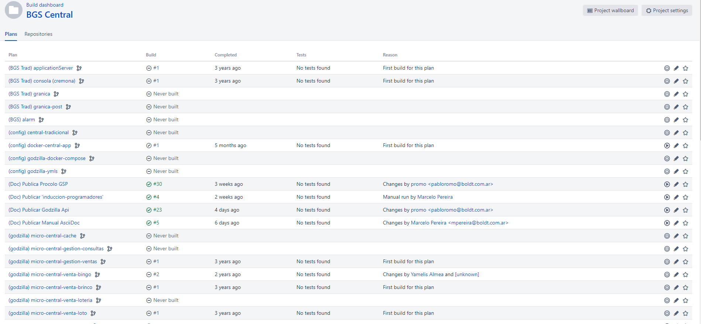

=== Visualización

Para visualizar las ejecuciones de un plan debemos ubicarlo y hacer click sobre el nombre como indica la siguiente imágen.

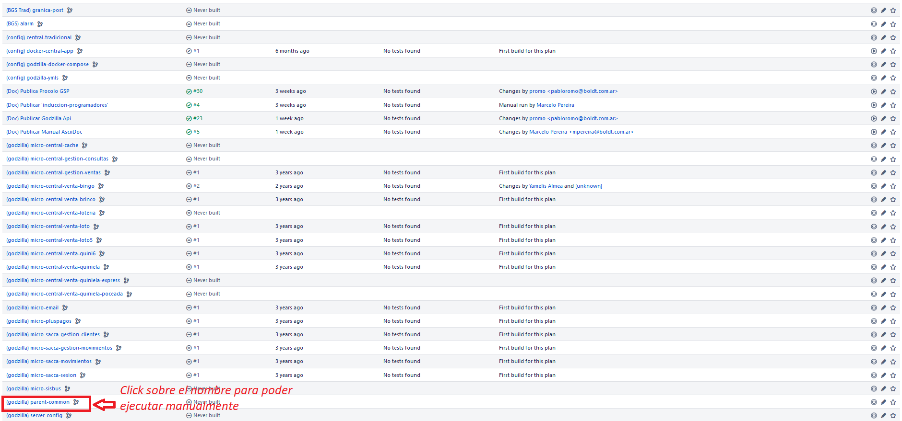

En este ejemplo usamos el plan *(godzilla) parent-common*. Al ingresar al plan veremos la siguiente pantalla

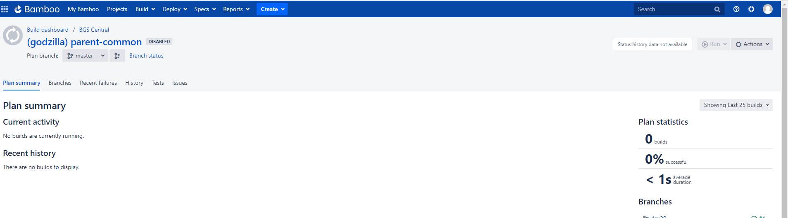

Es muy probable que la lista de ejecuciones esté vacía porque por defecto muestra la ejecución sobre branch master o main las cuales hoy no utilizamos.

Para ubicar las ejecuciones de un branch en especial, deberemos seleccinar el branch de git que queremos visualizar. En la siguiente imagen vemos 

* como seleccionar el branch *dev18* del plan *(godzilla) parent-common*

* como ubicar las ejecuciones *correctas* y *fallidas*

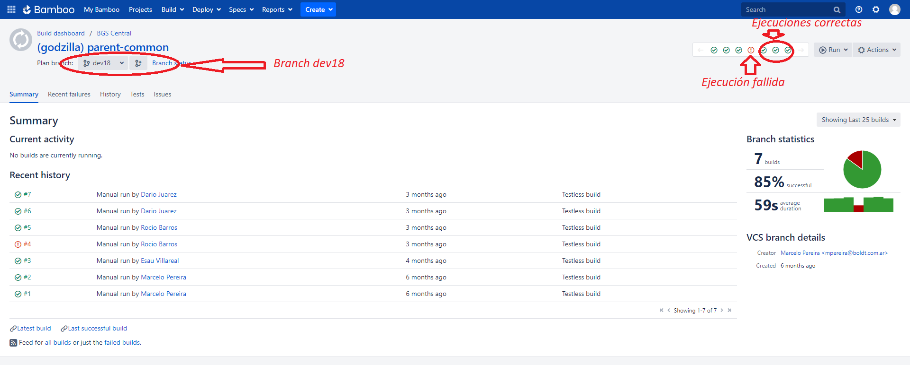

Para visualizar el log de una ejecución, debemos seleccionar la ejecución haciendo click sobre la misma como se muestra en la imágen siguiente

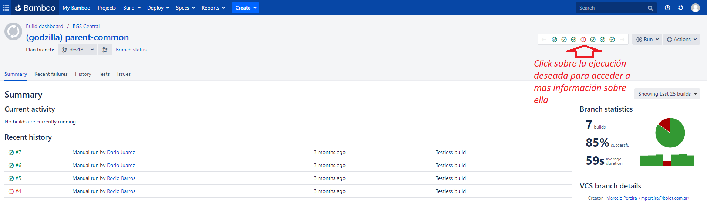

Al entrar a la visualización de la ejecución nos muestra la siguiente pantalla. En la imagen se muestra como acceder al log. A drede, elegimos una ejecución fallida para poder ver la falla en el log.

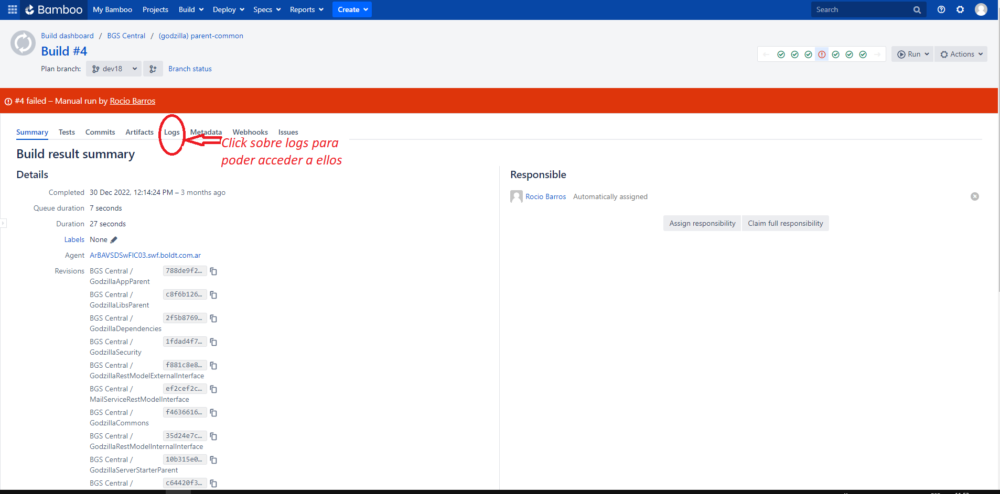

Una vez accedido al log podemos ver los errores en la pantalla principal o podemos navegar por todo el log haciendo click en "view" como muestra la siguiente imágen.

En este caso, el error arrojado nos indica que "nexus" no aceptó su entrega. Posiblemente sea porque la versión que queremos subir ya se encuentra en nexus.

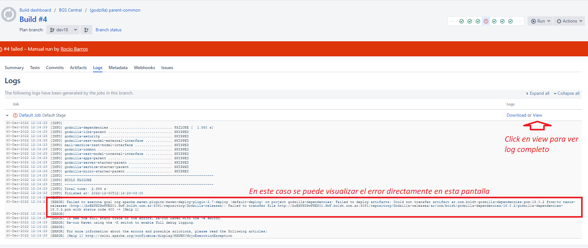

=== Ejecución

La mayoría de los planes (salvo alguna excepción como **(godzilla) parent-common**) se ejecutan automáticamente cuando bamboo lee el repositorio de git y se detectan cambios.

Para ejecutar un plan manualmente debemos ubicarlo y hacer click sobre el nombre del plan. Utilizaremos como ejemplo el plan '**(godzilla) parent-common**' como indica la siguiente imágen.

Al ingresar al plan veremos la siguiente pantalla

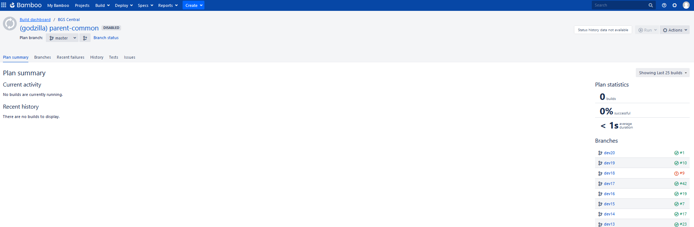

Debemos ubicar el branch que deseamos compilar y luego seleccionar "Run" -> "Run branch" como se indica en la siguiente imagen

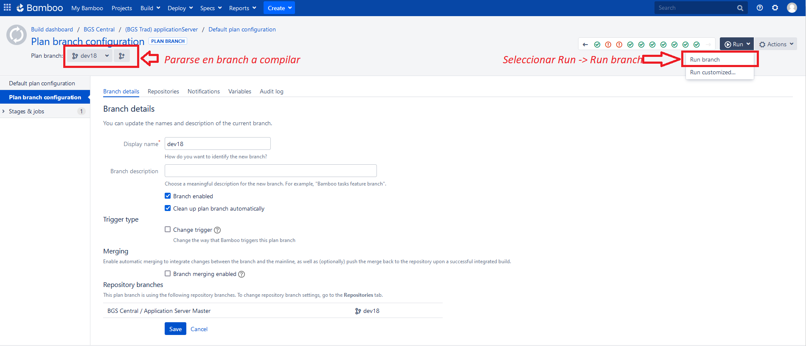

Al ejecutar el plan veremos su avance como muestra la siguiente pantalla. 

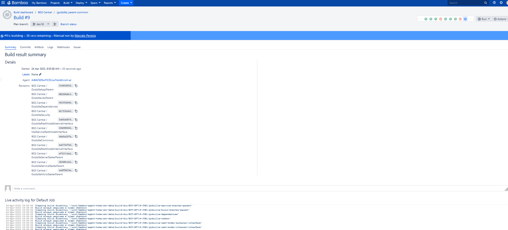

Al finzalizar la ejecución tendremos un resultado de "ejecución correcta" o " ejecución fallida". Para visualizar el log (obtener detalles de la ejecución) podremos hacer click sobre "logs" como indica la siguiente imagen.

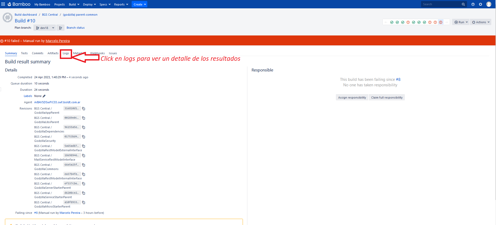

=== Configuración

Para configurar un plan existente se debe ubicar el plan y luego hacer click sobre el botón "modificar" como se muestra en la siguiente imagen. Si no aparece dicho botón puede que no tengamos permiso para modificar el plan.

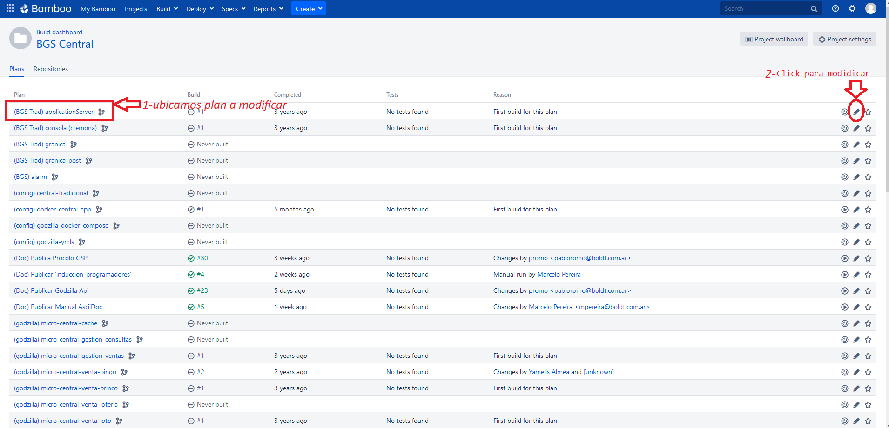

Al ingresar muestra la siguiente pantalla con diferentes tabs de opciones: 

image::images/c-2.png[text,900,600]

Las opciones mayormente utilizadas son: 

. Plan Detail: Se modifica nombre de plan y se le da una descripción
. Stages: se especifican los diferentes jobs a realizar al momento de ejecución
. Repositories: se especifican los repositorios git que se utilizarán en el plan
. Triggers: se esepecifican los "disparadores" que se ejecutarán para realizar las jobs del stage
. Branches: se configuran los branches
. Notifications: se especifican los usuarios a los cuales se les notifican los avisos de resultados de planes
. Variables: se especifican las variables del plan
. Las demas opciones no se utilizan

A continuación se describen las opciones mas usadas:

* Repositories

Al hacer click sobre "Repositories" obtenemos la siguiente pantalla: 

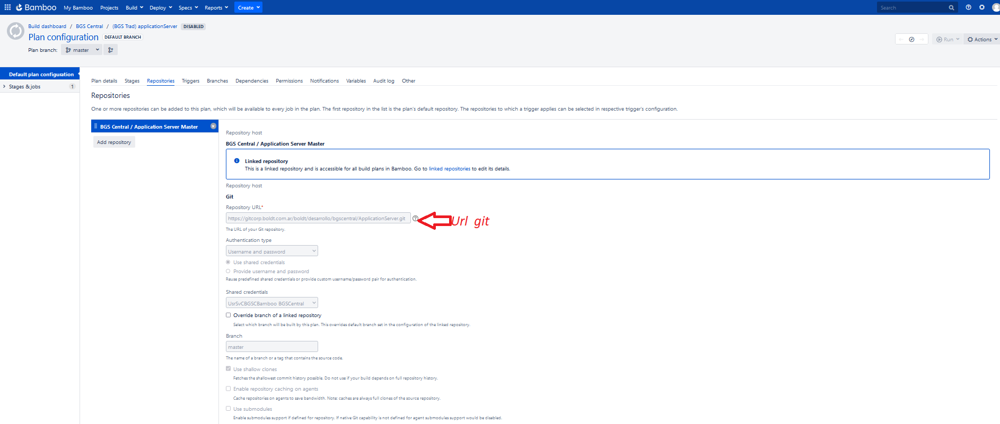

En esta opción veremos configurados los repositorios de git con sus URL's y la forma que tiene bamboo de accesarlo para hacer download de los fuentes. En este caso se le otorga a bamboo una "shared credential" para autenticar en git. Este repositorio se utiliza al momento de ejecutarse una tarea de un job.

* Triggers

Al hacer click sobre "Triggers" obtenemos la siguiente pantalla:

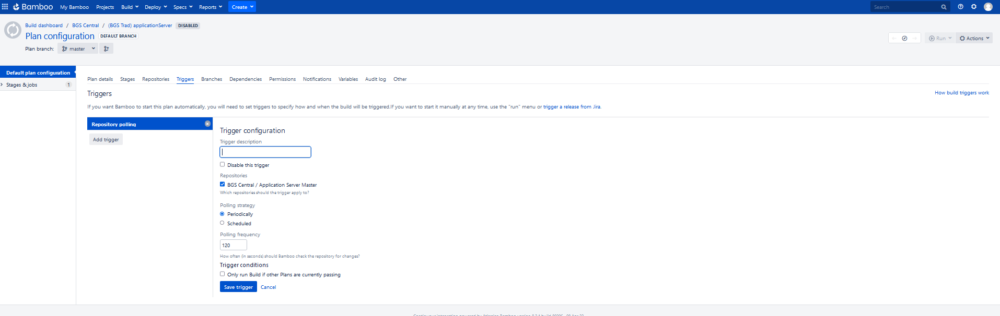

En esta opcioón veremos configurados los triggers (disparadores). Existen varios tipos de triggers. Nosotros utilizamos frecuentemente el trigger "Repository Polling" el cual revisa periódicamente los "Repositories" mencionados en el punto anterior y en el caso de encontrar modificaciones "lanza" la ejecución de los jobs

* Stages

Al hacer click sobre "stages" obtenemos la siguiente pantalla:

image::images/c-5.png[text,900,600]

En esta opción se detallan los jobs a ejecutar para la compilación y/o despliegue de los artefactos. Por lo general existe un solo job y dentro del mismo se detallan varias tareas.

*Job: conjunto de tareas, las cuales al finalizar su ejecución generan o publican el artefacto.*

Para visualizar el detalle de los jobs hacer click sobre "Default Jobs" como se indica en la siguiente figura 

image::images/c-6.png[text,900,600]

Nota: "Default Job" es un nombre genérico que Bamboo le otorga al Job principal al crearse un plan, pero puede cambiarse y se puede encontrar con otro nombre. También pueden existir mas de un job

Al accdeder al Job obtenemos la siguiente pantalla:

image::images/c-7.png[text,900,600]

Al ingresar al job se nos expone una lista de Tasks (tareas) que el Job ejecutará secuencialmente. En la mayría de los casos las tareas a ejecutar seran siempre 2:

. Obtener los fuentes
. Ejecutar compilación con maven, el cual compilará el artefecto en su formato correspondiente (jar, war, docker, pdf, html, etc) y lo subirá al server nexus si correspondiese

Existen varios otros tipos de tareas, incluyendo ejecución de scripts bash de linux y otros que mayormente no utilizamos.

*Nota: para generar publicaciones en confluence utilizamos un script  bash que publica el documento con una llamada al utilitario "curl"

Al seleccionar la tarea "Source Code Checkout" podremos ver que debe tener seleccionado el repositorio que tenemos configurado en la opcion "Repositories" mencionada anteriormente. Se muestra un ejemplo en la siguiente figura

image::images/c-8.png[text,900,600]

Esta tarea como mencionamos anteriormente, se encarga de obtener los fuentes de git a través del "Repository" configurado en el plan, cada vez que un "Trigger" detecta un cambio.

Al seleccionar la tarea "Maven 3.x" podremos observar el comando maven que se debe ejecutar para compilar y hacer deploy. Se muestra un ejemplo en la siguiente figura

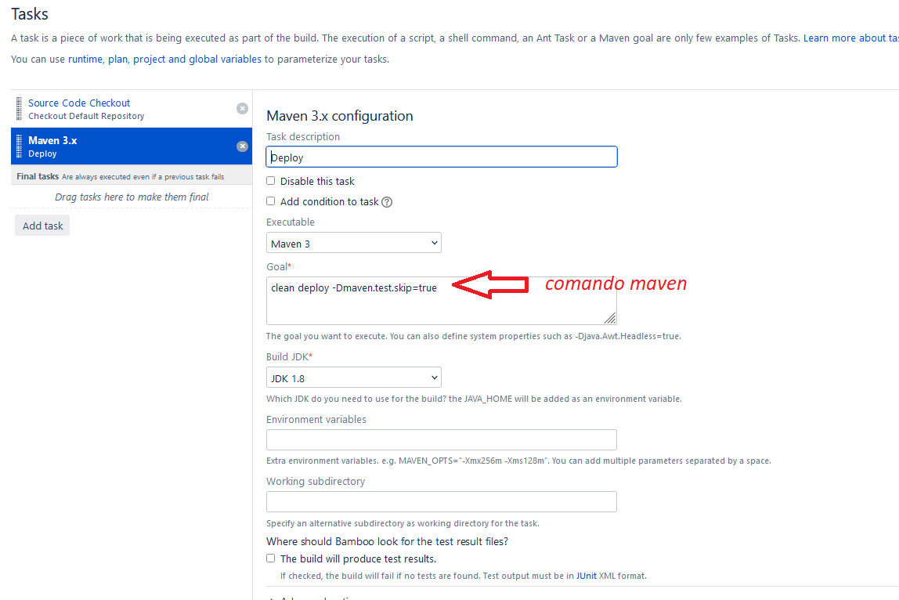

*Nota: el comando maven la mayoría de los casos, ademas de compilar ejecuta el upload a nexus.

En el caso de tener algún script bash programado se vería así:

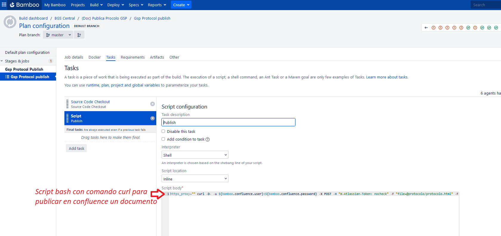

* Branches

Al hacer click sobre "Branches" obtenemos la siguiente pantalla:

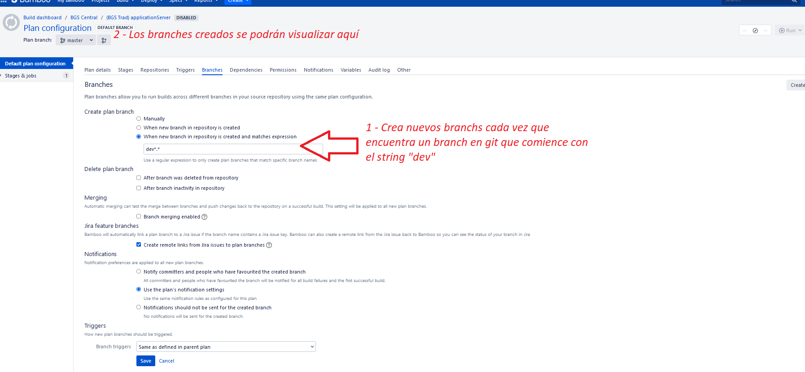

En esta opción configuramos la creación branches del plan de bamboo. Estos branches de bamboo apuntan a los branches de git. En nuestro caso, cada vez que se crea un branch en git que comience con el string "dev", bamboo reconocerá el branch de git y creará un branch para el plan. Luego se ejecutarán los correspondientes  "Triggers" y "Jobs" sobre ese branch. Ejemplo: si creamos el branch dev35, bamboo creará una branch dev35 para el plan de bamboo como se muestra en la figura anterior (en 2 - Los branches creados se podrán...). Cada vez que se detecten cambios en git sobre dev35, bamboo bajará los fuentes, los compilará y distribuirá según corresponda. 

=== Creación

Para crear un plan lo que hacemos es clonar un plan ya existente para luego modificarlo asignandole sus propias características. Lo mas usual es modificar los "Repositories" y luego hacer referencia  a este nuevo "Repository" en la Tarea del Jon "Source Code Checkout". Luego se reutiliza todo lo configurado en el plan origen.

Para clonar un plan, seguir las siguientes instrucciones:

. Click en "Create"
. Click en "Clone Plan"
. Seleccionar el plan "Origen". Este es el plan "base" que ya existe y va a ser clonado.
. Ingresar el nombre del plan nuevo

Luego Ingresar el "Plan Key" que es un string obligatorio, y presionar "Clone". Bamboo clonará el plan y se podrá visualizar en la pantalla principal del proyecto Especificado en 3

La siguiente imagen muestra un detalle de lo mencionado en las instrucciones

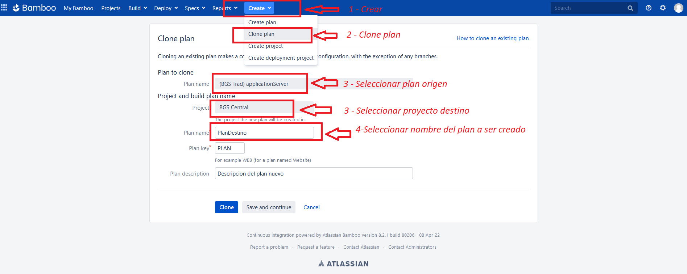

